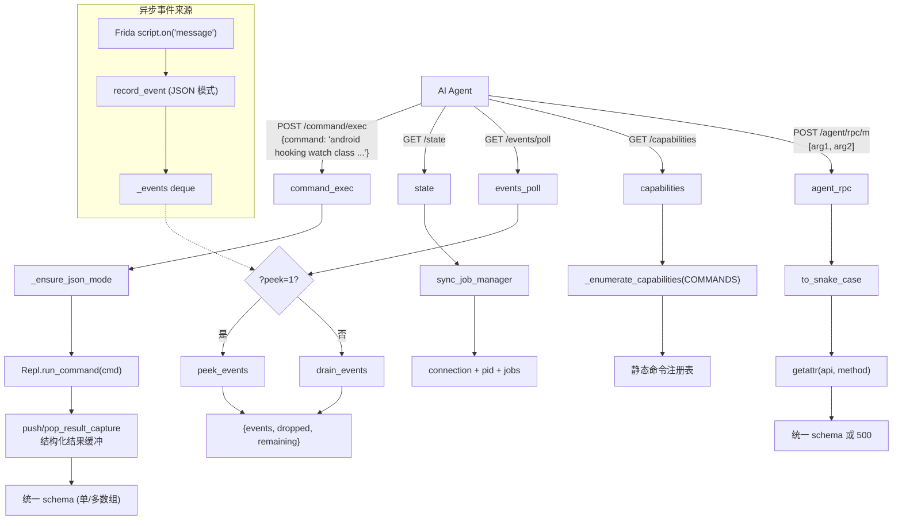

# 面向 Agent 的 HTTP 端点 <code>objection/api/agent_endpoints.py</code>

为 AI Agent 设计的命令层 HTTP 端点。与 `rpc.py`（直接桥接 Frida RPC exports）不同，这组端点工作在 **objection 命令层**——接收 objection 命令字符串、复用统一输出层（`objection/utils/output`）、返回固定 JSON schema。Agent 可通过这组端点执行命令、查状态、轮询事件、自发现能力、直调 RPC。

## 📋 模块概览
| 项目 | 值 |
| --- | --- |
| 文件路径 | `objection/api/agent_endpoints.py` |
| 类型 | API 端点（Flask Blueprint，新增模块） |
| 被谁调用 | `objection/api/app.py` 的 `create_app()` 注册（空前缀，端点挂在根路径） |
| 依赖 | `flask.Blueprint`/`jsonify`/`request`/`abort`、`objection.state.connection.state_connection`、`objection.state.jobs.job_manager_state`、`objection.utils.events.drain_events`/`peek_events`、`objection.utils.helpers.to_snake_case`、`objection.utils.output`（`CommandResult`/`output_result`/`push_result_capture`/`pop_result_capture`/`set_json_output`/`is_json_output`）、`objection.console.repl.Repl`、`objection.console.commands.COMMANDS`、`objection.console.agent_cli._enumerate_capabilities` |

## 🎯 解决的问题
- **Agent 需要命令层而非 RPC 层**：`/rpc/invoke` 暴露的是 Frida agent 的底层 exports（`android_hooking_list_classes` 等），Agent 要自己拼参数、解析原始返回。本端点接收 objection 命令字符串（`android hooking list classes`），复用人类命令的全部逻辑（参数解析、输出格式化、Job 管理），让 Agent 用「说命令」的方式驱动 objection。
- **统一 JSON schema**：所有端点返回 `{status, command, result, jobs_created, warnings}` 五字段结构，Agent 解析逻辑只写一次。错误也走同一 schema（带 `status: 'error'` + HTTP 4xx/5xx）。
- **异步事件可轮询**：Hook 命中、canary 触发等异步结果不能通过命令调用同步拿到。`/events/poll` 让 Agent 在执行 hook 命令后周期性拉取事件缓冲。
- **能力自发现**：Agent 不可能预先知道所有 objection 命令。`/capabilities` 返回命令注册表快照（不需要设备连接），Agent 可据此构造合法命令。
- **状态感知**：多步流程中 Agent 需知「现在连了什么设备、有哪些 Job 在跑」。`/state` 返回连接信息 + Job 列表。
- **强制 JSON 模式**：人类模式输出是人类可读文本，Agent 需要结构化。所有端点先 `_ensure_json_mode()` 把全局输出切到 JSON。

## 🏗️ 核心结构

### `bp` — Agent API 蓝图
源码：`objection/api/agent_endpoints.py:34`

```python
bp = Blueprint('agent_api', __name__, url_prefix='')
```

空前缀，端点挂在根路径：`POST /command/exec`、`GET /state`、`GET /events/poll`、`GET /capabilities`、`GET/POST /agent/rpc/<method>`。

### `_ensure_json_mode` — 强制 JSON 输出
源码：`objection/api/agent_endpoints.py:37`

```python
def _ensure_json_mode():
    if not is_json_output():
        set_json_output(True)
```

每个端点入口先调它。`set_json_output(True)` 是全局开关，让 `utils/output` 与 `utils/events` 的 `record_event` 走 JSON 分支（缓冲事件、产出 `CommandResult` 结构）。

### `_no_agent_response` — 无 agent 统一错误
源码：`objection/api/agent_endpoints.py:44`

```python
def _no_agent_response():
    return jsonify({
        'status': 'error',
        'command': '',
        'result': {'error': 'no agent is connected; start objection with `objection api` first'},
        'jobs_created': [],
        'warnings': [],
    }), 503
```

未注入 agent 时返回 503 + 统一 schema。提示用户用 `objection api` 启动（HTTP 服务器与 agent 共进程）。

### `command_exec` — 执行 objection 命令
源码：`objection/api/agent_endpoints.py:56`

```python
@bp.route('/command/exec', methods=('POST',))
def command_exec():
    _ensure_json_mode()

    if not state_connection.agent:
        return _no_agent_response()

    post_data = request.get_json(force=True, silent=True)
    if not post_data:
        return abort(jsonify(message='POST request without a valid JSON body received'))

    commands = []
    if 'command' in post_data:
        commands = [post_data['command']]
    elif 'commands' in post_data:
        commands = list(post_data['commands'])
    else:
        return abort(jsonify(message='JSON body must contain "command" or "commands"'))

    from objection.console.repl import Repl
    repl = Repl()

    results = []
    for cmd in commands:
        buf = push_result_capture()
        try:
            repl.run_command(cmd)
        except Exception as e:
            output_result(
                CommandResult(result={'error': str(e)}, status='error',
                              human_text='Command failed: {0}'.format(e), exit_code=1),
                command=cmd,
            )
        captured = pop_result_capture() or []

        if not captured:
            results.append({
                'status': 'ok',
                'command': cmd,
                'result': None,
                'jobs_created': [],
                'warnings': ['command produced no structured output; it may be unconverted or interactive-only.'],
            })
        else:
            last = captured[-1]
            if len(captured) > 1:
                last = dict(last)
                last.setdefault('warnings', [])
                last['warnings'] = list(last['warnings']) + [
                    'command emitted {0} structured payloads; only the last is returned as result.'.format(len(captured))
                ]
            results.append(last)

    if len(results) == 1:
        return jsonify(results[0])
    return jsonify(results)
```

核心机制：**结果捕获（result capture）**。objection 命令的人类模式直接打印 stdout，Agent 模式需要结构化结果。`push_result_capture()` 在输出层挂一个捕获缓冲，`repl.run_command(cmd)` 执行命令时，已改造的命令会调 `output_result(CommandResult(...))` 把结构化结果推入缓冲；`pop_result_capture()` 取出缓冲。

- 单命令（`{"command": "..."}`）→ 返回单对象；多命令（`{"commands": [...]}`）→ 返回数组。
- 命令抛异常 → 构造 `CommandResult(status='error')` 入队，仍返回结构化结果而非 500。
- 命令无结构化输出（未改造或交互式）→ 返回 `result: None` + warning 提示 Agent。
- 多条结构化输出 → 取最后一条作 result，其余在 warning 里告知。

延迟导入 `Repl` 避免循环依赖（repl 依赖 cli，cli 依赖 agent_cli）。

### `state` — 会话状态快照
源码：`objection/api/agent_endpoints.py:133`

```python
@bp.route('/state', methods=('GET',))
def state():
    _ensure_json_mode()
    if not state_connection.agent:
        return _no_agent_response()

    sc = state_connection
    agent_obj = sc.get_agent() if sc.agent else None

    jobs = []
    try:
        from objection.commands.jobs import sync_job_manager
        sync_job_manager()
        for uuid, job in job_manager_state.jobs.items():
            jobs.append({'id': uuid, 'type': job.job_type, 'name': job.name})
    except Exception:
        pass

    state_data = {
        'connection': {
            'type': sc.device_type, 'network': sc.network, 'host': sc.host, 'port': sc.port,
            'device_id': sc.device_id, 'name': sc.name, 'spawn': sc.spawn, 'foremost': sc.foremost,
        },
        'pid': getattr(agent_obj, 'pid', None) if agent_obj else None,
        'jobs': jobs,
    }
    return jsonify({'status': 'ok', 'command': '/state', 'result': state_data, 'jobs_created': [], 'warnings': []})
```

返回连接元信息（设备类型、host/port、device_id 等）+ agent pid + 运行中的 Job 列表。`sync_job_manager()` 先与设备同步 Job 状态（Frida 端 Job 可能已退出）再枚举。Job 块用 try/except 兜住——Job 同步失败不应让整个 state 请求失败。

### `events_poll` — 事件轮询
源码：`objection/api/agent_endpoints.py:185`

```python
@bp.route('/events/poll', methods=('GET',))
def events_poll():
    _ensure_json_mode()

    if 'peek' in request.args:
        from objection.utils.events import peek_events
        data = peek_events()
    else:
        data = drain_events()

    return jsonify({
        'status': 'ok', 'command': '/events/poll', 'result': data, 'jobs_created': [], 'warnings': [],
    })
```

默认 `drain_events()`（取出并清空队列），`?peek=1` 走 `peek_events()`（只看不清空）。结果包进统一 schema 的 `result` 字段。事件队列由 `utils/events.py` 维护，Frida `script.on('message')` 回调入队（仅在 JSON 模式）。

### `capabilities` — 命令自发现
源码：`objection/api/agent_endpoints.py:213`

```python
@bp.route('/capabilities', methods=('GET',))
def capabilities():
    _ensure_json_mode()

    from objection.console.commands import COMMANDS
    from objection.console.agent_cli import _enumerate_capabilities

    caps = _enumerate_capabilities(COMMANDS)
    return jsonify({
        'status': 'ok', 'command': '/capabilities',
        'result': {'commands': caps}, 'jobs_created': [], 'warnings': [],
    })
```

不需要设备连接——纯静态注册表快照。`_enumerate_capabilities`（来自 `agent_cli`）遍历 `COMMANDS` 注册表，产出每个命令的结构化描述（名称、参数、用途），供 Agent 自主构造合法命令。

### `agent_rpc` — 直调 agent RPC
源码：`objection/api/agent_endpoints.py:236`

```python
@bp.route('/agent/rpc/<string:method>', methods=('GET', 'POST'))
def agent_rpc(method):
    _ensure_json_mode()
    if not state_connection.agent:
        return _no_agent_response()

    method_name = to_snake_case(method)
    args_list = []
    if request.method == 'POST':
        post_data = request.get_json(force=True, silent=True)
        if post_data is None:
            return abort(jsonify(message='POST request without a valid JSON body received'))
        if not isinstance(post_data, list):
            return abort(jsonify(message='POST body must be a JSON array of positional arguments'))
        args_list = post_data

    try:
        api = state_connection.get_api()
        fn = getattr(api, method_name, None)
        if fn is None:
            raise AttributeError('unknown RPC method: {0}'.format(method_name))
        result = fn(*args_list)
    except Exception as e:
        return jsonify({
            'status': 'error', 'command': '/agent/rpc/{0}'.format(method),
            'result': {'error': str(e)}, 'jobs_created': [], 'warnings': [],
        }), 500

    return jsonify({
        'status': 'ok', 'command': '/agent/rpc/{0}'.format(method),
        'result': result, 'jobs_created': [], 'warnings': [],
    })
```

与 `/rpc/invoke` 功能类似但区别明显：

| 维度 | `/rpc/invoke` (rpc.py) | `/agent/rpc/<method>` (本端点) |
| --- | --- | --- |
| POST body | JSON 对象（`.values()` 作参数） | JSON 数组（位置参数） |
| 响应格式 | `jsonify(response)` 原始 | 统一 schema `{status, result, ...}` |
| 错误格式 | 400 + `{message}` | 500 + 统一 schema `status:'error'` |
| 未知方法 | `getattr` 抛异常 → 400 | 显式 `AttributeError` → 500 + 统一 schema |

本端点是「Agent 友好版 RPC」——强制 JSON 数组参数、统一 schema、明确的方法不存在错误。



## ⚙️ 实现要点
- **结果捕获机制是核心创新**：objection 命令的人类模式调 `click.echo` / `print`，改造为 Agent 模式不是重写每个命令，而是加一层 `output_result(CommandResult(...))`。`push_result_capture`/`pop_result_capture`（来自 `utils/output`）在输出层挂一个线程局部缓冲，让命令实现里的 `output_result` 调用被捕获而非直接打印。这样未改造的命令（不调 `output_result`）会落到「no structured output」分支，已改造的命令自动产出结构化结果——渐进迁移。
- **多命令批处理**：`{"commands": [...]}` 一次调多个命令，返回数组。比 Agent 逐条 HTTP 调用省往返；但命令间无依赖传递（每条独立捕获），适合批量查询而非流水线。
- **`sync_job_manager` 用 try/except 兜底**：`/state` 端点里 Job 同步失败被吞，`jobs` 返回空列表而非让整个请求 500。设计哲学：状态查询应尽可能成功，部分失败降级而非全失败。
- **`/capabilities` 不需要设备**：纯静态注册表，Agent 可在连接设备前先调它了解能力。这让 Agent 能做「先看能力 → 选命令 → 连设备 → 执行」的规划流程。
- **`/agent/rpc` 强制 JSON 数组**：与 `/rpc/invoke` 的 JSON 对象不同，数组语义更清晰（位置参数就是有序的）。`isinstance(post_data, list)` 校验，非数组直接 400——避免 Agent 误传对象导致参数乱序。
- **统一 schema 的 `command` 字段**：每条响应都带 `command`（执行的命令字符串或端点路径），方便 Agent 在日志/对话里对齐请求与响应。`/agent/rpc/foo` 的 `command` 字段是 `/agent/rpc/foo`（保留原 method 名，未转 snake_case），便于 Agent 回溯。
- **延迟导入避免循环依赖**：`command_exec` 内 `from objection.console.repl import Repl`、`state` 内 `from objection.commands.jobs import sync_job_manager`、`capabilities` 内 `from objection.console.commands import COMMANDS` 与 `from objection.console.agent_cli import _enumerate_capabilities`——都在函数体内导入，避免模块加载时 `api.agent_endpoints` → `console.repl` → `console.cli` → `console.agent_cli` 的循环。
- **`_ensure_json_mode` 每端点都调**：因为 HTTP 服务器可能被人类命令复用（同一进程既跑人类 repl 又跑 HTTP API），全局 JSON 开关可能被人类模式重置。每端点入口强制重设，保证 Agent 请求一定走 JSON 分支。

## 🔍 源码索引
| 符号 | 位置 |
| --- | --- |
| `bp` | `objection/api/agent_endpoints.py:34` |
| `_ensure_json_mode` | `objection/api/agent_endpoints.py:37` |
| `_no_agent_response` | `objection/api/agent_endpoints.py:44` |
| `command_exec` | `objection/api/agent_endpoints.py:56` |
| `state` | `objection/api/agent_endpoints.py:133` |
| `events_poll` | `objection/api/agent_endpoints.py:185` |
| `capabilities` | `objection/api/agent_endpoints.py:213` |
| `agent_rpc` | `objection/api/agent_endpoints.py:236` |

## 🔗 相关文档
- [整体架构](/guide/architecture)
- [HTTP API 端点](/guide/agent-http)
- [面向 AI Agent 使用](/guide/agent-usage)
- [统一 JSON Schema](/guide/agent-schema)
- [异步事件缓冲](/reference/utils/events)
- [统一输出层](/reference/utils/output)
- [HTTP 应用入口](/reference/api/app)
- [RPC 桥接](/reference/api/rpc)
