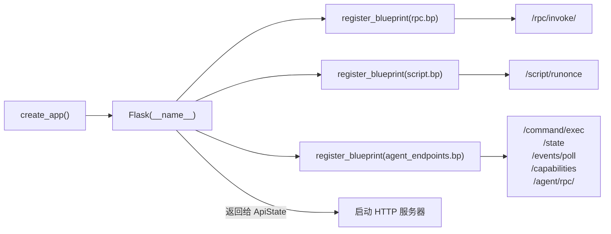
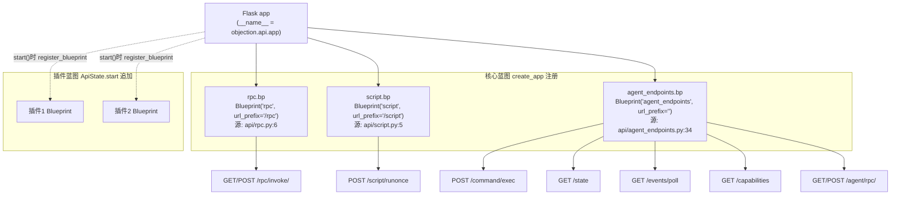
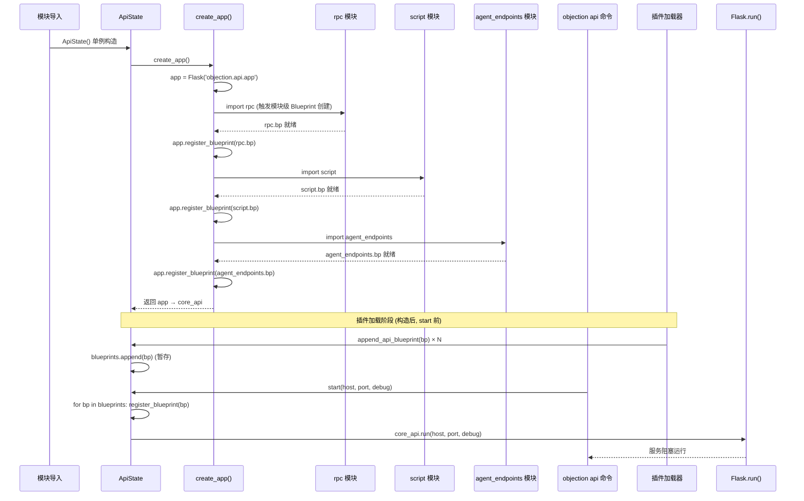

# HTTP 应用入口 <code>objection/api/app.py</code>

 objection HTTP API 的工厂函数入口。创建 Flask 应用实例，注册三个蓝图（`rpc`、`script`、`agent_endpoints`），把 objection 的 HTTP 能力组装成一个可被 `objection api` 命令启动的 WSGI 应用。

## 📋 模块概览
| 项目 | 值 |
| --- | --- |
| 文件路径 | `objection/api/app.py` |
| 类型 | API 工厂（HTTP 应用装配） |
| 被谁调用 | `objection/state/api.py` 的 `ApiState`（启动 HTTP 服务器时调 `create_app()` 拿 Flask 实例） |
| 依赖 | `flask.Flask`、`objection.api.rpc`、`objection.api.script`、`objection.api.agent_endpoints` |

## 🎯 解决的问题
- **蓝图解耦**：`/rpc/*`、`/script/*`、Agent 端点（`/command/exec`、`/state` 等）三组端点分属不同模块，各自定义 Blueprint。本入口只做「注册」，不实现任何端点逻辑——遵循 Flask 的应用工厂模式。
- **插件蓝图延迟注册**：插件通过 `Plugin._append_to_api` 往 `api_state` 追加的蓝图，由 `ApiState` 在加载阶段（启动 Flask 前）统一注册，本模块的 `create_app` 只注册核心三蓝图。
- **单一装配点**：所有 HTTP 路由的「组装」集中在一个函数，方便审查 objection 暴露了哪些 HTTP 表面。

## 🏗️ 核心结构

### `create_app` — 应用工厂
源码：[`objection/api/app.py:8`](https://github.com/android-security-engineer/objection-skills/blob/master/objection/api/app.py#L8)

```python
from flask import Flask

from . import rpc
from . import script
from . import agent_endpoints


def create_app() -> Flask:
    """
        Creates a new Flask instance for the objection API
    """
    app = Flask(__name__)
    app.register_blueprint(rpc.bp)
    app.register_blueprint(script.bp)
    app.register_blueprint(agent_endpoints.bp)

    return app
```

四个动作：建 `Flask(__name__)`、注册 rpc 蓝图、注册 script 蓝图、注册 agent_endpoints 蓝图。每个蓝图在自己模块里用 `Blueprint(name, __name__, url_prefix=...)` 定义，`create_app` 只调 `register_blueprint`。

三蓝图的 `url_prefix`：

| 蓝图 | 模块 | url_prefix | 提供端点 |
| --- | --- | --- | --- |
| `rpc.bp` | `api/rpc.py:6` | `/rpc` | `GET/POST /rpc/invoke/<method>` |
| `script.bp` | `api/script.py:5` | `/script` | `POST /script/runonce` |
| `agent_endpoints.bp` | `api/agent_endpoints.py:34` | `''`（根路径） | `POST /command/exec`、`GET /state`、`GET /events/poll`、`GET /capabilities`、`GET/POST /agent/rpc/<method>` |



## ⚙️ 实现要点
- **工厂函数而非模块级 `app = Flask()`**：用 `create_app()` 工厂模式而非模块级全局 app，好处是每次调用生成独立实例（测试可隔离）、配置可在创建时注入（当前未用但预留）、避免循环导入（蓝图模块 import app 模块会循环）。这是 Flask 推荐的「应用工厂」模式。
- **三蓝图无嵌套**：rpc 与 script 各有独立 `url_prefix`，agent_endpoints 用空前缀（端点路径直接挂在根）。三者平级注册，互不嵌套——简单清晰，但路由命名空间靠各蓝图自行保证不冲突。
- **插件蓝图不在此注册**：插件通过 `Plugin._append_to_api` → `api_state.append_api_blueprint` 收集，`ApiState` 在 `create_app` 之后再注册这些蓝图。本函数只管核心三蓝图，插件扩展性由 `ApiState` 承担。
- **`Flask(__name__)` 用本模块名**：`__name__` 是 `objection.api.app`，Flask 用它定位静态/模板目录（objection 未用到，但保持惯例）。

## 🔍 源码索引
| 符号 | 位置 |
| --- | --- |
| `create_app` | [`objection/api/app.py:8`](https://github.com/android-security-engineer/objection-skills/blob/master/objection/api/app.py#L8) |

## 🧩 蓝图注册与路由命名空间

下图刻画三个核心蓝图注册到 Flask app 后形成的路由命名空间层级，以及插件蓝图在 `ApiState.start()` 阶段追加挂载的位置。



命名空间要点（基于 [`rpc.py:6`](https://github.com/android-security-engineer/objection-skills/blob/master/objection/api/rpc.py#L6)、[`script.py:5`](https://github.com/android-security-engineer/objection-skills/blob/master/objection/api/script.py#L5)、[`agent_endpoints.py:34`](https://github.com/android-security-engineer/objection-skills/blob/master/objection/api/agent_endpoints.py#L34)）：

- **`agent_endpoints` 用空前缀**：`url_prefix=''`（[`agent_endpoints.py:34`](https://github.com/android-security-engineer/objection-skills/blob/master/objection/api/agent_endpoints.py#L34)），端点直接挂在根路径，如 `/command/exec`、`/state`。这与 rpc/script 的 `/rpc`、`/script` 前缀形成对比——Agent 端点是 objection 的"主入口"，刻意不设前缀以缩短 URL。
- **命名空间靠约定不靠隔离**：三个蓝图平级注册，无嵌套。Flask 不强制蓝图间路由不冲突，若插件蓝图也注册 `/state` 会覆盖 agent_endpoints 的 `/state`（Flask 抛 `AssertionError` 阻止覆盖）。objection 靠"插件用独特前缀"的约定避免冲突，但无强制机制。
- **`/agent/rpc/<method>` 与 `/rpc/invoke/<method>` 互补**：前者由 `agent_endpoints` 提供，强制 JSON 输出、走命令层包装；后者由 `rpc` 蓝图提供，直接桥接 Frida RPC、支持 `?json=false` 返回原始响应。两者都按 `<method>` 路由，但语义不同——前者是"Agent 友好的 RPC"，后者是"裸 RPC 桥接"。

## 🔁 应用工厂调用时序

下图展示从 `ApiState.__init__` 触发 `create_app()` 到 Flask app 就绪、再到 `start()` 挂载插件蓝图并启动服务的完整时序。



时序关键点：

- **蓝图在模块导入时创建**：`bp = Blueprint(...)` 是模块级语句（[`rpc.py:6`](https://github.com/android-security-engineer/objection-skills/blob/master/objection/api/rpc.py#L6)），`create_app` 内 `from . import rpc` 触发模块加载时即创建蓝图对象。这意味着蓝图是单例——多次 `create_app()` 会复用同一蓝图对象，但注册到不同 Flask app 实例。Flask 允许同一蓝图注册到多个 app，但 objection 只调一次 `create_app()`。
- **`from . import` 的顺序**：`app.py` 顶部按 `rpc` → `script` → `agent_endpoints` 顺序导入（[`app.py:3-5`](https://github.com/android-security-engineer/objection-skills/blob/master/objection/api/app.py#L3)），注册顺序与之一致。注册顺序影响 Flask 的路由匹配优先级——但三蓝图路由前缀不重叠，顺序无实际影响。
- **插件蓝图两阶段**：`append_api_blueprint` 只暂存到 `self.blueprints` 列表，不立即注册（[`state/api.py:11-23`](https://github.com/android-security-engineer/objection-skills/blob/master/objection/state/api.py#L11)）；直到 `start()` 才统一 `register_blueprint`（[`state/api.py:37-38`](https://github.com/android-security-engineer/objection-skills/blob/master/objection/state/api.py#L37)）。这避免了"插件加载中途蓝图被部分访问"的中间状态。

## 📐 路由表装配视图（ASCII 框图）

下图展示 `create_app()` 执行后 Flask app 内部的路由表结构，以及插件蓝图追加后的增量。

```
create_app() 执行后:
┌──────────────────────────────────────────────────────────────┐
│ Flask app (objection.api.app)                                 │
│                                                               │
│  url_map (路由表):                                             │
│  ┌──────────────────────────────────────────────────────────┐│
│  │ Rule                          Methods   endpoint          ││
│  │ /rpc/invoke/<string:method>  GET,POST  rpc.invoke         ││
│  │ /script/runonce               POST      script.runonce    ││
│  │ /command/exec                 POST      agent_endpoints.* ││
│  │ /state                        GET       agent_endpoints.* ││
│  │ /events/poll                  GET       agent_endpoints.* ││
│  │ /capabilities                 GET       agent_endpoints.* ││
│  │ /agent/rpc/<method>           GET,POST  agent_endpoints.* ││
│  └──────────────────────────────────────────────────────────┘│
│                                                               │
│  blueprints (已注册):                                         │
│  ┌──────────────────────────────────────────────────────────┐│
│  │ rpc.bp            url_prefix='/rpc'                       ││
│  │ script.bp         url_prefix='/script'                    ││
│  │ agent_endpoints.bp url_prefix=''                          ││
│  └──────────────────────────────────────────────────────────┘│
└──────────────────────────────────────────────────────────────┘

ApiState.start() 追加插件蓝图后:
┌──────────────────────────────────────────────────────────────┐
│ + 插件1.bp  url_prefix='/plugin1'  (假设)                     │
│ + 插件2.bp  url_prefix='/plugin2'  (假设)                     │
│   → 路由表新增 /plugin1/*, /plugin2/* 规则                     │
└──────────────────────────────────────────────────────────────┘
```

装配边界情况：

- **`<string:method>` 路由参数**：`/rpc/invoke/<string:method>` 的 `<string:method>` 是 Flask 的 string 转换器，匹配不含 `/` 的任意字符串（[`rpc.py:10`](https://github.com/android-security-engineer/objection-skills/blob/master/objection/api/rpc.py#L10)）。这意味着方法名不能含斜杠——PascalCase 方法名如 `AndroidHook` 可正常匹配，但若方法名含 `/` 会 404。实际 agent.js 导出的方法名都是标识符，无斜杠。
- **`/agent/rpc/<method>` 无类型转换器**：`<method>` 等价于 `<string:method>`，但未显式声明类型。Flask 默认 string 转换器，行为一致。
- **`/script/runonce` 仅 POST**：该端点只接受 POST（[`script.py:11`](https://github.com/android-security-engineer/objection-skills/blob/master/objection/api/script.py#L11)），GET 请求会被 Flask 路由层直接返回 405 Method Not Allowed，不进入视图函数。`/rpc/invoke/<method>` 同时支持 GET 和 POST——GET 无参数调用，POST 以 body 为参数。
- **无全局错误处理**：`create_app` 未注册 `@app.errorhandler`，蓝图内视图函数抛异常时 Flask 用默认 500 处理器返回 HTML 错误页。这对 Agent 不友好（Agent 期望 JSON），但 `agent_endpoints` 的视图函数内部自行 try/except 并返回统一 JSON schema，绕过了默认错误处理。`rpc` 蓝图的 `invoke` 视图若抛异常则返回 HTML 500——这是裸 RPC 桥接的已知粗糙点。

## 🔗 相关文档
- [整体架构](/guide/architecture)
- [HTTP API 端点](/guide/agent-http)
- [RPC 桥接](/reference/api/rpc)
- [脚本注入端点](/reference/api/script)
- [面向 Agent 的 HTTP 端点](/reference/api/agent_endpoints)
