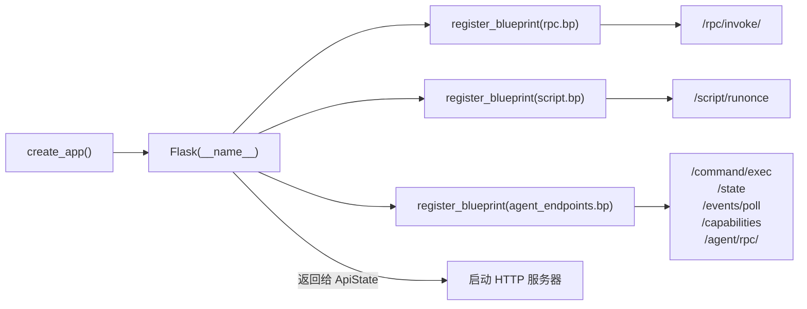

# HTTP 应用入口 <code>objection/api/app.py</code>

 objection HTTP API 的工厂函数入口。创建 Flask 应用实例，注册三个蓝图（`rpc`、`script`、`agent_endpoints`），把 objection 的 HTTP 能力组装成一个可被 `objection api` 命令启动的 WSGI 应用。

## 📋 模块概览
| 项目 | 值 |
| --- | --- |
| 文件路径 | `objection/api/app.py` |
| 类型 | API 工厂（HTTP 应用装配） |
| 被谁调用 | `objection/state/api.py` 的 `ApiState`（启动 HTTP 服务器时调 `create_app()` 拿 Flask 实例） |
| 依赖 | `flask.Flask`、`objection.api.rpc`、`objection.api.script`、`objection.api.agent_endpoints` |

## 🎯 解决的问题
- **蓝图解耦**：`/rpc/*`、`/script/*`、Agent 端点（`/command/exec`、`/state` 等）三组端点分属不同模块，各自定义 Blueprint。本入口只做「注册」，不实现任何端点逻辑——遵循 Flask 的应用工厂模式。
- **插件蓝图延迟注册**：插件通过 `Plugin._append_to_api` 往 `api_state` 追加的蓝图，由 `ApiState` 在加载阶段（启动 Flask 前）统一注册，本模块的 `create_app` 只注册核心三蓝图。
- **单一装配点**：所有 HTTP 路由的「组装」集中在一个函数，方便审查 objection 暴露了哪些 HTTP 表面。

## 🏗️ 核心结构

### `create_app` — 应用工厂
源码：`objection/api/app.py:8`

```python
from flask import Flask

from . import rpc
from . import script
from . import agent_endpoints


def create_app() -> Flask:
    """
        Creates a new Flask instance for the objection API
    """
    app = Flask(__name__)
    app.register_blueprint(rpc.bp)
    app.register_blueprint(script.bp)
    app.register_blueprint(agent_endpoints.bp)

    return app
```

四个动作：建 `Flask(__name__)`、注册 rpc 蓝图、注册 script 蓝图、注册 agent_endpoints 蓝图。每个蓝图在自己模块里用 `Blueprint(name, __name__, url_prefix=...)` 定义，`create_app` 只调 `register_blueprint`。

三蓝图的 `url_prefix`：

| 蓝图 | 模块 | url_prefix | 提供端点 |
| --- | --- | --- | --- |
| `rpc.bp` | `api/rpc.py:6` | `/rpc` | `GET/POST /rpc/invoke/<method>` |
| `script.bp` | `api/script.py:5` | `/script` | `POST /script/runonce` |
| `agent_endpoints.bp` | `api/agent_endpoints.py:34` | `''`（根路径） | `POST /command/exec`、`GET /state`、`GET /events/poll`、`GET /capabilities`、`GET/POST /agent/rpc/<method>` |



## ⚙️ 实现要点
- **工厂函数而非模块级 `app = Flask()`**：用 `create_app()` 工厂模式而非模块级全局 app，好处是每次调用生成独立实例（测试可隔离）、配置可在创建时注入（当前未用但预留）、避免循环导入（蓝图模块 import app 模块会循环）。这是 Flask 推荐的「应用工厂」模式。
- **三蓝图无嵌套**：rpc 与 script 各有独立 `url_prefix`，agent_endpoints 用空前缀（端点路径直接挂在根）。三者平级注册，互不嵌套——简单清晰，但路由命名空间靠各蓝图自行保证不冲突。
- **插件蓝图不在此注册**：插件通过 `Plugin._append_to_api` → `api_state.append_api_blueprint` 收集，`ApiState` 在 `create_app` 之后再注册这些蓝图。本函数只管核心三蓝图，插件扩展性由 `ApiState` 承担。
- **`Flask(__name__)` 用本模块名**：`__name__` 是 `objection.api.app`，Flask 用它定位静态/模板目录（objection 未用到，但保持惯例）。

## 🔍 源码索引
| 符号 | 位置 |
| --- | --- |
| `create_app` | `objection/api/app.py:8` |

## 🔗 相关文档
- [整体架构](/guide/architecture)
- [HTTP API 端点](/guide/agent-http)
- [RPC 桥接](/reference/api/rpc)
- [脚本注入端点](/reference/api/script)
- [面向 Agent 的 HTTP 端点](/reference/api/agent_endpoints)
