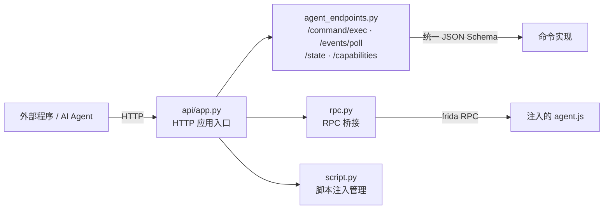

# 🌐 HTTP API 文档

`objection/api/` 提供 objection 的 HTTP 端点实现，让外部程序（含 AI Agent）能通过 HTTP 驱动 objection。本分区逐文件讲解。

## 🗺️ 端点架构

## 📂 文件清单

| 文档 | 源码 | 职责 |
| --- | --- | --- |
| [app](/reference/api/app) | `api/app.py` | HTTP 应用入口 |
| [rpc](/reference/api/rpc) | `api/rpc.py` | RPC 桥接 |
| [script](/reference/api/script) | `api/script.py` | 脚本注入管理 |
| [agent_endpoints](/reference/api/agent_endpoints) | `api/agent_endpoints.py` | 面向 Agent 的 HTTP 端点 |

## 🔗 相关文档

- [HTTP API 端点](/guide/agent-http)
- [面向 AI Agent 使用](/guide/agent-usage)
- [统一 JSON Schema](/guide/agent-schema)
