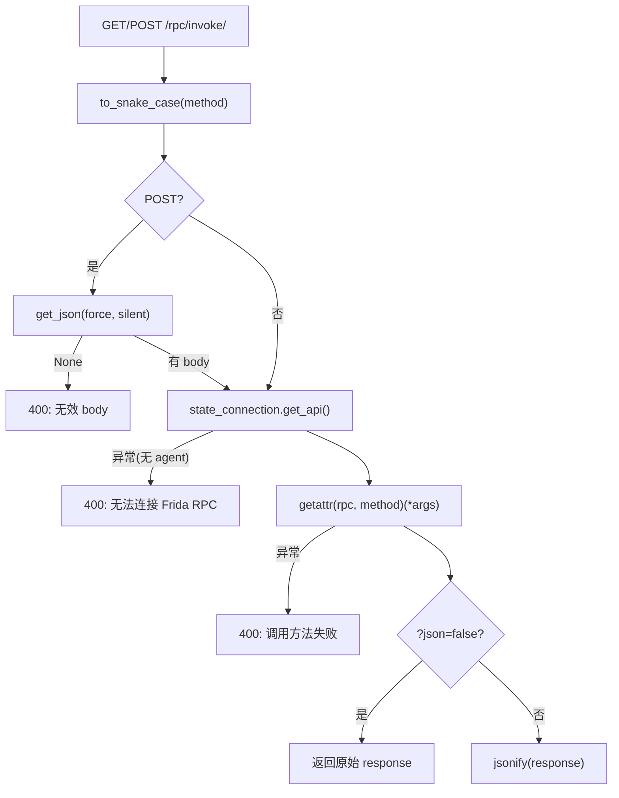

# RPC 桥接端点 <code>objection/api/rpc.py</code>

把 HTTP 请求桥接到 Frida agent 的 RPC exports。`GET/POST /rpc/invoke/<method>` 取出 agent 的 RPC 对象，按方法名 `getattr` 调用，结果 JSON 序列化返回。这是「直接驱动 Frida RPC」的低层端点，与 `agent_endpoints` 的「命令层」端点互补。

## 📋 模块概览
| 项目 | 值 |
| --- | --- |
| 文件路径 | `objection/api/rpc.py` |
| 类型 | API 端点（Flask Blueprint） |
| 被谁调用 | `objection/api/app.py` 的 `create_app()` 注册到 `/rpc` 前缀 |
| 依赖 | `flask.Blueprint`/`jsonify`/`request`/`abort`、`objection.state.connection.state_connection`、`objection.utils.helpers.to_snake_case` |

## 🎯 解决的问题
- **HTTP 直驱 Frida RPC**：Frida agent 的 `rpc.exports` 暴露了一批方法（如 `android_hooking_list_classes`），本端点让外部 HTTP 客户端能按方法名直接调用，无需经 objection 命令层。
- **GET/POST 双动词**：无参方法用 GET（如 `list classes`），带参方法用 POST（body 是 JSON 数组，作为位置参数）。
- **方法名风格转换**：URL 里用人类可读的驼峰或短横，转 snake_case 后 `getattr`——因为 Frida agent 的 exports 命名是 snake_case。
- **原始响应透传**：某些 RPC 方法返回已是 JSON 字符串或非 dict 结构，`?json=false` 让端点直接返回原始响应不经 `jsonify` 二次包装。

## 🏗️ 核心结构

### `bp` — RPC 蓝图
源码：`objection/api/rpc.py:6`

```python
bp = Blueprint('rpc', __name__, url_prefix='/rpc')
```

蓝图名 `rpc`，前缀 `/rpc`。所有本模块路由都挂在 `/rpc/...` 下。

### `invoke` — RPC 方法调用端点
源码：`objection/api/rpc.py:9`

```python
@bp.route('/invoke/<string:method>', methods=('GET', 'POST'))
def invoke(method):
    method = to_snake_case(method)

    if request.method == 'POST':
        post_data = request.get_json(force=True, silent=True)
        if not post_data:
            return abort(jsonify(message='POST request without a valid body received'))

    try:
        rpc = state_connection.get_api()
    except Exception as e:
        return abort(jsonify(message='Failed to talk to the Frida RPC: {e}'.format(e=str(e))))

    try:
        if request.method == 'POST':
            response = getattr(rpc, method)(*post_data.values())
        if request.method == 'GET':
            response = getattr(rpc, method)()

        if 'json' in request.args and request.args.get('json').lower() == 'false':
            return response
    except Exception as e:
        return abort(jsonify(message='Failed to call method: {e}'.format(e=str(e))))

    return jsonify(response)
```

流程四步：

1. **方法名转换**：`to_snake_case(method)`——URL 里的 `android-hooking-list-classes` 或 `androidHookingListClasses` 都转成 `android_hooking_list_classes` 匹配 exports。
2. **POST body 校验**：`get_json(force=True, silent=True)` 强制按 JSON 解析、失败返 None；None 则 400。
3. **取 RPC 对象**：`state_connection.get_api()` 拿 agent 的 `rpc.exports` 代理对象。未注入 agent 时抛异常 → 400。
4. **getattr 调用**：POST 用 `post_data.values()` 作位置参数（注意是 dict values，依赖 Python 3.7+ 字典有序）；GET 无参。`?json=false` 透传原始响应；否则 `jsonify` 包装。



## ⚙️ 实现要点
- **`to_snake_case` 统一命名**：Frida agent 的 exports 用 snake_case，但 HTTP 客户端传驼峰或短横更自然。`to_snake_case`（来自 `utils/helpers`）做转换，让 URL 对人类友好且不依赖 agent 端命名细节。
- **`post_data.values()` 依赖字典有序**：POST body 是 JSON 对象（dict），用 `.values()` 作位置参数依赖 Python 3.7+ 字典保序——客户端必须按参数顺序构造 JSON 对象。这与 `agent_endpoints.agent_rpc` 要求 POST body 是 JSON 数组不同，本端点接受对象、那个接受数组。
- **`force=True, silent=True` 的容错**：`force` 忽略 Content-Type 强制按 JSON 解析（客户端可能忘设 header），`silent` 让解析失败返 None 而非抛异常——配合 `if not post_data` 做优雅 400。
- **`?json=false` 透传**：某些 RPC 方法返回的已是字符串或非 JSON 结构，二次 `jsonify` 会把它包成 `{"result": ...}` 或报错。`?json=false` 跳过包装，原样返回——但 Flask 仍会设 Content-Type，客户端需自行处理。
- **异常即 400**：`get_api` 失败（无 agent）和方法调用失败都走 `abort(jsonify(...))`，返回 400 + 错误消息。这与 `agent_endpoints` 的统一 schema（status 字段 + 503/500）不同——本端点是低层、更原始的接口，错误格式朴素。
- **无统一 schema**：与 `agent_endpoints` 的 `{status, command, result, jobs_created, warnings}` 不同，本端点直接 `jsonify(response)` 返回 agent 原始返回值。适合已经熟悉 Frida RPC 返回结构的客户端，不适合需要统一错误处理的 Agent。

## 🔍 源码索引
| 符号 | 位置 |
| --- | --- |
| `bp` | `objection/api/rpc.py:6` |
| `invoke` | `objection/api/rpc.py:9` |

## 🔗 相关文档
- [整体架构](/guide/architecture)
- [HTTP API 端点](/guide/agent-http)
- [HTTP 应用入口](/reference/api/app)
- [脚本注入端点](/reference/api/script)
- [面向 Agent 的 HTTP 端点](/reference/api/agent_endpoints)
