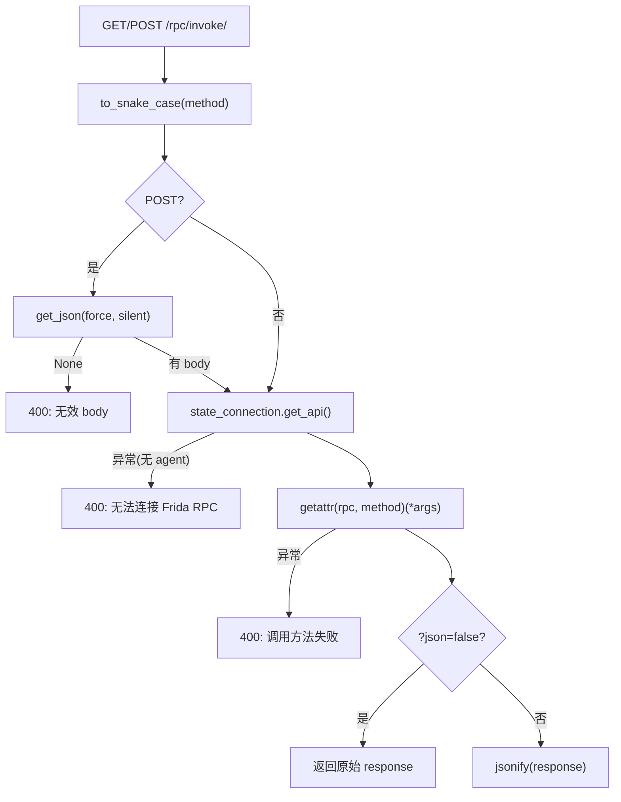
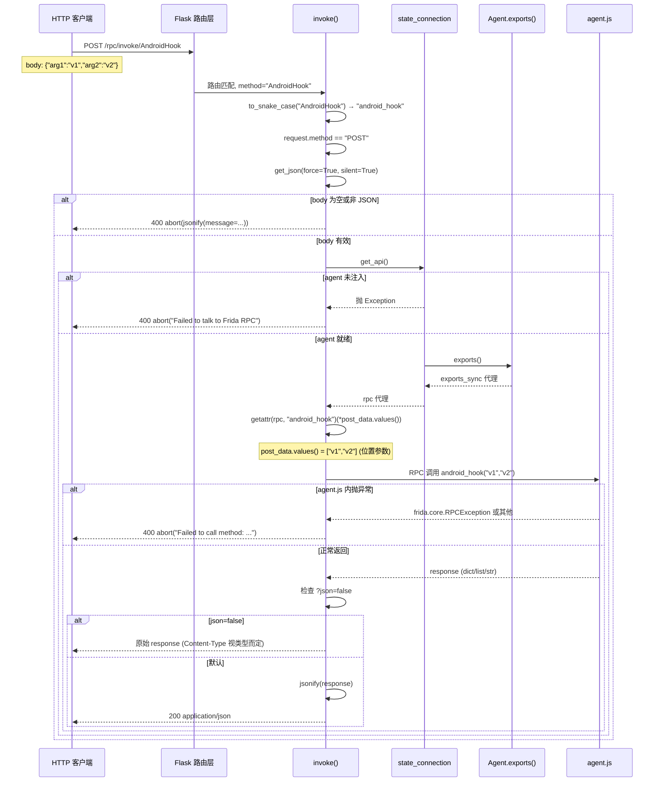
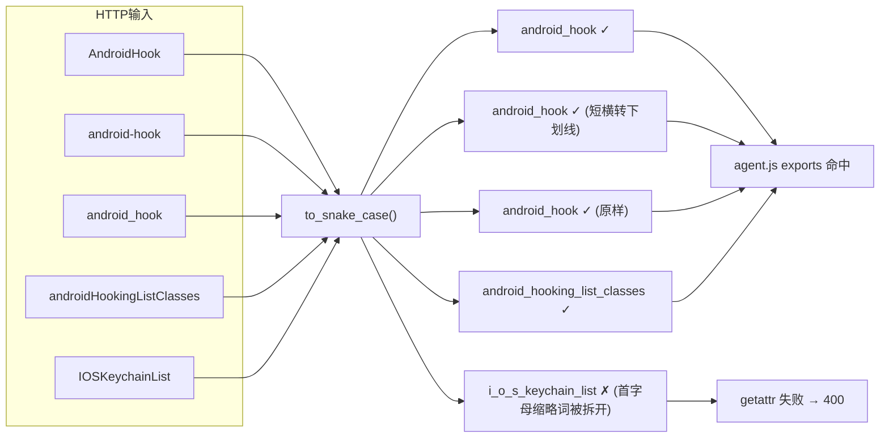

# RPC 桥接端点 <code>objection/api/rpc.py</code>

把 HTTP 请求桥接到 Frida agent 的 RPC exports。`GET/POST /rpc/invoke/<method>` 取出 agent 的 RPC 对象，按方法名 `getattr` 调用，结果 JSON 序列化返回。这是「直接驱动 Frida RPC」的低层端点，与 `agent_endpoints` 的「命令层」端点互补。

## 📋 模块概览
| 项目 | 值 |
| --- | --- |
| 文件路径 | `objection/api/rpc.py` |
| 类型 | API 端点（Flask Blueprint） |
| 被谁调用 | `objection/api/app.py` 的 `create_app()` 注册到 `/rpc` 前缀 |
| 依赖 | `flask.Blueprint`/`jsonify`/`request`/`abort`、`objection.state.connection.state_connection`、`objection.utils.helpers.to_snake_case` |

## 🎯 解决的问题
- **HTTP 直驱 Frida RPC**：Frida agent 的 `rpc.exports` 暴露了一批方法（如 `android_hooking_list_classes`），本端点让外部 HTTP 客户端能按方法名直接调用，无需经 objection 命令层。
- **GET/POST 双动词**：无参方法用 GET（如 `list classes`），带参方法用 POST（body 是 JSON 数组，作为位置参数）。
- **方法名风格转换**：URL 里用人类可读的驼峰或短横，转 snake_case 后 `getattr`——因为 Frida agent 的 exports 命名是 snake_case。
- **原始响应透传**：某些 RPC 方法返回已是 JSON 字符串或非 dict 结构，`?json=false` 让端点直接返回原始响应不经 `jsonify` 二次包装。

## 🏗️ 核心结构

### `bp` — RPC 蓝图
源码：[`objection/api/rpc.py:6`](https://github.com/android-security-engineer/objection-skills/blob/master/objection/api/rpc.py#L6)

```python
bp = Blueprint('rpc', __name__, url_prefix='/rpc')
```

蓝图名 `rpc`，前缀 `/rpc`。所有本模块路由都挂在 `/rpc/...` 下。

### `invoke` — RPC 方法调用端点
源码：[`objection/api/rpc.py:9`](https://github.com/android-security-engineer/objection-skills/blob/master/objection/api/rpc.py#L9)

```python
@bp.route('/invoke/<string:method>', methods=('GET', 'POST'))
def invoke(method):
    method = to_snake_case(method)

    if request.method == 'POST':
        post_data = request.get_json(force=True, silent=True)
        if not post_data:
            return abort(jsonify(message='POST request without a valid body received'))

    try:
        rpc = state_connection.get_api()
    except Exception as e:
        return abort(jsonify(message='Failed to talk to the Frida RPC: {e}'.format(e=str(e))))

    try:
        if request.method == 'POST':
            response = getattr(rpc, method)(*post_data.values())
        if request.method == 'GET':
            response = getattr(rpc, method)()

        if 'json' in request.args and request.args.get('json').lower() == 'false':
            return response
    except Exception as e:
        return abort(jsonify(message='Failed to call method: {e}'.format(e=str(e))))

    return jsonify(response)
```

流程四步：

1. **方法名转换**：`to_snake_case(method)`——URL 里的 `android-hooking-list-classes` 或 `androidHookingListClasses` 都转成 `android_hooking_list_classes` 匹配 exports。
2. **POST body 校验**：`get_json(force=True, silent=True)` 强制按 JSON 解析、失败返 None；None 则 400。
3. **取 RPC 对象**：`state_connection.get_api()` 拿 agent 的 `rpc.exports` 代理对象。未注入 agent 时抛异常 → 400。
4. **getattr 调用**：POST 用 `post_data.values()` 作位置参数（注意是 dict values，依赖 Python 3.7+ 字典有序）；GET 无参。`?json=false` 透传原始响应；否则 `jsonify` 包装。



## ⚙️ 实现要点
- **`to_snake_case` 统一命名**：Frida agent 的 exports 用 snake_case，但 HTTP 客户端传驼峰或短横更自然。`to_snake_case`（来自 `utils/helpers`）做转换，让 URL 对人类友好且不依赖 agent 端命名细节。
- **`post_data.values()` 依赖字典有序**：POST body 是 JSON 对象（dict），用 `.values()` 作位置参数依赖 Python 3.7+ 字典保序——客户端必须按参数顺序构造 JSON 对象。这与 `agent_endpoints.agent_rpc` 要求 POST body 是 JSON 数组不同，本端点接受对象、那个接受数组。
- **`force=True, silent=True` 的容错**：`force` 忽略 Content-Type 强制按 JSON 解析（客户端可能忘设 header），`silent` 让解析失败返 None 而非抛异常——配合 `if not post_data` 做优雅 400。
- **`?json=false` 透传**：某些 RPC 方法返回的已是字符串或非 JSON 结构，二次 `jsonify` 会把它包成 `{"result": ...}` 或报错。`?json=false` 跳过包装，原样返回——但 Flask 仍会设 Content-Type，客户端需自行处理。
- **异常即 400**：`get_api` 失败（无 agent）和方法调用失败都走 `abort(jsonify(...))`，返回 400 + 错误消息。这与 `agent_endpoints` 的统一 schema（status 字段 + 503/500）不同——本端点是低层、更原始的接口，错误格式朴素。
- **无统一 schema**：与 `agent_endpoints` 的 `{status, command, result, jobs_created, warnings}` 不同，本端点直接 `jsonify(response)` 返回 agent 原始返回值。适合已经熟悉 Frida RPC 返回结构的客户端，不适合需要统一错误处理的 Agent。

## 🔍 源码索引
| 符号 | 位置 |
| --- | --- |
| `bp` | [`objection/api/rpc.py:6`](https://github.com/android-security-engineer/objection-skills/blob/master/objection/api/rpc.py#L6) |
| `invoke` | [`objection/api/rpc.py:9`](https://github.com/android-security-engineer/objection-skills/blob/master/objection/api/rpc.py#L9) |

## 🔁 HTTP→RPC 桥接完整时序

下图刻画一次 POST `/rpc/invoke/AndroidHook` 的完整调用时序，从 Flask 路由匹配到 agent.js 执行并返回，覆盖正常路径与两类异常路径。



时序关键点：

- **三层异常捕获点**：第一层在 `get_json` 后校验 body（[`rpc.py:29-30`](https://github.com/android-security-engineer/objection-skills/blob/master/objection/api/rpc.py#L29)），返回 400；第二层在 `get_api()` 外包 try（[`rpc.py:32-37`](https://github.com/android-security-engineer/objection-skills/blob/master/objection/api/rpc.py#L32)），agent 未注入时返回 400；第三层在 `getattr` 调用外包 try（[`rpc.py:39-52`](https://github.com/android-security-engineer/objection-skills/blob/master/objection/api/rpc.py#L39)），方法不存在或 agent.js 抛异常时返回 400。三层都走 `abort(jsonify(...))`，错误格式统一为 `{"message": "..."}`。
- **GET 与 POST 的参数语义分歧**：GET 完全无参（`getattr(rpc, method)()`，[`rpc.py:46`](https://github.com/android-security-engineer/objection-skills/blob/master/objection/api/rpc.py#L46)），POST 用 `post_data.values()` 作位置参数（[`rpc.py:43`](https://github.com/android-security-engineer/objection-skills/blob/master/objection/api/rpc.py#L43)）。这意味着无参方法可用 GET 轻量调用，但带参方法必须 POST 且 body 是 JSON 对象（非数组）。
- **`json=false` 的提前返回**：`if 'json' in request.args and request.args.get('json').lower() == 'false'` 在 try 块内 `return response`（[`rpc.py:48-49`](https://github.com/android-security-engineer/objection-skills/blob/master/objection/api/rpc.py#L48)），跳过末尾的 `jsonify`。若 `response` 是字符串，Flask 直接以 `text/html` 返回；若是 dict 但客户端不想被二次包装，则原样返回 dict（Flask 仍会 JSON 序列化）。

## 🔀 方法名风格转换映射

下图展示 `to_snake_case` 对不同输入风格的转换结果，以及哪些能正确命中 agent.js exports。



转换边界情况（基于 [`rpc.py:22`](https://github.com/android-security-engineer/objection-skills/blob/master/objection/api/rpc.py#L22) 与 `to_snake_case` 实现）：

- **短横与下划线等价**：`to_snake_case` 会把短横 `-` 也转成下划线，所以 `android-hook` 与 `android_hook` 都能命中。这让 URL 风格更灵活。
- **PascalCase 正常**：`AndroidHook` → `android_hook`，每个大写字母前插入下划线再小写，符合预期。
- **连续大写被拆开**：`IOSKeychainList` 中 `IOS` 是连续三个大写字母，`to_snake_case` 会在每个大写字母前插入下划线，得到 `i_o_s_keychain_list`——这与 agent.js 实际导出的 `ios_keychain_list` 不匹配，会导致 `getattr` 失败。实际 objection 的 agent.js exports 用的是 `ios_` 前缀（小写），HTTP 客户端应传 `IosKeychainList` 或 `ios-keychain-list` 而非 `IOSKeychainList`。
- **方法不存在无白名单校验**：`getattr(rpc, method)` 对未知方法名不会立即报错——`exports_sync` 代理返回一个可调用对象，调用时才向 agent.js 发起 RPC，agent.js 找不到方法时抛异常被第三层 try 捕获，返回 400 `Failed to call method`。所以"方法名拼写错误"与"agent.js 内部异常"在 HTTP 层无法区分，都返回相同的 400 格式。

## 📐 参数传递与响应包装数据流（ASCII 框图）

下图展示 POST 请求的 JSON body 如何被解构为位置参数，以及响应如何根据 `?json` 参数选择包装路径。

```
POST /rpc/invoke/AndroidHook
body: {"class":"com.foo.Bar","method":"login"}
       (JSON 对象, Python dict)

┌──────────────────────────────────────────────────────────┐
│ invoke() 处理                                             │
│                                                          │
│  1. method = to_snake_case("AndroidHook")                │
│       → "android_hook"                                   │
│                                                          │
│  2. post_data = request.get_json(force=True, silent=True)│
│       → {"class":"com.foo.Bar","method":"login"}         │
│       (force: 忽略 Content-Type 强制 JSON 解析)           │
│       (silent: 解析失败返 None 而非抛异常)                │
│                                                          │
│  3. if not post_data: → 400 (空 body 或解析失败)         │
│                                                          │
│  4. rpc = state_connection.get_api()                     │
│       → exports_sync 代理对象                            │
│                                                          │
│  5. getattr(rpc, "android_hook")(*post_data.values())    │
│       post_data.values() = ["com.foo.Bar","login"]       │
│       (dict_values 转 tuple 作位置参数)                   │
│       ↓                                                  │
│       等价于: rpc.android_hook("com.foo.Bar","login")    │
│       ↓                                                  │
│       agent.js 收到两个位置参数                          │
│                                                          │
│  6. response = <agent.js 返回值>                         │
│       可能为 dict / list / str / None                    │
└──────────────────────────────────────────────────────────┘
                          │
                          ▼
┌──────────────────────────────────────────────────────────┐
│ 响应路径选择                                              │
│                                                          │
│  ?json=false ?                                           │
│  ├── 是 → return response (原始, 不经 jsonify)           │
│  │       若 response 是 str → text/html                  │
│  │       若 response 是 dict → 仍被 Flask 序列化为 JSON  │
│  │                                                        │
│  └── 否 → jsonify(response)                              │
│           → 200 application/json                         │
│           dict → {"k":"v"}                               │
│           list → [1,2,3]                                 │
│           str → "..." (被包成 JSON 字符串)               │
│           None → null                                    │
└──────────────────────────────────────────────────────────┘
```

并发与错误处理细节：

- **`post_data.values()` 顺序依赖**：Python 3.7+ 字典保持插入顺序，`post_data.values()` 的顺序与 JSON body 中键的出现顺序一致。客户端必须按 agent.js 方法签名的参数顺序构造 JSON 对象——例如 `android_hook(class, method)` 要求 body 是 `{"class":"...","method":"..."}` 而非 `{"method":"...","class":"..."}`，否则参数错位。这是该端点最易出错的设计点，因为 JSON 对象的"无序"语义与位置参数的"有序"要求矛盾。`agent_endpoints.agent_rpc` 改用 JSON 数组（`["com.foo.Bar","login"]`）规避了此问题。
- **`force=True` 绕过 Content-Type**：客户端即便不设 `Content-Type: application/json`，`get_json(force=True)` 仍会尝试按 JSON 解析 body。这对 curl 等简易客户端友好，但也意味着发送非 JSON body（如 form-urlencoded）会被误解析为 None（`silent=True` 容错），最终返回 400 `POST request without a valid body`。
- **`abort(jsonify(...))` 的语义**：`abort` 接受一个 Response 对象时直接返回该对象并设状态码。`jsonify(...)` 返回的 Response 默认 200，但 `abort` 会把它转为 400（`abort` 的第一个位置参数若已是 Response，状态码取 `abort` 内部默认或显式指定）。实际 objection 用 `abort(jsonify(message=...))` 返回 400 + JSON body——这是 Flask 的非典型用法（通常 `abort(400)` 配合 `@app.errorhandler`），但能保证错误响应也是 JSON 而非 HTML。
- **无并发保护**：`invoke` 是无状态视图函数，Flask 多线程处理并发请求时每次调用独立的 `get_api()` 与 `getattr`。但 `state_connection` 是全局单例，多个并发 RPC 调用会共享同一个 agent session——Frida 的 RPC 调用本身是线程安全的（内部有锁），但若两个调用操作同一 hook 可能产生竞态。objection 的 HTTP API 默认监听 `127.0.0.1`，并发量低，实际无问题。

## 🔗 相关文档
- [整体架构](/guide/architecture)
- [HTTP API 端点](/guide/agent-http)
- [HTTP 应用入口](/reference/api/app)
- [脚本注入端点](/reference/api/script)
- [面向 Agent 的 HTTP 端点](/reference/api/agent_endpoints)
