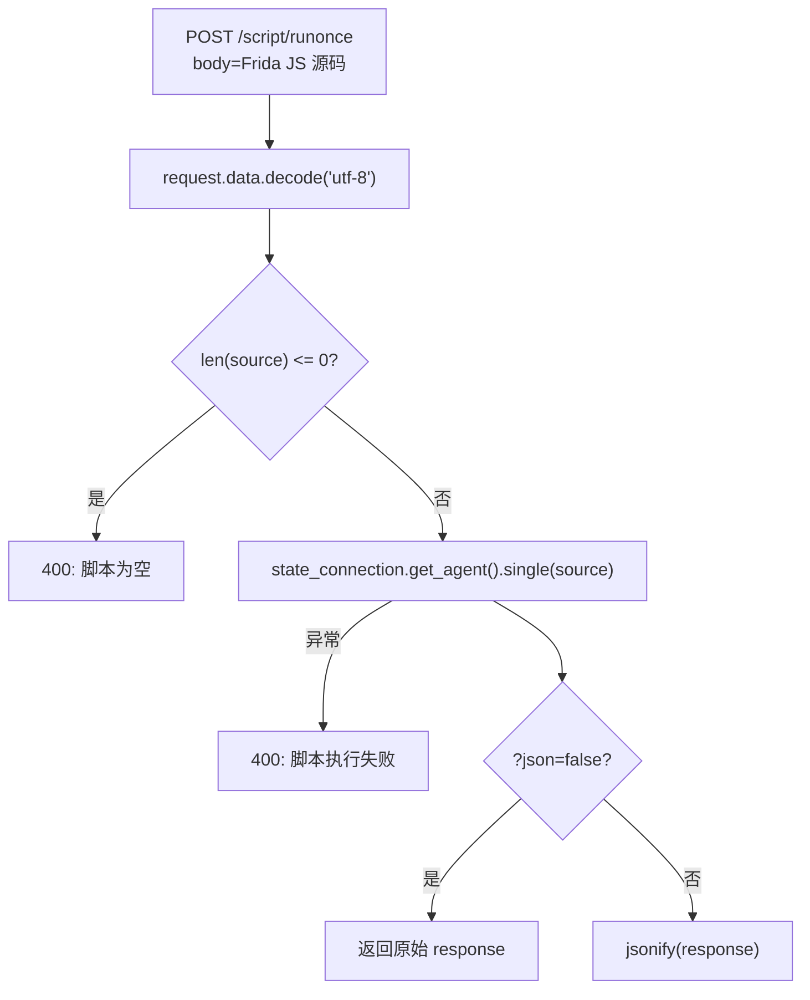

# 脚本注入端点 <code>objection/api/script.py</code>

提供 `POST /script/runonce` 端点，让 HTTP 客户端把任意 Frida 脚本源码投递给 objection 一次性执行。区别于 `rpc.py` 调用已注册的 RPC exports，本端点注入的是**临时脚本**——脚本源码即请求体，跑完即弃。

## 📋 模块概览
| 项目 | 值 |
| --- | --- |
| 文件路径 | `objection/api/script.py` |
| 类型 | API 端点（Flask Blueprint） |
| 被谁调用 | `objection/api/app.py` 的 `create_app()` 注册到 `/script` 前缀 |
| 依赖 | `flask.Blueprint`/`jsonify`/`request`/`abort`、`objection.state.connection.state_connection` |

## 🎯 解决的问题
- **临时脚本执行**：RPC 端点只能调 agent 已暴露的方法，但有时想跑一段未注册的 Frida 脚本（如一次性内存扫描、临时 hook）。本端点接受原始 JS 源码，通过 agent 的 `single()` 一次性注入执行。
- **非侵入**：脚本不在 agent 里持久化，跑完卸载——适合「试一下」的场景，不污染 agent 状态。
- **原始响应透传**：与 rpc 端点一样支持 `?json=false`，让脚本返回的非 JSON 结构直接透传。

## 🏗️ 核心结构

### `bp` — script 蓝图
源码：[`objection/api/script.py:5`](https://github.com/android-security-engineer/objection-skills/blob/master/objection/api/script.py#L5)

```python
bp = Blueprint('script', __name__, url_prefix='/script')
```

蓝图名 `script`，前缀 `/script`。

### `runonce` — 一次性脚本执行端点
源码：[`objection/api/script.py:8`](https://github.com/android-security-engineer/objection-skills/blob/master/objection/api/script.py#L8)

```python
@bp.route('/runonce', methods=('POST',))
def runonce():
    source = request.data.decode('utf-8')

    if len(source) <= 0:
        return abort(jsonify(message='Missing or empty script received'))

    try:
        response = state_connection.get_agent().single(source)

        if 'json' in request.args and request.args.get('json').lower() == 'false':
            return response
    except Exception as e:
        return abort(jsonify(message='Script failed to run: {e}'.format(e=str(e))))

    return jsonify(response)
```

流程：

1. **取脚本源码**：`request.data` 是原始请求体字节流（非 form、非 JSON），`decode('utf-8')` 转字符串。客户端应以 `Content-Type: text/plain` 或 `application/javascript` 直接 POST 脚本源码。
2. **非空校验**：空脚本 400。
3. **一次性执行**：`state_connection.get_agent().single(source)`——agent 的 `single` 方法创建临时脚本、加载、取返回、卸载。
4. **透传或包装**：`?json=false` 返回原始响应，否则 `jsonify`。
5. **异常即 400**：脚本语法错或执行抛异常 → 400 + 错误消息。



## ⚙️ 实现要点
- **`request.data` 而非 `request.json`**：脚本源码是纯文本 JS，不是 JSON。用 `request.data` 拿原始字节，避免客户端被迫把脚本包成 `{"source": "..."}` JSON——降低使用门槛，`curl -d @script.js` 即可。
- **`.single()` 的语义**：agent 的 `single` 方法创建一个临时 `Script` 对象、`load`、等结果、卸载——与持久化的 agent 脚本不同，跑完不留痕。适合一次性探测，不适合需要持续监听消息的 hook（那种应走 `rpc` 端点或插件）。
- **无消息处理器定制**：`single` 内部用 agent 默认的消息处理，脚本 `send()` 的消息走 agent 的 `script_on_message`。Agent 模式下这些消息进事件队列，可被 `/events/poll` 拉取——所以即使 `runonce` 的脚本能产生异步消息，Agent 也能通过事件端点收到。
- **`?json=false` 的用例**：脚本 `rpc.exports` 返回的若是字节流或自定义结构，`jsonify` 会失败或误包装；`?json=false` 透传，由客户端解析。但注意 Flask 默认 Content-Type 仍是 `application/json`，客户端不应依赖 Content-Type 而应按响应体解析。
- **仅 POST**：脚本源码可能很长，GET 的 URL 长度限制不适用，故只接受 POST。
- **无统一 schema**：与 rpc 端点一样，返回 agent 原始结果，不走 `agent_endpoints` 的 `{status, command, result, ...}` 统一 schema。适合低层脚本注入，不适合需要结构化结果的 Agent 流程。

## 🔍 源码索引
| 符号 | 位置 |
| --- | --- |
| `bp` | [`objection/api/script.py:5`](https://github.com/android-security-engineer/objection-skills/blob/master/objection/api/script.py#L5) |
| `runonce` | [`objection/api/script.py:8`](https://github.com/android-security-engineer/objection-skills/blob/master/objection/api/script.py#L8) |

## 🔗 相关文档
- [整体架构](/guide/architecture)
- [HTTP API 端点](/guide/agent-http)
- [HTTP 应用入口](/reference/api/app)
- [RPC 桥接](/reference/api/rpc)
- [面向 Agent 的 HTTP 端点](/reference/api/agent_endpoints)
