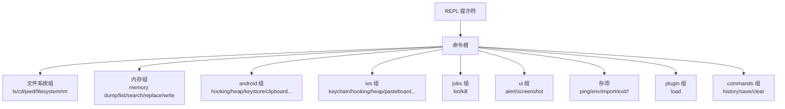

# 📖 命令速查总览

objection 的 REPL 把所有能力组织成一棵**命令树**。这棵树在 `objection/console/commands.py` 的 `COMMANDS` 字典里定义——每个命令的 `meta` 就是一句话说明，`exec` 指向真正执行的 Python 函数。本页把这棵树完整铺开，作为命令的索引总览。

> 想了解某条命令的底层实现？每条命令都链接到对应的 [源码模块文档](/reference/commands/android/clipboard)。

## 🔑 命令树结构



### 命令分发调用栈

下面是 REPL 收到一行命令后，从解析到执行函数的完整调用栈（ASCII 框图）：

```
REPL 输入: "android hooking list classes"
  │
  ▼
┌─────────────────────────────────────────────────────────┐
│ console/repl.py : Repl.run_command(line)                │
│   ├─ tokenize(line) → ["android","hooking","list",...]  │
│   └─ walk COMMANDS tree → 找到 exec 函数                 │
└─────────────────────────────────────────────────────────┘
  │
  ▼
┌─────────────────────────────────────────────────────────┐
│ console/commands.py : COMMANDS['android']['commands']   │
│   ['hooking']['commands']['list']['commands']           │
│   ['classes']['exec'] = hooking.show_android_classes    │
└─────────────────────────────────────────────────────────┘
  │
  ▼
┌─────────────────────────────────────────────────────────┐
│ commands/android/hooking.py : show_android_classes()    │
│   ├─ api = state_connection.get_api()                   │
│   ├─ classes = api.android_hooking_get_classes()  ◀─ RPC│
│   └─ output_result(CommandResult(result=classes))       │
└─────────────────────────────────────────────────────────┘
  │
  ▼  (frida 同步 RPC 通道)
┌─────────────────────────────────────────────────────────┐
│ agent.js (注入目标进程) : rpc.androidHookingGetClasses() │
│   └─ Java.perform(() => Java.enumerateLoadedClasses(...))│
└─────────────────────────────────────────────────────────┘
```

## 🌳 完整命令清单

### 🖥️ 通用与环境

| 命令 | 说明 | 源码 |
| --- | --- | --- |
| `!` | 执行操作系统命令（REPL 内直接 `!ls`） | `console/repl.py` |
| `reconnect` | 重连当前 App | `console/repl.py` |
| `reconnect_spawn` | 重新 spawn 当前 App | `console/repl.py` |
| `resume` | 恢复被附加的进程 | `console/repl.py` |
| `import <path>` | 从全路径加载并运行 frida 脚本 | `commands/frida_commands.py` |
| `ping` | ping 注入的 agent | `commands/frida_commands.py` |
| `env` | 打印环境信息 | `commands/device.py` |
| `frida` | 获取 Frida 环境信息 | `commands/device.py` |
| `evaluate` | 在 agent 内求值 JavaScript | `commands/android/heap.py` |
| `exit` | 退出 | — |

### 📁 文件系统组

| 命令 | 说明 | 源码 |
| --- | --- | --- |
| `ls` | 列出当前目录文件 | `commands/filemanager.py` |
| `cd` | 切换当前工作目录 | `commands/filemanager.py` |
| `pwd` | 打印设备上当前工作目录 | `commands/filemanager.py` |
| `filesystem cat` | 打印文件内容 | `commands/filemanager.py` |
| `filesystem upload` | 上传文件 | `commands/filemanager.py` |
| `filesystem download` | 下载文件或目录 | `commands/filemanager.py` |
| `rm` | 删除远程文件 | `commands/filemanager.py` |

### 🧠 内存组 `memory`

| 命令 | 说明 | 源码 |
| --- | --- | --- |
| `memory dump all` | dump 整个进程内存 | `commands/memory.py` |
| `memory dump from_base` | 从基址 dump N 字节到文件 | `commands/memory.py` |
| `memory list modules` | 列出已加载模块 | `commands/memory.py` |
| `memory list exports` | 列出模块导出 | `commands/memory.py` |
| `memory search` | 在进程内存搜索模式 | `commands/memory.py` |
| `memory replace` | 搜索并替换内存模式 | `commands/memory.py` |
| `memory write` | 向内存地址写原始字节 | `commands/memory.py` |

### 🤖 Android 组 `android`

| 命令 | 说明 | 源码 |
| --- | --- | --- |
| `android deoptimize` | 强制 VM 用解释器执行 | `commands/android/general.py` |
| `android shell_exec` | 执行 shell 命令 | `commands/android/general.py` |
| `android hooking list classes` | 列出已加载类 | `commands/android/hooking.py` |
| `android hooking class_methods` | 列出类的方法 | `commands/android/hooking.py` |
| `android hooking class_loaders` | 列出类加载器 | `commands/android/hooking.py` |
| `android hooking activities` | 列出注册的 Activity | `commands/android/hooking.py` |
| `android hooking receivers` | 列出 BroadcastReceivers | `commands/android/hooking.py` |
| `android hooking services` | 列出 Services | `commands/android/hooking.py` |
| `android hooking watch` | 监听 Java 调用 | `commands/android/hooking.py` |
| `android hooking set return_value` | 设置方法返回值（仅布尔） | `commands/android/hooking.py` |
| `android hooking get current_activity` | 获取前台 Activity | `commands/android/hooking.py` |
| `android hooking search` | 搜索类与方法 | `commands/android/hooking.py` |
| `android hooking notify` | 类可用时通知 | `commands/android/hooking.py` |
| `android hooking generate class` | 通用 hook 管理器 | `commands/android/generate.py` |
| `android hooking generate simple` | 简单 hook | `commands/android/generate.py` |
| `android heap search instances` | 搜索类的活跃实例 | `commands/android/heap.py` |
| `android heap print fields` | 打印实例字段 | `commands/android/heap.py` |
| `android heap print methods` | 打印实例方法 | `commands/android/heap.py` |
| `android heap execute` | 在 Java 句柄上执行方法 | `commands/android/heap.py` |
| `android heap evaluate` | 在 Java 句柄上求值 JS | `commands/android/heap.py` |
| `android keystore list` | 列出 KeyStore 条目 | `commands/android/keystore.py` |
| `android keystore detail` | 列出密钥详情 | `commands/android/keystore.py` |
| `android keystore clear` | 清空 KeyStore | `commands/android/keystore.py` |
| `android keystore watch` | 监控 KeyStore 使用 | `commands/android/keystore.py` |
| `android clipboard monitor` | 监控剪贴板 | `commands/android/clipboard.py` |
| `android intent launch_activity` | 用 Intent 启动 Activity | `commands/android/intents.py` |
| `android intent launch_service` | 用 Intent 启动 Service | `commands/android/intents.py` |
| `android intent implicit_intents` | 分析隐式 Intent | `commands/android/intents.py` |
| `android root disable` | 禁用 root 检测 | `commands/android/root.py` |
| `android root simulate` | 模拟 root 环境 | `commands/android/root.py` |
| `android sslpinning disable` | 禁用 SSL Pinning | `commands/android/pinning.py` |
| `android proxy set` | 设置代理 | `commands/android/proxy.py` |
| `android ui screenshot` | 截图 | `commands/android/general.py` |
| `android ui FLAG_SECURE` | 控制 FLAG_SECURE | `commands/android/general.py` |

### 🍎 iOS 组 `ios`

| 命令 | 说明 | 源码 |
| --- | --- | --- |
| `ios info` | iOS 与 App 信息 | `commands/ios/bundles.py` |
| `ios info binary` | 二进制与 dylib 信息 | `commands/ios/binary.py` |
| `ios keychain dump` | dump keychain | `commands/ios/keychain.py` |
| `ios keychain dump_raw` | dump 原始 keychain | `commands/ios/keychain.py` |
| `ios keychain clear` | 删除所有 keychain 条目 | `commands/ios/keychain.py` |
| `ios keychain remove` | 删除一条 | `commands/ios/keychain.py` |
| `ios keychain update` | 更新一条 | `commands/ios/keychain.py` |
| `ios keychain add` | 添加一条 | `commands/ios/keychain.py` |
| `ios plist cat` | 查看 plist | `commands/ios/plist.py` |
| `ios bundles list_frameworks` | 列出 framework | `commands/ios/bundles.py` |
| `ios bundles list_bundles` | 列出 bundle | `commands/ios/bundles.py` |
| `ios nsuserdefaults get` | 获取所有 NSUserDefaults | `commands/ios/nsuserdefaults.py` |
| `ios nsurlcredentialstorage dump` | dump 凭证 | `commands/ios/nsurlcredentialstorage.py` |
| `ios cookies get` | 获取共享 cookies | `commands/ios/cookies.py` |
| `ios ui alert` | 弹窗 | `commands/ios/userinterface.py` |
| `ios ui dump` | dump 序列化 UI | `commands/ios/userinterface.py` |
| `ios ui screenshot` | 截图 | `commands/ios/userinterface.py` |
| `ios ui biometrics_bypass` | 绕过生物识别 | `commands/ios/userinterface.py` |
| `ios heap print ivars` | 打印实例变量 | `commands/ios/heap.py` |
| `ios heap print methods` | 打印实例方法 | `commands/ios/heap.py` |
| `ios heap search instances` | 搜索活跃实例 | `commands/ios/heap.py` |
| `ios heap execute` | 在对象上执行方法 | `commands/ios/heap.py` |
| `ios heap evaluate` | 在对象上求值 JS | `commands/ios/heap.py` |
| `ios hooking list classes` | 列出类 | `commands/ios/hooking.py` |
| `ios hooking class_methods` | 列出类方法 | `commands/ios/hooking.py` |
| `ios hooking watch` | 监听调用 | `commands/ios/hooking.py` |
| `ios hooking set return_value` | 设置返回值 | `commands/ios/hooking.py` |
| `ios hooking search` | 搜索类与方法 | `commands/ios/hooking.py` |
| `ios hooking generate class` | 通用 hook 管理器 | `commands/ios/generate.py` |
| `ios hooking generate simple` | 简单 hook | `commands/ios/generate.py` |
| `ios pasteboard monitor` | 监控粘贴板 | `commands/ios/pasteboard.py` |
| `ios sslpinning disable` | 禁用 SSL Pinning | `commands/ios/pinning.py` |
| `ios jailbreak disable` | 禁用越狱检测 | `commands/ios/jailbreak.py` |
| `ios jailbreak simulate` | 模拟越狱环境 | `commands/ios/jailbreak.py` |
| `ios monitor crypto` | 监控 CommonCrypto | `commands/ios/monitor.py` |

### 🗃️ 其它命令组

| 命令 | 说明 | 源码 |
| --- | --- | --- |
| `sqlite connect` | 连接 SQLite 数据库 | `commands/sqlite.py` |
| `jobs list` | 列出所有作业 | `commands/jobs.py` |
| `jobs kill` | 终止作业 | `commands/jobs.py` |
| `ui alert` | 显示弹窗（iOS 会崩） | `commands/ui.py` |
| `plugin load` | 加载插件 | `commands/plugin_manager.py` |
| `commands history` | 列出本会话命令 | `commands/command_history.py` |
| `commands save` | 保存命令历史到文件 | `commands/command_history.py` |
| `commands clear` | 清空命令历史 | `commands/command_history.py` |

## 🔗 相关文档

- [REPL 与命令](/guide/repl)
- [快速上手](/guide/quickstart)
- [源码模块文档总览](/reference/) — 按代码模块逐个深入
