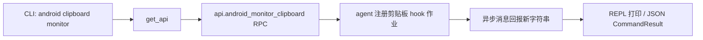

# Android 剪贴板监控 <code>commands/android/clipboard.py</code>

该模块负责在 Android 设备上启动一个后台作业，持续监控剪贴板内容，每当出现新的字符串时通过异步消息回报。它属于 `android clipboard` 命令组，CLI 前缀为 `android clipboard monitor`，是移动端敏感数据泄露测试的常用入口。

## 模块概览

| 项目 | 值 |
| --- | --- |
| 文件路径 | `objection/commands/android/clipboard.py` |
| Agent 实现 | `agent/src/android/clipboard.ts` |
| 命令组 | `android clipboard` |
| 依赖 | `objection.state.connection`、`objection.utils.output` |

## 解决的问题

- 复制粘贴是用户输入密码、验证码、token 的高频路径，剪贴板常被 App 明文读取，需要监控其流转。
- 让安全测试者在动态分析时无需自己写 Frida 脚本，一行命令即可挂上监控。
- 监控以异步作业形式常驻，命中后通过消息通道推送，不阻塞 REPL。

## 📋 命令清单

| 命令 | 函数 | 说明 |
| --- | --- | --- |
| `android clipboard monitor` | `monitor()` | 启动剪贴板监控作业，回报新字符串 |

## ⚙️ 实现原理

Python 层极薄：仅做参数透传与 JSON 模式包装。真正的 hook 逻辑（`ClipboardManager.getPrimaryClip` 等）在 agent TS 侧。Python 通过 `state_connection.get_api()` 拿到 RPC 句柄后调用 `api.android_monitor_clipboard()` 启动作业，不接收同步返回值——新剪贴板字符串以异步消息形式到达。

### `monitor()` — 启动剪贴板监控

源码：[`objection/commands/android/clipboard.py:7`](https://github.com/android-security-engineer/objection-skills/blob/master/objection/commands/android/clipboard.py#L7)

无参数解析（命令本身不带位置参数）。直接调 `api.android_monitor_clipboard()` 在 agent 上注册作业。JSON 模式下返回一个描述动作的 `CommandResult`，并附两条告警：作业 id 未暴露、命中结果以异步消息到达。

```python
# objection/commands/android/clipboard.py:16-27
api = state_connection.get_api()
api.android_monitor_clipboard()

if should_output_json(args):
    return output_result(
        CommandResult(
            result={'action': 'monitoring_clipboard'},
            warnings=['Job id not surfaced; use `agent state` to list running jobs.',
                      'New clipboard strings arrive as async messages.'],
        ),
        command='android clipboard monitor',
    )
return None
```



## JSON 模式行为

`should_output_json(args)` 为真时返回 `CommandResult`，`result` 仅含 `action: 'monitoring_clipboard'`。由于监控结果不在同步返回里，`warnings` 提示调用方：作业 id 需通过 `agent state` 查询、命中数据需轮询异步消息或 HTTP `/events`。非 JSON 模式返回 `None`，输出全靠异步消息驱动。

## 🔍 源码索引

| 符号 | 位置 |
| --- | --- |
| `monitor` | [`objection/commands/android/clipboard.py:7`](https://github.com/android-security-engineer/objection-skills/blob/master/objection/commands/android/clipboard.py#L7) |

## 相关文档

- [RPC 通信机制](/guide/rpc)
- [REPL 与命令](/guide/repl)
