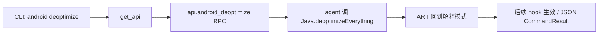

# Android VM 反优化 <code>commands/android/general.py</code>

该模块强制 Android 虚拟机以解释器执行所有方法，阻止 JIT/优化绕过方法 hook。它对应 `android deoptimize` 命令，是当 hook 失效（被内联或编译为原生码）时的兜底手段。

## 模块概览

| 项目 | 值 |
| --- | --- |
| 文件路径 | `objection/commands/android/general.py` |
| Agent 实现 | `agent/src/android/general.ts` |
| 命令组 | `android deoptimize` |
| 依赖 | `objection.state.connection`、`objection.utils.output` |

## 解决的问题

- ART 会把热点方法 JIT 编译甚至内联，导致 Frida 的 `Java.use().method.implementation` hook 被绕过。
- 某些反调试/反 hook 逻辑依赖优化后的原生路径，强制解释执行可让 hook 重新生效。
- 为后续 hooking/heap 操作提供稳定的拦截前提。

## 📋 命令清单

| 命令 | 函数 | 说明 |
| --- | --- |
| `android deoptimize` | `deoptimise()` | 强制 VM 用解释器执行，防优化绕过 hook |

## ⚙️ 实现原理

Python 层只做一件事：取 API 句柄、调 `api.android_deoptimize()`。agent 侧通过 Frida 的 `Java.deoptimizeEverything()`（见 [Frida JS API](https://frida.re/docs/javascript-api/)）让 ART 回到解释模式。

### `deoptimise()` — 强制解释执行

源码：[`objection/commands/android/general.py:7`](https://github.com/android-security-engineer/objection-skills/blob/master/objection/commands/android/general.py#L7)

无参数。直接 RPC 调用，JSON 模式返回 `action: 'deoptimize'`。

```python
# objection/commands/android/general.py:18-26
api = state_connection.get_api()
api.android_deoptimize()

if should_output_json(args):
    return output_result(
        CommandResult(result={'action': 'deoptimize'}),
        command='android deoptimize',
    )
return None
```



## JSON 模式行为

JSON 模式返回 `CommandResult(result={'action': 'deoptimize'})`，无 warnings——该操作是同步生效的 VM 状态切换，无作业残留。非 JSON 模式返回 `None`，agent 侧成功即静默。

## 🔍 源码索引

| 符号 | 位置 |
| --- | --- |
| `deoptimise` | [`objection/commands/android/general.py:7`](https://github.com/android-security-engineer/objection-skills/blob/master/objection/commands/android/general.py#L7) |

## 相关文档

- [RPC 通信机制](/guide/rpc)
- [REPL 与命令](/guide/repl)
