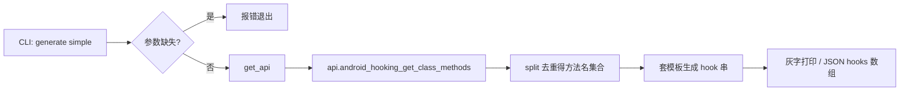

# Android Hook 脚本生成 <code>commands/android/generate.py</code>

该模块为安全测试者生成 Java hook 的 Frida 脚本骨架：一份通用的 Hook Manager 模板，或针对某个类的所有方法批量生成 `implementation` 覆写代码。它对应 `android hooking generate` 命令组，CLI 前缀为 `android hooking generate <class|simple>`。

## 模块概览

| 项目 | 值 |
| --- | --- |
| 文件路径 | `objection/commands/android/generate.py` |
| Agent 实现 | `agent/src/android/hooking.ts`（`simple` 需枚举类方法） |
| 命令组 | `android hooking generate` |
| 依赖 | `objection.state.connection`、`objection.utils.output`、`click`、`os` |

## 解决的问题

- 手写 Frida Java hook 模板重复度高，提供一个可复制即用的起点。
- 针对一个类自动覆盖其全部方法，省去逐个查方法名的功夫。
- 输出可写文件也可走 JSON，便于 agent/CI 集成。

## 📋 命令清单

| 命令 | 函数 | 说明 |
| --- | --- | --- |
| `android hooking generate class` | `clazz()` | 输出通用 Hook Manager 模板源码 |
| `android hooking generate simple <class>` | `simple()` | 为类中每个方法生成 implementation 覆写骨架 |

## ⚙️ 实现原理

`clazz()` 纯本地读取静态资产文件，不碰 RPC；`simple()` 需先经 `api.android_hooking_get_class_methods(classname, False)` 拿到方法列表，再在 Python 里去重、套模板字符串生成 hook 代码。

### `clazz()` — 输出 Hook Manager 模板

源码：[`objection/commands/android/generate.py:10`](https://github.com/android-security-engineer/objection-skills/blob/master/objection/commands/android/generate.py#L10)

读取打包在 `objection/utils/assets/javahookmanager.js` 的模板源码，非 JSON 模式灰字打印；JSON 模式把源码塞进 `CommandResult.result.source`。

```python
# objection/commands/android/generate.py:19-27
js_path = os.path.join(
    os.path.abspath(os.path.dirname(__file__)),
    '../../utils/assets', 'javahookmanager.js'
)
with open(js_path, 'r') as f:
    source = f.read()
    if not should_output_json(args):
        click.secho(source, dim=True)
```

### `simple()` — 批量生成方法 hook

源码：[`objection/commands/android/generate.py:37`](https://github.com/android-security-engineer/objection-skills/blob/master/objection/commands/android/generate.py#L37)

先校验参数（缺类名报错），再 RPC 取方法列表。空列表时报 `no class / methods found`。之后用集合推导式 `set([x.split('(')[0].split('.')[-1] for x in methods])` 去掉重载签名、只留方法名，套用模板生成每段 hook。

```python
# objection/commands/android/generate.py:68-84
unique_methods = set([x.split('(')[0].split('.')[-1] for x in methods])
json_mode = should_output_json(args)

hooks = []
for method in unique_methods:
    hook = """
Java.perform(function() {
    var clazz = Java.use('{clazz}');
    clazz.{method}.implementation = function() {
        //
        return clazz.{method}.apply(this, arguments);
    }
});
""".replace('{clazz}', classname).replace('{method}', method)
```



## JSON 模式行为

- `clazz()`：返回 `result={'source', 'asset': 'javahookmanager.js'}`。
- `simple()`：缺类名或无方法时返回 `status='error'` 的 `CommandResult`；成功返回 `result={'class', 'methods'(排序), 'hooks'(列表)}`。
- `simple()` 在 JSON 模式下仍走 RPC 枚举方法（agent 友好），只是把渲染从控制台改为 JSON 字段。

## 🔍 源码索引

| 符号 | 位置 |
| --- | --- |
| `clazz` | [`objection/commands/android/generate.py:10`](https://github.com/android-security-engineer/objection-skills/blob/master/objection/commands/android/generate.py#L10) |
| `simple` | [`objection/commands/android/generate.py:37`](https://github.com/android-security-engineer/objection-skills/blob/master/objection/commands/android/generate.py#L37) |

## 相关文档

- [Android Hooking（功能详解）](/features/hooking)
- [RPC 通信机制](/guide/rpc)
- [REPL 与命令](/guide/repl)
