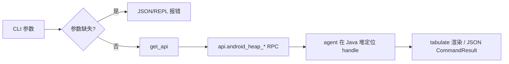

# Android 堆实例操作 <code>commands/android/heap.py</code>

该模块在 Android 应用的 Java 堆里搜索某个类的活实例、查看其实例方法/字段、调用指定方法、或在其上下文执行 JavaScript。它属于 `android heap` 命令组，CLI 前缀为 `android heap <search|print|execute>`，是动态分析时与运行中对象交互的核心工具。

## 模块概览

| 项目 | 值 |
| --- | --- |
| 文件路径 | `objection/commands/android/heap.py` |
| Agent 实现 | `agent/src/android/heap.ts` |
| 命令组 | `android heap` |
| 依赖 | `objection.state.connection`、`objection.utils.output`、`click`、`pprint`、`prompt_toolkit`、`tabulate` |

## 解决的问题

- 静态 hook 需要知道方法签名，但运行时对象常以非公开构造方式存在，直接抓活实例更实际。
- 想读取某个单例的私有字段值或调用其内部方法，无需重新打包 App。
- 在已抓到的实例上下文里跑一段 JS，把 `clazz` 变量绑定到该 handle，灵活探查。

## 📋 命令清单

| 命令 | 函数 | 说明 |
| --- | --- | --- |
| `android heap search instances <class>` | `instances()` | 枚举某类的活实例，输出 hashcode/类名/toString |
| `android heap print methods <hashcode>` | `methods()` | 列出某 handle 上的可用方法 |
| `android heap execute method <hashcode> <method>` | `execute()` | 在 handle 上调用指定方法 |
| `android heap print fields <hashcode>` | `fields()` | 列出 handle 的字段名与值 |
| `android heap execute js <hashcode> [--inline <js>]` | `evaluate()` | 在 handle 上下文执行 JS |

辅助函数（非命令入口）：`_should_ignore_methods_with_arguments()`（行 14）、`_should_return_as_string()`（行 25）。

## ⚙️ 实现原理

每个命令函数遵循同一骨架：校验参数 → `state_connection.get_api()` 取 RPC → 调对应 `api.android_heap_*` → JSON 模式返回 `CommandResult`，否则用 `tabulate`/`pprint`/`click.secho` 渲染。

### `instances()` — 搜索活实例

源码：`objection/commands/android/heap.py:36`

参数取 `args[0]` 作为类名，调 `api.android_heap_get_live_class_instances(target_class)` 返回 list of dict。空列表直接返回 `None`（无输出）；非空用 `tabulate` 渲染 hashcode / classname / tostring 三列。

```python
# objection/commands/android/heap.py:60-61
api = state_connection.get_api()
instance_results = api.android_heap_get_live_class_instances(target_class)
```

### `methods()` — 列实例方法

源码：`objection/commands/android/heap.py:82`

`args[0]` 转 int 作为 handle，调 `api.android_heap_print_methods(target_handle)`。返回的 `method_results` 是 `[类名, [方法...]]` 二元组。`--without-arguments` 标志会用 `filter(lambda x: '()' in x, ...)` 只留无参方法。

```python
# objection/commands/android/heap.py:104-112
target_handle = int(args[0])
api = state_connection.get_api()
method_results = api.android_heap_print_methods(target_handle)

if _should_ignore_methods_with_arguments(args):
    method_results[1] = list(filter(lambda x: '()' in x, method_results[1]))
```

### `execute()` — 调用实例方法

源码：`objection/commands/android/heap.py:131`

取 handle 与方法名，`_should_return_as_string(args)` 控制 `--return-string`，传给 `api.android_heap_execute_handle_method(target_handle, method, as_string)`。结果若为 dict 用 `pprint.pformat`，否则 `str()`。

```python
# objection/commands/android/heap.py:154-159
target_handle = int(args[0])
method = args[1]
api = state_connection.get_api()
exec_results = api.android_heap_execute_handle_method(target_handle, method,
                                                      _should_return_as_string(args))
```

### `fields()` — 列实例字段

源码：`objection/commands/android/heap.py:178`

handle 转 int，调 `api.android_heap_print_fields(target_handle)`，返回 `[{name, value}, ...]`，用 `tabulate` 渲染 Name/Value 两列。

### `evaluate()` — 在 handle 上执行 JS

源码：`objection/commands/android/heap.py:220`

这是模块里唯一有交互式 prompt 的命令。REPL 模式下用 `prompt_toolkit.prompt` 配 `PygmentsLexer(JavascriptLexer)` 多行编辑 JS，`clazz` 变量提示在底栏。**JSON 模式下交互 prompt 不可用**，强制要求 `--inline <js>`，否则报错。

```python
# objection/commands/android/heap.py:245-257
if should_output_json(args):
    if '--inline' not in args:
        return output_result(
            CommandResult(
                result={'error': 'JSON mode requires --inline <js>; interactive prompt unavailable'},
                status='error', exit_code=1,
            ),
            command='android heap execute js',
        )
    args = list(args)
    args.remove('--inline')
    js = ' '.join(args[1:])
```



## JSON 模式行为

- 所有命令缺参数时都返回 `status='error'`、`exit_code=1` 且带 `human_text` 的 `CommandResult`，agent 可据 `error` 字段判断。
- `evaluate()` 在 JSON 模式强制 `--inline`，避免无 tty 时挂死。
- `evaluate()` 的 JS 执行结果由 agent 异步消息回报，`CommandResult.warnings` 提示需轮询 `agent state` 或 HTTP `/events`。

## 🔍 源码索引

| 符号 | 位置 |
| --- | --- |
| `_should_ignore_methods_with_arguments` | `objection/commands/android/heap.py:14` |
| `_should_return_as_string` | `objection/commands/android/heap.py:25` |
| `instances` | `objection/commands/android/heap.py:36` |
| `methods` | `objection/commands/android/heap.py:82` |
| `execute` | `objection/commands/android/heap.py:131` |
| `fields` | `objection/commands/android/heap.py:178` |
| `evaluate` | `objection/commands/android/heap.py:220` |

## 相关文档

- [RPC 通信机制](/guide/rpc)
- [REPL 与命令](/guide/repl)
