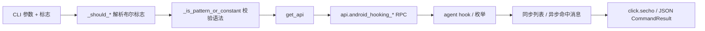

# Android Hooking <code>commands/android/hooking.py</code>

该模块是 objection Android 动态分析的主力：枚举类/方法/组件、按模式 watch 方法调用、设置返回值、懒监听类加载、导出搜索结果。它属于 `android hooking` 命令组，CLI 前缀为 `android hooking <list|watch|search|set|get|generate|notify>`，覆盖了从侦察到主动改写行为的完整链路。

## 模块概览

| 项目 | 值 |
| --- | --- |
| 文件路径 | `objection/commands/android/hooking.py` |
| Agent 实现 | `agent/src/android/hooking.ts` |
| 命令组 | `android hooking` |
| 依赖 | `objection.state.connection`、`objection.utils.output`、`objection.utils.helpers`、`click`、`json` |

## 解决的问题

- 侦察：列出已加载类、ClassLoader、四大组件、当前 Activity，定位攻击面。
- 监听：watch 指定方法调用，可选 dump 参数/返回值/调用栈，追踪数据流。
- 改写：把敏感校验方法的返回值固定为 true/false，绕过登录/校验。
- 懒触发：`notify` 在类尚未加载时埋点，加载即触发，应对动态加载/加固。

## 📋 命令清单

| 命令 | 函数 | 说明 |
| --- | --- | --- |
| `android hooking list classes` | `show_android_classes()` | 列出已加载 Java 类 |
| `android hooking list class_loaders` | `show_android_class_loaders()` | 列出已注册 ClassLoader |
| `android hooking list class_methods <class>` | `show_android_class_methods()` | 列出某类的方法 |
| `android hooking list broadcast_receivers` | `show_registered_broadcast_receivers()` | 列出注册的广播接收器 |
| `android hooking list services` | `show_registered_services()` | 列出注册的 Service |
| `android hooking list activities` | `show_registered_activities()` | 列出注册的 Activity |
| `android hooking get current_activity` | `get_current_activity()` | 获取当前 Activity/Fragment |
| `android hooking watch <pattern> [--dump-args/--dump-backtrace/--dump-return]` | `watch()` | watch 方法调用 |
| `android hooking notify <pattern> [--watch ...]` | `notify()` | 类加载懒监听 |
| `android hooking search <class>!<method> [--json <file>] [--only-classes]` | `search()` | 搜索类与方法（可带 overload） |
| `android hooking set return_value <method> [overload] <true/false>` | `set_method_return_value()` | 固定方法返回值 |

辅助函数：`_is_pattern_or_constant`(11)、`_string_is_true`(33)、`_should_dump_backtrace`(44)、`_should_watch`(55)、`_should_dump_args`(66)、`_should_dump_return_value`(77)、`_should_dump_json`(88)、`_should_be_quiet`(99)、`_should_print_only_classes`(110)、`_get_flag_value`(121)。

## ⚙️ 实现原理

模块定义了一组 `_should_*` 辅助函数解析布尔标志（`--dump-args` 等），命令函数先校验参数与 `CLASS!METHOD` 模式语法，再经 `state_connection.get_api()` 调对应 `api.android_hooking_*` RPC，最后按 JSON 模式分流输出。

### `show_android_classes()` — 列类

源码：`objection/commands/android/hooking.py:144`

无参数，调 `api.android_hooking_get_classes()` 取列表，`sorted()` 后逐行打印并统计数量。注意 Java 类按需加载，未必全在。

```python
# objection/commands/android/hooking.py:153-167
api = state_connection.get_api()
classes = sorted(api.android_hooking_get_classes())
if should_output_json(args):
    return output_result(
        CommandResult(result={'classes': classes, 'count': len(classes)}),
        command='android hooking list classes',
    )
for class_name in classes:
    click.secho(class_name)
click.secho('\nFound {0} classes'.format(len(classes)), bold=True)
```

### `watch()` — watch 方法调用

源码：`objection/commands/android/hooking.py:300`

核心侦察命令。`args[0]` 为模式（`com.example.test!toString` 或类名/通配）。先 `_is_pattern_or_constant()` 校验语法，再调 `api.android_hooking_watch(query, dump_args, dump_backtrace, dump_return)`。命中以异步消息到达。

```python
# objection/commands/android/hooking.py:327-345
query = args[0]
if not _is_pattern_or_constant(query):
    ...
api = state_connection.get_api()
api.android_hooking_watch(query,
                          _should_dump_args(args),
                          _should_dump_backtrace(args),
                          _should_dump_return_value(args))
```

### `search()` — 搜索类与方法

源码：`objection/commands/android/hooking.py:365`

最复杂的命令。调 `api.android_hooking_enumerate(query)` 拿 `[{loader, classes:[{name, methods}]}]`。JSON 模式下会**额外**对每个类调 `api.android_hooking_get_class_methods_overloads(name, methods, loader)` 补全 overload 信息（从 loader 字符串里解析 `$className`）。

```python
# objection/commands/android/hooking.py:404-405
api = state_connection.get_api()
results = api.android_hooking_enumerate(query)
```

`--json <filename>`（由 `_get_flag_value` 取值）走旧路径写文件；全局 JSON 模式走统一 `CommandResult` 到 stdout，并 warn「overloads 拉取较慢」。

### `set_method_return_value()` — 固定返回值

源码：`objection/commands/android/hooking.py:554`

要求至少 2 个位置参数，且最后一个必须是 `true`/`false`。`args[0]` 是全限定方法名（单引号会被替换为双引号以适配重载签名），`args[1]` 可选 overload 过滤串。调 `api.android_hooking_set_method_return(class_name, overload_filter, retval)`。

```python
# objection/commands/android/hooking.py:595-604
class_name = args[0].replace('\'', '"')  # fun!
overload_filter = args[1].replace(' ', '') if len(args) == 3 else None
retval = True if _string_is_true(args[-1]) else False
api = state_connection.get_api()
api.android_hooking_set_method_return(class_name, overload_filter, retval)
```

### `notify()` — 懒监听类加载

源码：`objection/commands/android/hooking.py:235`

针对动态加载场景：类还没出现时，`api.android_hooking_lazy_watch_for_pattern(query, should_watch, dump_arguments, dump_return, dump_backtrace)` 在 agent 侧埋点，类一加载即触发 watch。

### `get_current_activity()` — 取当前 Activity

源码：`objection/commands/android/hooking.py:533`

调 `api.android_hooking_get_current_activity()` 返回 `{activity, fragment}` dict，分别打印。



## JSON 模式行为

- 所有 `list *` 命令返回 `{<key>: [...], count: N}` 结构，agent 易解析。
- `watch`/`notify`/`set return_value` 因作业异步，`CommandResult.warnings` 提示作业 id 需经 `agent state` 查、命中走异步消息或 HTTP `/events`。
- `search` 区分 `--json <file>`（写文件，返回 `dumped_to`）与全局 JSON 模式（返回 `results` 数组到 stdout）。
- 缺参数一律返回 `status='error'`、`exit_code=1` 且含 `human_text`。

## 🔍 源码索引

| 符号 | 位置 |
| --- | --- |
| `_is_pattern_or_constant` | `objection/commands/android/hooking.py:11` |
| `_string_is_true` | `objection/commands/android/hooking.py:33` |
| `_should_dump_backtrace` | `objection/commands/android/hooking.py:44` |
| `_should_watch` | `objection/commands/android/hooking.py:55` |
| `_should_dump_args` | `objection/commands/android/hooking.py:66` |
| `_should_dump_return_value` | `objection/commands/android/hooking.py:77` |
| `_should_dump_json` | `objection/commands/android/hooking.py:88` |
| `_should_be_quiet` | `objection/commands/android/hooking.py:99` |
| `_should_print_only_classes` | `objection/commands/android/hooking.py:110` |
| `_get_flag_value` | `objection/commands/android/hooking.py:121` |
| `show_android_classes` | `objection/commands/android/hooking.py:144` |
| `show_android_class_loaders` | `objection/commands/android/hooking.py:170` |
| `show_android_class_methods` | `objection/commands/android/hooking.py:194` |
| `notify` | `objection/commands/android/hooking.py:235` |
| `watch` | `objection/commands/android/hooking.py:300` |
| `search` | `objection/commands/android/hooking.py:365` |
| `show_registered_broadcast_receivers` | `objection/commands/android/hooking.py:464` |
| `show_registered_services` | `objection/commands/android/hooking.py:487` |
| `show_registered_activities` | `objection/commands/android/hooking.py:510` |
| `get_current_activity` | `objection/commands/android/hooking.py:533` |
| `set_method_return_value` | `objection/commands/android/hooking.py:554` |

## 相关文档

- [Android Hooking（功能详解）](/features/hooking)
- [RPC 通信机制](/guide/rpc)
- [REPL 与命令](/guide/repl)
