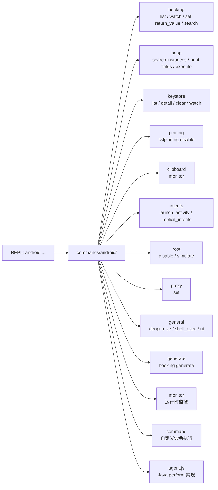

# 🤖 Android 命令模块文档

`objection/commands/android/` 下的每个 Python 文件实现一组 `android ...` REPL 命令。本分区逐文件讲解。

> 这些命令在目标 Android 进程内的实现，见 [agent TS · android](/reference/agent/)。

## 🗺️ 模块地图

## 📂 文件清单

| 文档 | 源码 | 命令组 |
| --- | --- | --- |
| [clipboard](/reference/commands/android/clipboard) | `commands/android/clipboard.py` | `android clipboard` |
| [command](/reference/commands/android/command) | `commands/android/command.py` | `android command` |
| [general](/reference/commands/android/general) | `commands/android/general.py` | `android deoptimize/shell_exec/ui` |
| [generate](/reference/commands/android/generate) | `commands/android/generate.py` | `android hooking generate` |
| [heap](/reference/commands/android/heap) | `commands/android/heap.py` | `android heap` |
| [hooking](/reference/commands/android/hooking) | `commands/android/hooking.py` | `android hooking` |
| [intents](/reference/commands/android/intents) | `commands/android/intents.py` | `android intent` |
| [keystore](/reference/commands/android/keystore) | `commands/android/keystore.py` | `android keystore` |
| [monitor](/reference/commands/android/monitor) | `commands/android/monitor.py` | `android monitor` |
| [pinning](/reference/commands/android/pinning) | `commands/android/pinning.py` | `android sslpinning` |
| [proxy](/reference/commands/android/proxy) | `commands/android/proxy.py` | `android proxy` |
| [root](/reference/commands/android/root) | `commands/android/root.py` | `android root` |

## 🔗 相关文档

- [命令速查总览](/reference/cli/)
- [Android 功能详解](/features/android-ssl-pinning)
