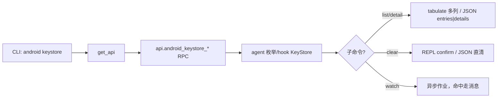

# Android Keystore（源码层） <code>commands/android/keystore.py</code>

该模块是 objection 与 Android KeyStore 交互的 Python 入口，提供四个能力：列出条目、查详情、清空、监听使用。它属于 `android keystore` 命令组，CLI 前缀为 `android keystore <list|detail|clear|watch>`。本文档聚焦源码层面逐函数讲解，与[功能版详解](/features/android-keystore)互补——后者讲攻击场景与原理，这里讲每个函数的参数、RPC 调用与输出格式。

## 模块概览

| 项目 | 值 |
| --- | --- |
| 文件路径 | `objection/commands/android/keystore.py` |
| Agent 实现 | `agent/src/android/keystore.ts` |
| 命令组 | `android keystore` |
| 依赖 | `objection.state.connection`、`objection.utils.output`、`click`、`tabulate` |

## 解决的问题

- KeyStore 是 App 存密钥/证书的安全仓库，列条目可判断哪些 alias 被使用。
- 详情暴露算法、密钥大小、是否在安全硬件、用途(purposes)等，评估密钥强度与保护级别。
- `clear` 在测试环境重置，`watch` 捕获 `Cipher.init`/`Signature.sign` 等调用时机与参数。

## 📋 命令清单

| 命令 | 函数 | 说明 |
| --- | --- | --- |
| `android keystore list` | `entries()` | 列出 KeyStore 条目（alias/是否key/是否证书） |
| `android keystore detail` | `detail()` | 列出每条目的算法、大小、模式等详情 |
| `android keystore clear` | `clear()` | 清空 KeyStore（JSON 模式跳过确认） |
| `android keystore watch` | `watch()` | 监听 KeyStore 使用，异步回报 |

## ⚙️ 实现原理

四个函数同构：`state_connection.get_api()` 取 RPC 句柄 → 调 `api.android_keystore_*` → JSON 模式返回 `CommandResult`，否则用 `tabulate`/`click.secho` 渲染。真正的 hook 逻辑（`KeyStore`、`KeyProperties`、`Cipher` 等）在 agent TS 侧。

### `entries()` — 列出 KeyStore 条目

源码：[`objection/commands/android/keystore.py:8`](https://github.com/android-security-engineer/objection-skills/blob/master/objection/commands/android/keystore.py#L8)

无位置参数。调 `api.android_keystore_list()` 返回 `[{alias, is_key, is_certificate}, ...]`。JSON 模式返回 `result={'entries': ks, 'count': len(ks)}`；否则用 `tabulate` 渲染 Alias / Key / Certificate 三列。

```python
# objection/commands/android/keystore.py:16-27
api = state_connection.get_api()
ks = api.android_keystore_list()

if should_output_json(args):
    return output_result(
        CommandResult(result={'entries': ks, 'count': len(ks)}),
        command='android keystore list',
    )

output = [[x['alias'], x['is_key'], x['is_certificate']] for x in ks]
click.secho(tabulate(output, headers=['Alias', 'Key', 'Certificate']))
```

### `detail()` — 列出条目详情

源码：[`objection/commands/android/keystore.py:30`](https://github.com/android-security-engineer/objection-skills/blob/master/objection/commands/android/keystore.py#L30)

调 `api.android_keystore_detail()` 返回更丰富的 dict 列表，字段含 `keystoreAlias`、`keyAlgorithm`、`keySize`、`blockModes`、`encryptionPaddings`、`digests`、`keyValidityStart`、`origin`、`purposes`、`signaturePaddings`、`isInsideSecureHardware`。列表型字段用 `','.join` 压成单格，11 列 tabulate。

```python
# objection/commands/android/keystore.py:38-66
api = state_connection.get_api()
ks = api.android_keystore_detail()

if should_output_json(args):
    return output_result(
        CommandResult(result={'details': ks, 'count': len(ks)}),
        command='android keystore detail',
    )

click.secho('Listing details for all items in the Android KeyStore...', dim=True)
output = [[
    x['keystoreAlias'], x['keyAlgorithm'], x['keySize'],
    ','.join(x['blockModes']), ','.join(x['encryptionPaddings']),
    ','.join(x['digests']), x['keyValidityStart'], x['origin'],
    x['purposes'], ','.join(x['signaturePaddings']), x['isInsideSecureHardware'],
] for x in ks]
```

### `clear()` — 清空 KeyStore

源码：[`objection/commands/android/keystore.py:69`](https://github.com/android-security-engineer/objection-skills/blob/master/objection/commands/android/keystore.py#L69)

破坏性操作。**REPL 模式下用 `click.confirm` 二次确认**，输入非 yes 则中止；**JSON 模式跳过确认**（agent 无法回答交互 prompt），直接调 `api.android_keystore_clear()`。

```python
# objection/commands/android/keystore.py:77-83
# JSON 模式下跳过交互确认（Agent 无法回答 confirm）
if not should_output_json(args):
    if not click.confirm('Are you sure you want to clear the Android keystore?'):
        return None

api = state_connection.get_api()
api.android_keystore_clear()
```

### `watch()` — 监听 KeyStore 使用

源码：[`objection/commands/android/keystore.py:93`](https://github.com/android-security-engineer/objection-skills/blob/master/objection/commands/android/keystore.py#L93)

无参数。调 `api.android_keystore_watch()` 注册异步作业，hook `Cipher.init`/`Signature`/`Mac` 等 KeyStore 相关调用。命中数据通过异步消息到达，`CommandResult.warnings` 提示作业 id 需经 `agent state` 查询。

```python
# objection/commands/android/keystore.py:101-110
api = state_connection.get_api()
api.android_keystore_watch()

if should_output_json(args):
    return output_result(
        CommandResult(
            result={'watching': True},
            warnings=['Job id not surfaced; use `agent state` to list running jobs.'],
        ),
        command='android keystore watch',
    )
```



## JSON 模式行为

- `entries`/`detail`：返回原始 dict 列表与 count，agent 可直接消费。
- `clear`：JSON 模式**跳过 `click.confirm`**——这是源码里特意处理的 agent 友好点（行 77 注释明示），调用方需自知风险。
- `watch`：因异步，`result` 仅 `{'watching': True}`，作业 id 与命中数据需轮询 `agent state` 或 HTTP `/events`。
- 四个函数返回类型注解为 `None`（实际 JSON 模式返回 `CommandResult`），这是历史遗留，不影响行为。

## 🔍 源码索引

| 符号 | 位置 |
| --- | --- |
| `entries` | [`objection/commands/android/keystore.py:8`](https://github.com/android-security-engineer/objection-skills/blob/master/objection/commands/android/keystore.py#L8) |
| `detail` | [`objection/commands/android/keystore.py:30`](https://github.com/android-security-engineer/objection-skills/blob/master/objection/commands/android/keystore.py#L30) |
| `clear` | [`objection/commands/android/keystore.py:69`](https://github.com/android-security-engineer/objection-skills/blob/master/objection/commands/android/keystore.py#L69) |
| `watch` | [`objection/commands/android/keystore.py:93`](https://github.com/android-security-engineer/objection-skills/blob/master/objection/commands/android/keystore.py#L93) |

## 相关文档

- [Android Keystore 监控（功能详解）](/features/android-keystore)
- [RPC 通信机制](/guide/rpc)
- [REPL 与命令](/guide/repl)
