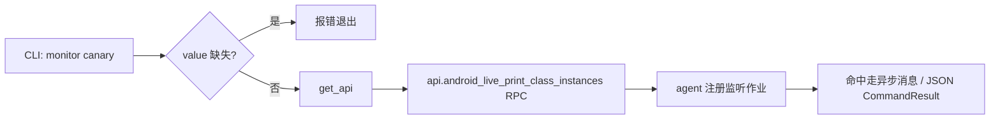

# Android 字符串金丝雀监控 <code>commands/android/monitor.py</code>

该模块在目标进程里埋一个「金丝雀字符串」监听器：当指定字符串在内存中被命中时报警。它属于 `android monitor` 命令组，CLI 前缀为 `android monitor canary`，常用于追踪某个敏感常量（如硬编码密钥、API key）何时被读取到。

## 模块概览

| 项目 | 值 |
| --- | --- |
| 文件路径 | `objection/commands/android/monitor.py` |
| Agent 实现 | `agent/src/android/monitor.ts` |
| 命令组 | `android monitor` |
| 依赖 | `objection.state.connection`、`objection.utils.output`、`click` |

## 解决的问题

- 静态分析发现的硬编码字符串，需确认运行时是否真的被加载/使用。
- 命中时刻能联动其它 hook，定位触发该字符串的代码路径。
- 监听以异步作业常驻，不阻塞 REPL。

## 📋 命令清单

| 命令 | 函数 | 说明 |
| --- | --- | --- |
| `android monitor canary <value> [<filter>]` | `string_canary()` | 监听某字符串金丝雀的命中 |

## ⚙️ 实现原理

`args[0]` 是金丝雀值（变量名 `target_class` 沿用历史命名，实为字符串）。调 `api.android_live_print_class_instances(target_class)` 在 agent 侧注册监听作业，命中通过异步消息回报。

### `string_canary()` — 监听字符串金丝雀

源码：[`objection/commands/android/monitor.py:9`](https://github.com/android-security-engineer/objection-skills/blob/master/objection/commands/android/monitor.py#L9)

无参数报错退出。取 `args[0]` 后直接 RPC。JSON 模式返回 `result={'action': 'monitoring_canary', 'value': ...}`，`warnings` 提示命中走异步消息、作业 id 需经 `agent state` 查。

```python
# objection/commands/android/monitor.py:32-35
target_class = args[0]

api = state_connection.get_api()
api.android_live_print_class_instances(target_class)
```

```python
# objection/commands/android/monitor.py:37-45
if should_output_json(args):
    return output_result(
        CommandResult(
            result={'action': 'monitoring_canary', 'value': target_class},
            warnings=['Canary hits arrive as async messages; poll via `agent state` or HTTP /events.',
                      'Job id not surfaced; use `agent state` to list running jobs.'],
        ),
        command='android monitor canary',
    )
```



## JSON 模式行为

缺 `value` 时返回 `status='error'`、`exit_code=1`、含 `human_text` 的 `CommandResult`。正常时因作业异步，`warnings` 明确告诉 agent：命中数据需轮询 `agent state` 或 HTTP `/events`，作业 id 不在同步返回里。

## 🔍 源码索引

| 符号 | 位置 |
| --- | --- |
| `string_canary` | [`objection/commands/android/monitor.py:9`](https://github.com/android-security-engineer/objection-skills/blob/master/objection/commands/android/monitor.py#L9) |

## 相关文档

- [RPC 通信机制](/guide/rpc)
- [REPL 与命令](/guide/repl)
