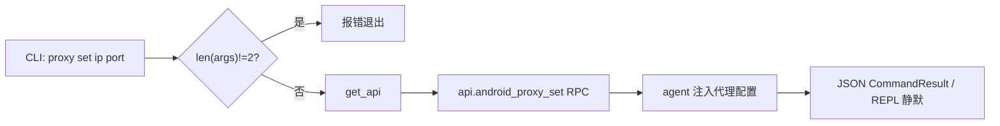

# Android 代理设置 <code>commands/android/proxy.py</code>

该模块在目标 App 进程内设置 HTTP 代理（IP + 端口），常配合 SSL pinning 绕过做流量抓包。它属于 `android proxy` 命令组，CLI 前缀为 `android proxy set`。

## 模块概览

| 项目 | 值 |
| --- | --- |
| 文件路径 | `objection/commands/android/proxy.py` |
| Agent 实现 | `agent/src/android/proxy.ts` |
| 命令组 | `android proxy` |
| 依赖 | `objection.state.connection`、`objection.utils.output`、`click` |

## 解决的问题

- 系统 Wi-Fi 代理对部分 App 无效（App 忽略系统代理或走直连），需在进程内强制设置。
- 抓 HTTPS 流量时，配合 `android sslpinning disable` 形成完整链路。
- 为自动化测试提供结构化 JSON 输出。

## 📋 命令清单

| 命令 | 函数 | 说明 |
| --- | --- | --- |
| `android proxy set <ip> <port>` | `android_proxy_set()` | 在 App 内设置 HTTP 代理 |

## ⚙️ 实现原理

强制要求恰好 2 个位置参数（IP、端口）。校验通过后调 `api.android_proxy_set(args[0], args[1])`，agent 侧 hook 网络栈或 `System.setProperty` 注入代理。

### `android_proxy_set()` — 设置代理

源码：[`objection/commands/android/proxy.py:9`](https://github.com/android-security-engineer/objection-skills/blob/master/objection/commands/android/proxy.py#L9)

`len(args) != 2` 即报错（不限于缺失，多给参数也拒）。JSON 模式缺参返回 `status='error'`、`exit_code=1`、含 `human_text`。成功返回 `result={'action': 'proxy_set', 'host', 'port'}`。

```python
# objection/commands/android/proxy.py:17-32
if len(args) != 2:
    if should_output_json(args):
        return output_result(
            CommandResult(
                result={'error': 'expected <ip address> <port>'},
                status='error',
                human_text='Usage: android proxy set <ip address> <port>',
                exit_code=1,
            ),
            command='android proxy set',
        )
    click.secho('Usage: android proxy set <ip address> <port>', bold=True)
    return None

api = state_connection.get_api()
api.android_proxy_set(args[0], args[1])
```



## JSON 模式行为

参数数量不对时返回带 `error`/`human_text`/`exit_code` 的错误 `CommandResult`，agent 可据 `error` 字段判断。成功时返回 `proxy_set` 动作与 host/port 回显。**注意**：该模块源码本身可用且完整，实际可用性取决于 agent 侧 `android_proxy_set` 的实现是否覆盖目标 App 的网络栈——不同 App 框架（OkHttp/Cronet/原生 socket）支持程度不一，需实测验证。

## 🔍 源码索引

| 符号 | 位置 |
| --- | --- |
| `android_proxy_set` | [`objection/commands/android/proxy.py:9`](https://github.com/android-security-engineer/objection-skills/blob/master/objection/commands/android/proxy.py#L9) |

## 相关文档

- [RPC 通信机制](/guide/rpc)
- [REPL 与命令](/guide/repl)
