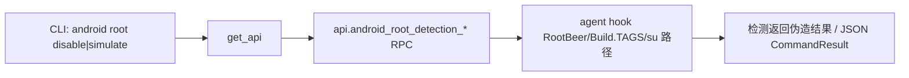

# Android Root 检测对抗 <code>commands/android/root.py</code>

该模块提供两个相反的能力：`disable` hook 掉常见 root 检测逻辑（让 App 在已 root 设备上以为没 root）；`simulate` 反向伪造一个已 root 环境的信号（让 App 在未 root 设备上以为已 root）。它属于 `android root` 命令组，CLI 前缀为 `android root <disable|simulate>`。

## 模块概览

| 项目 | 值 |
| --- | --- |
| 文件路径 | `objection/commands/android/root.py` |
| Agent 实现 | `agent/src/android/root.ts` |
| 命令组 | `android root` |
| 依赖 | `objection.state.connection`、`objection.utils.output` |

## 解决的问题

- root 检测常阻止 App 运行或降级功能，`disable` 让分析在已 root 设备上继续。
- `simulate` 用于测试 App 的 root 检测分支是否正确触发（反向验证防御逻辑）。
- 两者皆以异步作业常驻，hook 后即时生效。

## 📋 命令清单

| 命令 | 函数 | 说明 |
| --- | --- | --- |
| `android root disable` | `disable()` | hook 掉 root 检测，伪造「未 root」 |
| `android root simulate` | `simulate()` | 伪造 root 信号，让 App 以为已 root |

## ⚙️ 实现原理

两函数对称：取 API → 调对应 `api.android_root_detection_*` → JSON 模式返回 `CommandResult`。agent 侧 hook `Build.TAGS`、`/system/bin/su` 探测、`RootBeer` 等检测点。

### `disable()` — 关闭 root 检测

源码：[`objection/commands/android/root.py:5`](https://github.com/android-security-engineer/objection-skills/blob/master/objection/commands/android/root.py#L5)

无参数。调 `api.android_root_detection_disable()`，让检测方法返回「未 root」结果。

```python
# objection/commands/android/root.py:13-14
api = state_connection.get_api()
api.android_root_detection_disable()
```

### `simulate()` — 模拟 root 环境

源码：[`objection/commands/android/root.py:27`](https://github.com/android-security-engineer/objection-skills/blob/master/objection/commands/android/root.py#L27)

无参数。调 `api.android_root_detection_enable()`（注意方法名是 `enable`，对应「启用 root 信号模拟」）。

```python
# objection/commands/android/root.py:35-36
api = state_connection.get_api()
api.android_root_detection_enable()
```

两者 JSON 模式均带 `warnings`，提示作业 id 需经 `agent state` 查询。

```python
# objection/commands/android/root.py:16-23 (disable 的 JSON 输出)
if should_output_json(args):
    return output_result(
        CommandResult(
            result={'action': 'root_detection_disabled'},
            warnings=['Job id not surfaced; use `agent state` to list running jobs.'],
        ),
        command='android root disable',
    )
```



## JSON 模式行为

- `disable` 返回 `result={'action': 'root_detection_disabled'}`。
- `simulate` 返回 `result={'action': 'root_detection_simulated'}`。
- 两者因异步作业，`warnings` 统一提示作业 id 不在同步返回，需 `agent state` 查询。注意 `simulate` 调用的是 `android_root_detection_enable`（命名上 enable 对应「模拟 root 存在」），别被名字误导。

## 🔍 源码索引

| 符号 | 位置 |
| --- | --- |
| `disable` | [`objection/commands/android/root.py:5`](https://github.com/android-security-engineer/objection-skills/blob/master/objection/commands/android/root.py#L5) |
| `simulate` | [`objection/commands/android/root.py:27`](https://github.com/android-security-engineer/objection-skills/blob/master/objection/commands/android/root.py#L27) |

## 相关文档

- [RPC 通信机制](/guide/rpc)
- [REPL 与命令](/guide/repl)
