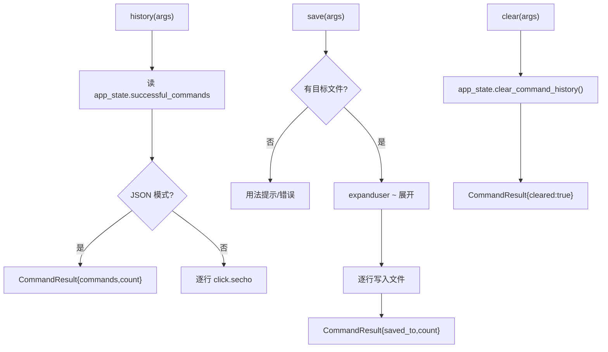
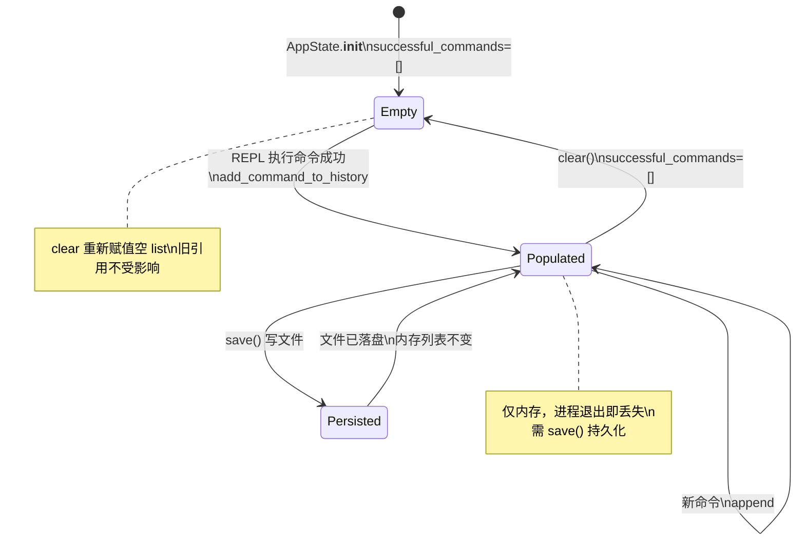

# 命令历史 <code>commands/command_history.py</code>

本模块管理当前 objection REPL 会话中**已成功执行的命令**列表，提供查看、保存到本地文件、清空三种动作。命令组前缀为 `commands ...`。它只读 `app_state.successful_commands` 这一内存状态，不与设备或 Agent 交互。

## 📋 模块概览

| 项目 | 值 |
| --- | --- |
| 文件路径 | `objection/commands/command_history.py` |
| Agent 实现 | 无（纯本地状态） |
| 命令组 | `commands history/save/clear` |
| 依赖 | `os`、`click`、`objection.state.app`、`objection.utils.output` |

## 🎯 解决的问题

- 会话长了想回顾**执行过哪些命令**，而非翻终端 scrollback。
- 把当前会话的命令序列**导出**为脚本文件，供下次复用或交接他人。
- 切换上下文时**清空**历史，避免误读 stale 记录。
- JSON 模式下要把历史作为结构化数据返回，便于 Agent 后处理。

## 📜 命令清单

| 命令 | 函数 | 说明 |
| --- | --- | --- |
| `commands history` | `history()` | 列出当前会话执行过的唯一命令 |
| `commands save <local destination>` | `save()` | 把命令历史写入本地文件 |
| `commands clear` | `clear()` | 清空当前会话命令历史 |

## ⚙️ 实现原理

三个函数都围绕 `app_state.successful_commands`（一个列表）做读/写/清。非 JSON 模式用 `click.secho` 直接打印；JSON 模式用 `output_result(CommandResult(...))` 包一层。`save` 会做 `os.path.expanduser` 展开 `~`，`clear` 委托给 `app_state.clear_command_history()`。

### `history()` — 列出会话命令

源码：[`objection/commands/command_history.py:10`](https://github.com/android-security-engineer/objection-skills/blob/master/objection/commands/command_history.py#L10)

遍历 `app_state.successful_commands` 逐行打印；JSON 模式返回命令列表与计数：

```python
# objection/commands/command_history.py:20-28
for command in app_state.successful_commands:
    click.secho(command)

if should_output_json(args):
    return output_result(
        CommandResult(result={'commands': app_state.successful_commands,
                              'count': len(app_state.successful_commands)}),
        command='commands history',
    )
```

### `save()` — 保存到文件

源码：[`objection/commands/command_history.py:32`](https://github.com/android-security-engineer/objection-skills/blob/master/objection/commands/command_history.py#L32)

无参数时打印用法并（JSON 模式）返回 `missing local destination` 错误。有参数则展开 `~` 后逐行写入：

```python
# objection/commands/command_history.py:49-55
destination = os.path.expanduser(args[0]) if args[0].startswith('~') else args[0]

with open(destination, 'w') as f:
    for command in app_state.successful_commands:
        f.write('{0}\n'.format(command))
```

JSON 模式返回 `{'saved_to': destination, 'count': len(...)}`。

### `clear()` — 清空历史

源码：[`objection/commands/command_history.py:65`](https://github.com/android-security-engineer/objection-skills/blob/master/objection/commands/command_history.py#L65)

委托状态管理器清空，无破坏性确认（仅清内存列表，不影响设备）：

```python
# objection/commands/command_history.py:73-74
app_state.clear_command_history()
click.secho('Command history cleared.', fg='green')
```

JSON 模式返回 `{'cleared': True}`。



## 🔌 JSON 模式行为

- 三个函数都在 `should_output_json(args)` 为真时返回 `CommandResult`，否则返回 `None`。
- `save` 缺参数时 JSON 模式返回 `status='error'`、`{'error': 'missing local destination'}`。
- `history`/`clear` 不校验参数，恒可执行。

## 🔍 源码索引

| 符号 | 位置 |
| --- | --- |
| `history` | [`objection/commands/command_history.py:10`](https://github.com/android-security-engineer/objection-skills/blob/master/objection/commands/command_history.py#L10) |
| `save` | [`objection/commands/command_history.py:32`](https://github.com/android-security-engineer/objection-skills/blob/master/objection/commands/command_history.py#L32) |
| `clear` | [`objection/commands/command_history.py:65`](https://github.com/android-security-engineer/objection-skills/blob/master/objection/commands/command_history.py#L65) |

## 📒 历史记录存储与去重逻辑

`app_state.successful_commands` 是一个 Python `list`，但行为上是**有序去重集合**——`add_command_to_history`（[`objection/state/app.py:11`](https://github.com/android-security-engineer/objection-skills/blob/master/objection/state/app.py#L11)）在 append 前检查 `command not in self.successful_commands`，重复命令不二次加入。因此 `commands history` 显示的是"本次会话执行过的**唯一**命令"，而非完整执行日志。

```
   REPL _execute_command (console/repl.py:172)
   |
   |  exec_method(arguments)  <-- 必须不抛异常
   |       |
   |       v
   |  app_state.add_command_to_history(command=document)
   |       |
   |       v
   +------------------------+
   | successful_commands [] |  (有序去重)
   +------------------------+
   | "env"                  |
   | "cd /data"             |
   | "ls"                   |  (重复 "ls" 不再加入)
   | "memory list modules"  |
   +------------------------+
        |           |          |
        v           v          v
   history()    save()     clear()
   打印         写文件      self.successful_commands = []
                            (重新赋值空 list，非 .clear())
```

记录时机的关键含义：`add_command_to_history` 在 `exec_method(arguments)`（[`objection/console/repl.py:170`](https://github.com/android-security-engineer/objection-skills/blob/master/objection/console/repl.py#L170)）**之后**调用（`:172`）。这意味着：(1) 若 `exec_method` 抛异常，命令不入历史；(2) "成功"的定义是"未抛异常"——命令逻辑返回 `status='error'` 但不抛异常的（如缺参 JSON 模式）**仍会被记录**。Agent 调用走 `output_result` 路径不抛异常，故 JSON 模式的 error 响应也会进历史。

## 🔄 历史记录状态流转

历史记录的三个动作（查看/保存/清空）都是对同一内存列表的读写，无持久化——会话结束后 `app_state` 随进程销毁，历史丢失。`clear` 通过**重新赋值空 list**（`self.successful_commands = []`，[`objection/state/app.py:30`](https://github.com/android-security-engineer/objection-skills/blob/master/objection/state/app.py#L30)）而非 `.clear()`——若外部持有旧 list 的引用，旧引用仍指向原数据（Python list 重新赋值不修改原对象）。这是潜在陷阱，但 objection 内部无此引用泄漏。



`save` 写文件用 `'w'` 模式覆盖（[`objection/commands/command_history.py:51`](https://github.com/android-security-engineer/objection-skills/blob/master/objection/commands/command_history.py#L51)），逐行 `f.write('{0}\n'.format(command))`——每命令一行，含原始参数。这产生的是"命令脚本"格式，可被 `objection --script file` 或逐行粘贴复用。但去重导致脚本**丢失执行次数信息**——若某命令需执行 3 次才能触发竞态，导出脚本只含 1 次。

## 🐛 边界情况与设计细节

- **记录的是原始 document 字符串**：含完整参数（如 `cd /var/mobile/Containers/Data/.../Documents`），不是规范化命令名。导出脚本复用时路径需仍有效。
- **去重基于字符串严格相等**：`ls` 与 `ls `（尾空格）被视为不同命令——REPL 词法差异会产生"看似重复"的历史条目。
- **`save` 的 `~` 展开条件**：`if args[0].startswith('~')`（`:49`）才展开，非 `~` 开头路径原样用。`expanduser` 对 `~/x` 与 `~user/x` 都支持，但 objection 只在 `~` 开头时调用——`./~/x` 这种不触发。
- **`save` 无文件已存在确认**：`'w'` 模式直接覆盖目标文件，不问确认（与 `memory dump` 的覆盖确认不同）。JSON 模式同样直接覆盖。
- **`clear` 无确认**：直接清空，不问"确定?"——与 `rm` 的 `click.confirm` 形成对比。因只清内存不删设备文件，风险低。
- **非 JSON 模式 `history` 恒打印表头**：`click.secho('Unique commands run in current session:', dim=True)`（`:18`）无论列表是否空都打印，空列表时只剩表头一行。
- **`save` 写入失败抛异常**：`open(destination, 'w')` 若路径不可写抛 `PermissionError`，不被捕获——会冒泡到 REPL 顶层处理，但此时 `add_command_to_history` 已在之前执行（`save` 命令本身已入历史）。
- **线程安全**：`app_state.successful_commands` 是普通 list，无锁。REPL 单线程执行命令故无竞态；但 HTTP API 多请求并发时若都触发命令执行，list 的 append 非原子可能丢失条目（理论风险，实际 objection REPL 串行执行）。

## 🔗 相关文档

- [RPC 通信机制](/guide/rpc)
- [REPL 与命令](/guide/repl)
