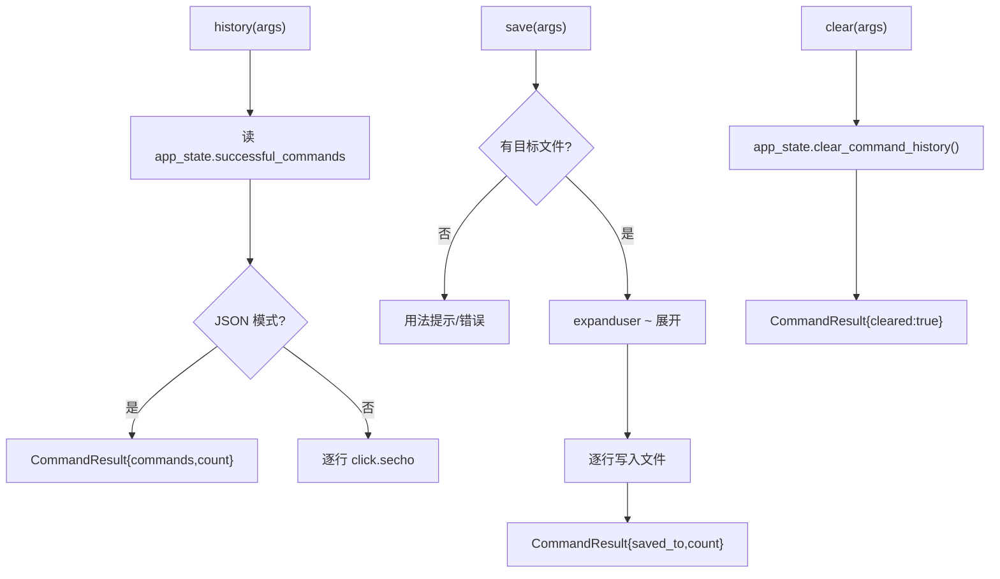

# 命令历史 <code>commands/command_history.py</code>

本模块管理当前 objection REPL 会话中**已成功执行的命令**列表，提供查看、保存到本地文件、清空三种动作。命令组前缀为 `commands ...`。它只读 `app_state.successful_commands` 这一内存状态，不与设备或 Agent 交互。

## 📋 模块概览

| 项目 | 值 |
| --- | --- |
| 文件路径 | `objection/commands/command_history.py` |
| Agent 实现 | 无（纯本地状态） |
| 命令组 | `commands history/save/clear` |
| 依赖 | `os`、`click`、`objection.state.app`、`objection.utils.output` |

## 🎯 解决的问题

- 会话长了想回顾**执行过哪些命令**，而非翻终端 scrollback。
- 把当前会话的命令序列**导出**为脚本文件，供下次复用或交接他人。
- 切换上下文时**清空**历史，避免误读 stale 记录。
- JSON 模式下要把历史作为结构化数据返回，便于 Agent 后处理。

## 📜 命令清单

| 命令 | 函数 | 说明 |
| --- | --- | --- |
| `commands history` | `history()` | 列出当前会话执行过的唯一命令 |
| `commands save <local destination>` | `save()` | 把命令历史写入本地文件 |
| `commands clear` | `clear()` | 清空当前会话命令历史 |

## ⚙️ 实现原理

三个函数都围绕 `app_state.successful_commands`（一个列表）做读/写/清。非 JSON 模式用 `click.secho` 直接打印；JSON 模式用 `output_result(CommandResult(...))` 包一层。`save` 会做 `os.path.expanduser` 展开 `~`，`clear` 委托给 `app_state.clear_command_history()`。

### `history()` — 列出会话命令

源码：`objection/commands/command_history.py:10`

遍历 `app_state.successful_commands` 逐行打印；JSON 模式返回命令列表与计数：

```python
# objection/commands/command_history.py:20-28
for command in app_state.successful_commands:
    click.secho(command)

if should_output_json(args):
    return output_result(
        CommandResult(result={'commands': app_state.successful_commands,
                              'count': len(app_state.successful_commands)}),
        command='commands history',
    )
```

### `save()` — 保存到文件

源码：`objection/commands/command_history.py:32`

无参数时打印用法并（JSON 模式）返回 `missing local destination` 错误。有参数则展开 `~` 后逐行写入：

```python
# objection/commands/command_history.py:49-55
destination = os.path.expanduser(args[0]) if args[0].startswith('~') else args[0]

with open(destination, 'w') as f:
    for command in app_state.successful_commands:
        f.write('{0}\n'.format(command))
```

JSON 模式返回 `{'saved_to': destination, 'count': len(...)}`。

### `clear()` — 清空历史

源码：`objection/commands/command_history.py:65`

委托状态管理器清空，无破坏性确认（仅清内存列表，不影响设备）：

```python
# objection/commands/command_history.py:73-74
app_state.clear_command_history()
click.secho('Command history cleared.', fg='green')
```

JSON 模式返回 `{'cleared': True}`。



## 🔌 JSON 模式行为

- 三个函数都在 `should_output_json(args)` 为真时返回 `CommandResult`，否则返回 `None`。
- `save` 缺参数时 JSON 模式返回 `status='error'`、`{'error': 'missing local destination'}`。
- `history`/`clear` 不校验参数，恒可执行。

## 🔍 源码索引

| 符号 | 位置 |
| --- | --- |
| `history` | `objection/commands/command_history.py:10` |
| `save` | `objection/commands/command_history.py:32` |
| `clear` | `objection/commands/command_history.py:65` |

## 🔗 相关文档

- [RPC 通信机制](/guide/rpc)
- [REPL 与命令](/guide/repl)
