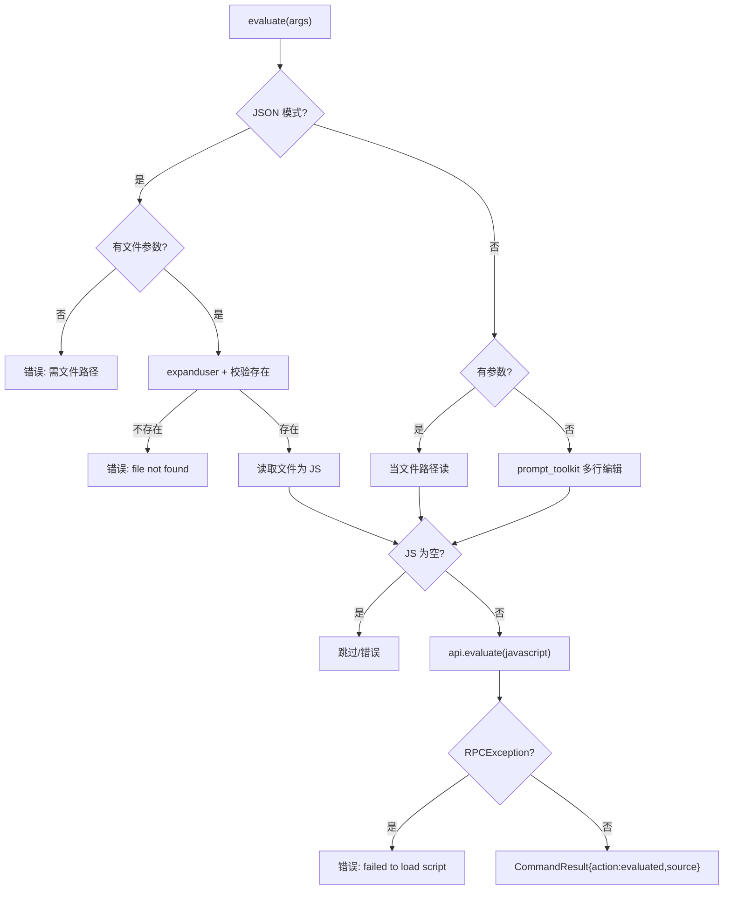

# 自定义脚本求值 <code>commands/custom.py</code>

本模块让用户**在 Agent（Frida 运行时）上下文中执行任意 JavaScript**，是 objection 的「逃生舱」——当内置命令不够用时，直接写 JS 调 Frida API。命令为 `evaluate`。交互模式可用多行编辑器现场输入；JSON/Agent 模式必须给定本地 `.js` 文件路径。

## 📋 模块概览

| 项目 | 值 |
| --- | --- |
| 文件路径 | `objection/commands/custom.py` |
| Agent 实现 | `agent/src/generic/index.ts`（`evaluate` RPC） |
| 命令组 | `evaluate` |
| 依赖 | `os`、`click`、`frida`、`prompt_toolkit`、`pygments`、`objection.state.connection`、`objection.utils.output` |

## 🎯 解决的问题

- 内置命令覆盖不到的场景，需要**直接跑一段 Frida JS**。
- 交互式多行编辑（带 JS 语法高亮），ESC+ENTER 提交。
- Agent 自动化场景下无法用交互 prompt，需从文件读脚本。
- 脚本加载失败（RPC 异常）要给出可读错误而非崩溃。

## 📜 命令清单

| 命令 | 函数 | 说明 |
| --- | --- | --- |
| `evaluate <local js path>` | `evaluate()` | 在 Agent 上下文执行 JS 文件或交互输入 |

## ⚙️ 实现原理

`evaluate` 根据是否 JSON 模式分支取脚本：JSON 模式强制要文件路径并校验存在；交互模式优先把参数当文件，否则开 prompt_toolkit 多行编辑器。拿到 JS 后调 `state_connection.get_api().evaluate(javascript)`，捕获 `frida.core.RPCException`。

### `evaluate()` — 执行 JS

源码：`objection/commands/custom.py:14`

JSON 模式下必须有文件路径，且文件要存在：

```python
# objection/commands/custom.py:25-47
if should_output_json(args):
    if len(args) <= 0:
        return output_result(
            CommandResult(
                result={'error': 'JSON mode requires a file path argument (interactive prompt unavailable)'},
                status='error', human_text='Usage: evaluate <local path to js file>', exit_code=1,
            ), command='evaluate')
    target_file = os.path.expanduser(args[0])
    if not os.path.exists(target_file):
        return output_result(
            CommandResult(result={'error': 'file not found', 'path': target_file},
                          status='error', exit_code=1), command='evaluate')
    with open(target_file, 'r', encoding='utf-8') as f:
        javascript = ''.join(f.readlines())
```

交互模式分支（`objection/commands/custom.py:48-67`）：有参数当文件，找不到报错返回；无参数开 prompt_toolkit 多行编辑器，带 `PygmentsLexer(JavascriptLexer)` 语法高亮与提示工具栏。

空脚本会拦截（`objection/commands/custom.py:68-79`）。实际执行与异常处理：

```python
# objection/commands/custom.py:83-94
state_connection.get_api().evaluate(javascript)
# ...
except frida.core.RPCException as e:
    if should_output_json(args):
        return output_result(
            CommandResult(result={'error': 'failed to load script', 'detail': str(e)},
                          status='error', exit_code=1), command='evaluate')
```

JSON 模式成功返回 `{'action': 'evaluated', 'source': target_file}`，并带 warning：脚本的输出（若有）是 Agent 异步消息，需轮询 `agent state` 或 HTTP `/events`。



## 🔌 JSON 模式行为

- JSON 模式**禁止**交互 prompt，必须有文件路径（`objection/commands/custom.py:25`）。
- 文件不存在返回 `status='error'`、`exit_code=1`。
- 脚本为空同样返回错误（`objection/commands/custom.py:69-77`）。
- 成功时返回 `action='evaluated'`，但**不**包含脚本本身的 stdout——脚本输出走 Agent 异步消息通道。

## 🔍 源码索引

| 符号 | 位置 |
| --- | --- |
| `evaluate` | `objection/commands/custom.py:14` |

## 🔗 相关文档

- [运行时操作命令](/features/runtime-commands)
- [RPC 通信机制](/guide/rpc)
- [REPL 与命令](/guide/repl)
