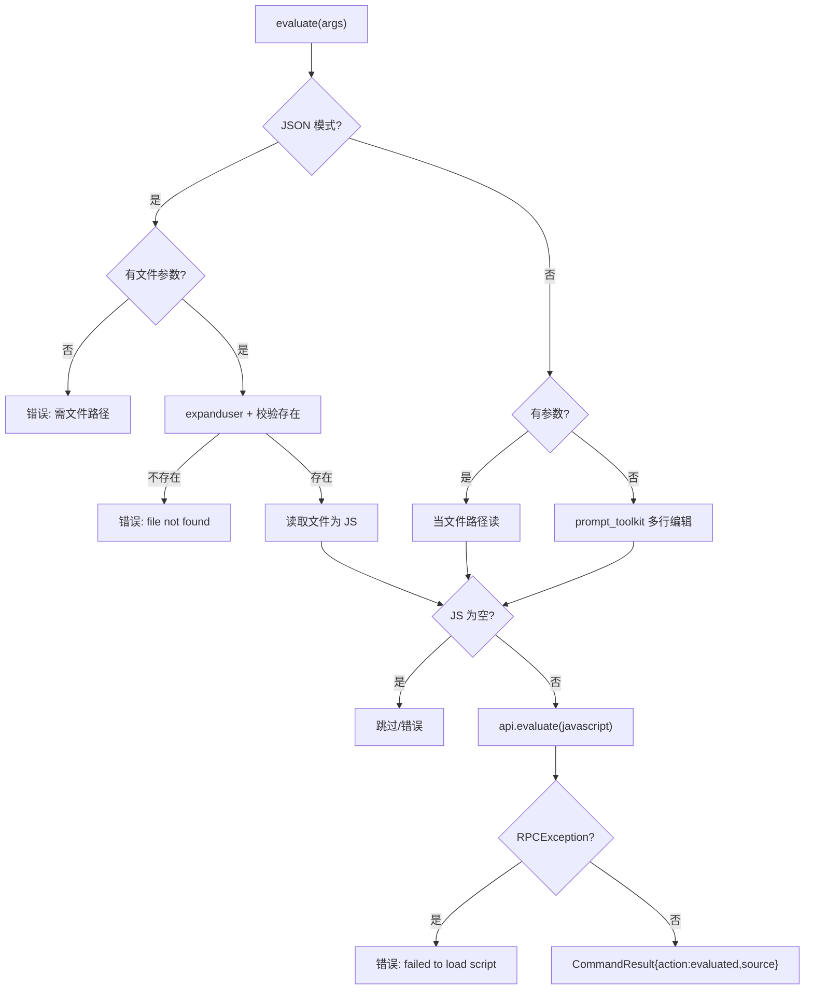

# 自定义脚本求值 <code>commands/custom.py</code>

本模块让用户**在 Agent（Frida 运行时）上下文中执行任意 JavaScript**，是 objection 的「逃生舱」——当内置命令不够用时，直接写 JS 调 Frida API。命令为 `evaluate`。交互模式可用多行编辑器现场输入；JSON/Agent 模式必须给定本地 `.js` 文件路径。

## 📋 模块概览

| 项目 | 值 |
| --- | --- |
| 文件路径 | `objection/commands/custom.py` |
| Agent 实现 | `agent/src/generic/index.ts`（`evaluate` RPC） |
| 命令组 | `evaluate` |
| 依赖 | `os`、`click`、`frida`、`prompt_toolkit`、`pygments`、`objection.state.connection`、`objection.utils.output` |

## 🎯 解决的问题

- 内置命令覆盖不到的场景，需要**直接跑一段 Frida JS**。
- 交互式多行编辑（带 JS 语法高亮），ESC+ENTER 提交。
- Agent 自动化场景下无法用交互 prompt，需从文件读脚本。
- 脚本加载失败（RPC 异常）要给出可读错误而非崩溃。

## 📜 命令清单

| 命令 | 函数 | 说明 |
| --- | --- | --- |
| `evaluate <local js path>` | `evaluate()` | 在 Agent 上下文执行 JS 文件或交互输入 |

## ⚙️ 实现原理

`evaluate` 根据是否 JSON 模式分支取脚本：JSON 模式强制要文件路径并校验存在；交互模式优先把参数当文件，否则开 prompt_toolkit 多行编辑器。拿到 JS 后调 `state_connection.get_api().evaluate(javascript)`，捕获 `frida.core.RPCException`。

### `evaluate()` — 执行 JS

源码：[`objection/commands/custom.py:14`](https://github.com/android-security-engineer/objection-skills/blob/master/objection/commands/custom.py#L14)

JSON 模式下必须有文件路径，且文件要存在：

```python
# objection/commands/custom.py:25-47
if should_output_json(args):
    if len(args) <= 0:
        return output_result(
            CommandResult(
                result={'error': 'JSON mode requires a file path argument (interactive prompt unavailable)'},
                status='error', human_text='Usage: evaluate <local path to js file>', exit_code=1,
            ), command='evaluate')
    target_file = os.path.expanduser(args[0])
    if not os.path.exists(target_file):
        return output_result(
            CommandResult(result={'error': 'file not found', 'path': target_file},
                          status='error', exit_code=1), command='evaluate')
    with open(target_file, 'r', encoding='utf-8') as f:
        javascript = ''.join(f.readlines())
```

交互模式分支（[`objection/commands/custom.py:48-67`](https://github.com/android-security-engineer/objection-skills/blob/master/objection/commands/custom.py#L48)）：有参数当文件，找不到报错返回；无参数开 prompt_toolkit 多行编辑器，带 `PygmentsLexer(JavascriptLexer)` 语法高亮与提示工具栏。

空脚本会拦截（[`objection/commands/custom.py:68-79`](https://github.com/android-security-engineer/objection-skills/blob/master/objection/commands/custom.py#L68)）。实际执行与异常处理：

```python
# objection/commands/custom.py:83-94
state_connection.get_api().evaluate(javascript)
# ...
except frida.core.RPCException as e:
    if should_output_json(args):
        return output_result(
            CommandResult(result={'error': 'failed to load script', 'detail': str(e)},
                          status='error', exit_code=1), command='evaluate')
```

JSON 模式成功返回 `{'action': 'evaluated', 'source': target_file}`，并带 warning：脚本的输出（若有）是 Agent 异步消息，需轮询 `agent state` 或 HTTP `/events`。



## 🔌 JSON 模式行为

- JSON 模式**禁止**交互 prompt，必须有文件路径（[`objection/commands/custom.py:25`](https://github.com/android-security-engineer/objection-skills/blob/master/objection/commands/custom.py#L25)）。
- 文件不存在返回 `status='error'`、`exit_code=1`。
- 脚本为空同样返回错误（[`objection/commands/custom.py:69-77`](https://github.com/android-security-engineer/objection-skills/blob/master/objection/commands/custom.py#L69)）。
- 成功时返回 `action='evaluated'`，但**不**包含脚本本身的 stdout——脚本输出走 Agent 异步消息通道。

## 🔍 源码索引

| 符号 | 位置 |
| --- | --- |
| `evaluate` | [`objection/commands/custom.py:14`](https://github.com/android-security-engineer/objection-skills/blob/master/objection/commands/custom.py#L14) |

## 📝 脚本获取的双模式分支

`evaluate` 的核心设计是"脚本来源分叉"：JSON/Agent 模式强制文件路径（交互 prompt 在无 TTY 的 Agent 环境不可用），交互模式支持多行编辑器现场输入。两条路径最终汇合到 `api.evaluate(javascript)` 同一 RPC 调用，但脚本来源、校验严格度、错误处理都不同。

```mermaid
flowchart TD
    A[evaluate args] --> B{JSON 模式?}
    B -- 是 --> J1{有文件参数?}
    J1 -- 否 --> J2[error: 需文件路径]
    J1 -- 是 --> J3[expanduser 展开 ~]
    J3 --> J4{os.path.exists?}
    J4 -- 否 --> J5[error: file not found]
    J4 -- 是 --> J6[open utf-8 readlines join]

    B -- 否 --> I1{有参数?}
    I1 -- 是 --> I2[expanduser]
    I2 --> I3{exists?}
    I3 -- 否 --> I4[红色提示 + return None]
    I3 -- 是 --> I5[open utf-8 readlines join]
    I1 -- 否 --> I6[prompt_toolkit 多行编辑\nPygmentsLexer JS 高亮\nESC+ENTER 提交]

    J6 --> C{len javascript > 0?}
    I5 --> C
    I6 --> C
    C -- 否 --> C1{JSON?}
    C1 -- 是 --> C2[error: javascript appears empty]
    C1 -- 否 --> C3[黄色提示 + return None]
    C -- 是 --> D[api.evaluate javascript]
    D --> E{RPCException?}
    E -- 是 --> E1{JSON?}
    E1 -- 是 --> E2[error: failed to load script\n+ detail]
    E1 -- 否 --> E3[红色提示 + return None]
    E -- 否 --> F{JSON?}
    F -- 是 --> F1[{action:evaluated, source}\n+ async warning]
    F -- 否 --> F2[静默 return None]
```

关键差异：交互模式文件不存在时 `return None` 不返回 `CommandResult`（`:58`），JSON 模式文件不存在返回结构化 error（`:38-45`）——Agent 调用能拿到 error，REPL 用户只看到红色提示。交互模式的 `prompt_toolkit` 编辑器（`:64-66`）提供 JS 语法高亮与底部工具栏提示"ESC then ENTER to accept"，这是 objection 唯一的多行交互输入入口。

## 🔌 执行上下文与异步输出语义

`api.evaluate(javascript)`（[`objection/commands/custom.py:83`](https://github.com/android-security-engineer/objection-skills/blob/master/objection/commands/custom.py#L83)）把 JS 字符串发给 Agent 端 `evaluate` RPC，在**主 agent 的 Frida session** 上下文中执行——这与 `import`（`frida_commands.load_background`）新建独立 session 不同。脚本与 agent 共享同一个 `Script` 对象的 exports 与 message 通道。

```
   objection 主 agent session (启动时建立)
   +------------------------------------------+
   | agent.js (内置 RPC exports)              |
   |   - env_frida, ping, memory_*, ...      |
   |   - evaluate(javascript)  <-- 本命令     |
   |       |                                   |
   |       v                                   |
   |   script.evaluate 或 动态创建临时 script  |
   |       |                                   |
   |       v                                   |
   |   用户 JS 在 Agent 上下文运行            |
   |     - 可调 Frida API (Process/Module/..) |
   |     - 可调 Java/ObjC 桥                  |
   |     - send(...) 走 message 回调          |
   +------------------------------------------+
                       |
                       v
              handlers.script_on_message
                       |
                       v
              异步消息队列 (/events, agent state)

   注意: api.evaluate 返回值被丢弃 (无赋值)
        脚本结果只能通过 send() 异步拿
```

返回值被丢弃（`:83` 不赋值给变量）——这是设计选择而非疏忽：Frida 的 `evaluate` RPC 若返回大对象会阻塞传输，且 JS 异步逻辑（`setTimeout`/`Promise`）的返回值在同步 RPC 完成时还未就绪。脚本通过 `send(...)` 主动推送结果到 message 通道，objection 的 `script_on_message` 处理器接收后入队，Agent 通过 `agent state` 或 HTTP `/events` 轮询取。warning（`:101`）明确此语义。

`''.join(f.readlines())`（`:47`/`:62`）读文件：`readlines()` 返回行列表（含 `\n`），`join` 拼回完整字符串，等价于 `f.read()`。两处都用 `encoding='utf-8'` 显式指定，避免在不同系统 locale 下误用 GBK 等编码读 JS 文件——但无 `errors` 参数，遇非法 UTF-8 字节仍会 `UnicodeDecodeError`。

## 🐛 边界情况与设计陷阱

- **JSON 模式禁止交互 prompt 是硬约束**：`should_output_json(args)` 在最外层（`:25`），即使 Agent 传了文件路径，只要 JSON 标志开就走文件分支——但若同时无参数，立即返回"requires a file path"错误（`:26-35`），不回退到 prompt。Agent 自动化必须预先把脚本落盘。
- **交互模式 `target_file` 未 expanduser 时直接用**：`:52` `target_file = args[0]`（未展开），`:53` `p = os.path.expanduser(target_file)` 才展开。若文件存在用展开后的 `p`，否则错误提示用未展开的 `target_file`（`:57`）——错误消息可能显示 `~/x.js` 而非展开后的绝对路径，便于用户辨认。
- **空脚本两模式处理不同**：JSON 模式返回 `error: javascript appears empty`（`:72`）；交互模式黄色提示"Skipping"并 `return None`（`:78`）——空脚本不视为错误，因 prompt 中用户可能误按提交。
- **`RPCException` 是唯一捕获的异常**：`except frida.core.RPCException`（`:84`）不捕获 `frida.ProcessNotRespondingError`/`frida.TransportError` 等其他 Frida 异常——这些会冒泡到 REPL 顶层，可能触发重连逻辑。
- **无脚本大小限制**：`javascript` 字符串无长度检查，超大脚本（如内嵌 base64 payload）通过 Frida RPC 传输可能超时或被截断，objection 不预警。
- **`evaluate` 与 `import` 的执行上下文差异**：`evaluate` 在主 agent session 执行，脚本可访问 agent 已建立的 Java/ObjC 桥与 hook 状态；`import` 新建 session，脚本隔离运行。需要与现有 hook 交互的脚本应用 `evaluate`，独立脚本用 `import`。
- **交互模式成功无反馈**：非 JSON 模式成功执行后 `return None`（`:105`），不打印"evaluated successfully"——用户只能从脚本自身的 `console.log`/`send` 输出判断是否成功，与 `frida_environment` 等命令的明确反馈不同。
- **`prompt_toolkit` 依赖外部库**：`prompt`、`PygmentsLexer`、`JavascriptLexer` 三个导入（`:6-8`）在模块加载时即执行，若环境缺 `pygments` 或 `prompt_toolkit`，`import custom` 失败会阻断整个 `evaluate` 命令注册。

## 🔗 相关文档

- [运行时操作命令](/features/runtime-commands)
- [RPC 通信机制](/guide/rpc)
- [REPL 与命令](/guide/repl)
