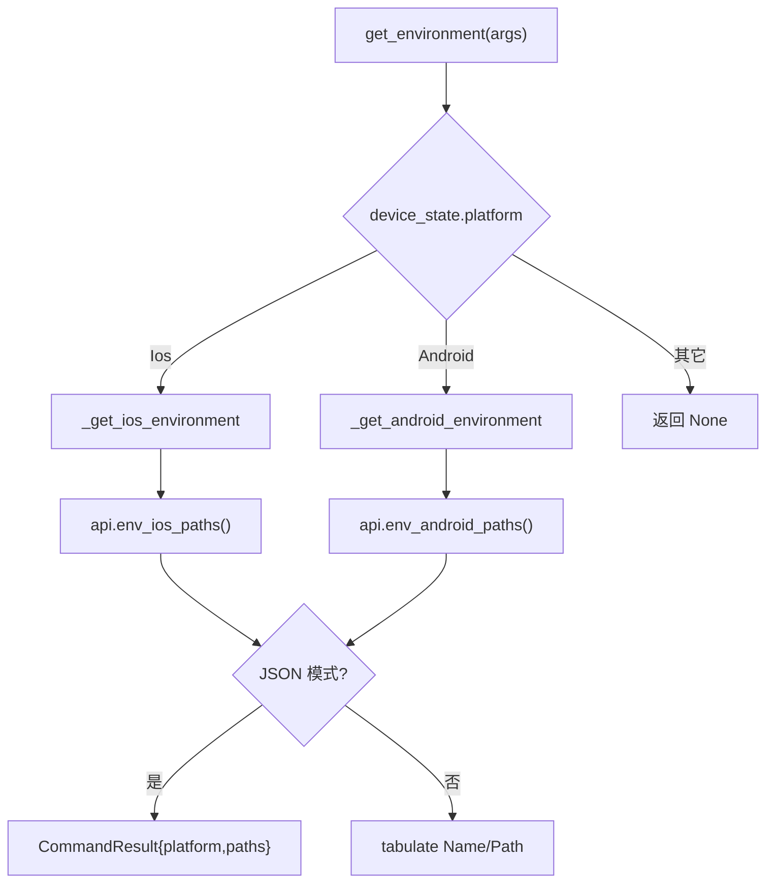

# 设备环境信息 <code>commands/device.py</code>

本模块查询当前注入目标设备的**环境路径**（iOS 的 Documents/Library/bundle，Android 的同等目录），按平台分发到对应 RPC。命令组为 `env`。它是定位文件、规划后续 `filesystem` 操作的起点。

## 📋 模块概览

| 项目 | 值 |
| --- | --- |
| 文件路径 | `objection/commands/device.py` |
| Agent 实现 | `agent/src/ios/filesystem.ts`、`agent/src/android/filesystem.ts`（`env_*_paths`） |
| 命令组 | `env` |
| 依赖 | `click`、`tabulate`、`objection.state.connection`、`objection.state.device`、`objection.utils.output` |

## 🎯 解决的问题

- 不知道当前 App 的 Documents/Library/bundle 目录在哪，无法后续 `cd`。
- iOS 与 Android 路径语义不同，需要平台分发。
- JSON 模式下要把路径作为结构化数据返回。

## 📜 命令清单

| 命令 | 函数 | 说明 |
| --- | --- | --- |
| `env` | `get_environment()` | 按平台查询并打印环境路径 |

## ⚙️ 实现原理

`get_environment` 按 `device_state.platform` 分发到 `_get_ios_environment` 或 `_get_android_environment`。两者结构对称：调 `env_ios_paths()` / `env_android_paths()` 拿到字典，JSON 模式直接返回；非 JSON 用 `tabulate` 渲染 `Name | Path` 两列。

### `get_environment()` — 平台分发

源码：`objection/commands/device.py:10`

```python
# objection/commands/device.py:21-26
if device_state.platform == Ios:
    return _get_ios_environment(args)

if device_state.platform == Android:
    return _get_android_environment(args)
```

未知平台返回 `None`。

### `_get_ios_environment()` — iOS 路径

源码：`objection/commands/device.py:30`

调用 `state_connection.get_api().env_ios_paths()`，返回含 `platform: 'ios'` 与 `paths` 字典的 `CommandResult`；非 JSON 模式用 `tabulate` 表格输出（`objection/commands/device.py:49-50`）。

### `_get_android_environment()` — Android 路径

源码：`objection/commands/device.py:54`

与 iOS 对称，调用 `env_android_paths()`，返回 `platform: 'android'`。



## 🔌 JSON 模式行为

- 两个平台函数都在 JSON 模式返回 `CommandResult`，含 `platform` 与 `paths` 键。
- 非 JSON 模式返回 `None`，仅打印表格。
- 不做参数校验，`args` 可为 `None`。

## 🔍 源码索引

| 符号 | 位置 |
| --- | --- |
| `get_environment` | `objection/commands/device.py:10` |
| `_get_ios_environment` | `objection/commands/device.py:30` |
| `_get_android_environment` | `objection/commands/device.py:54` |

## 🔗 相关文档

- [文件系统](/features/filesystem)
- [RPC 通信机制](/guide/rpc)
- [REPL 与命令](/guide/repl)
