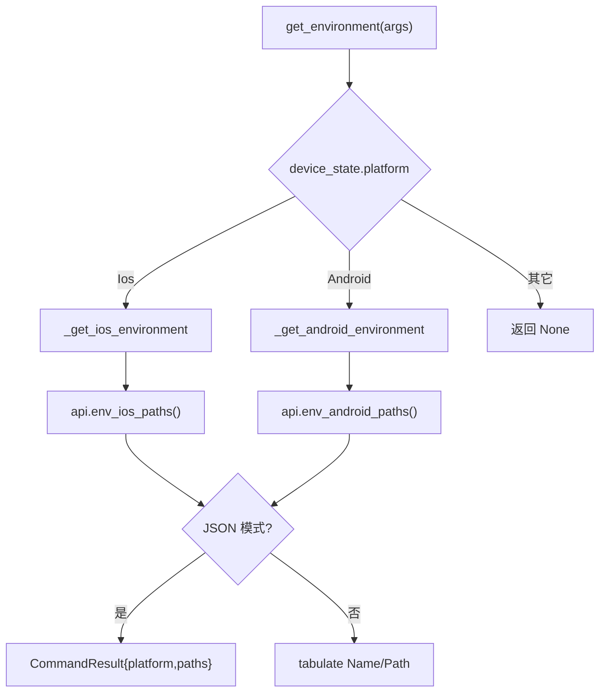
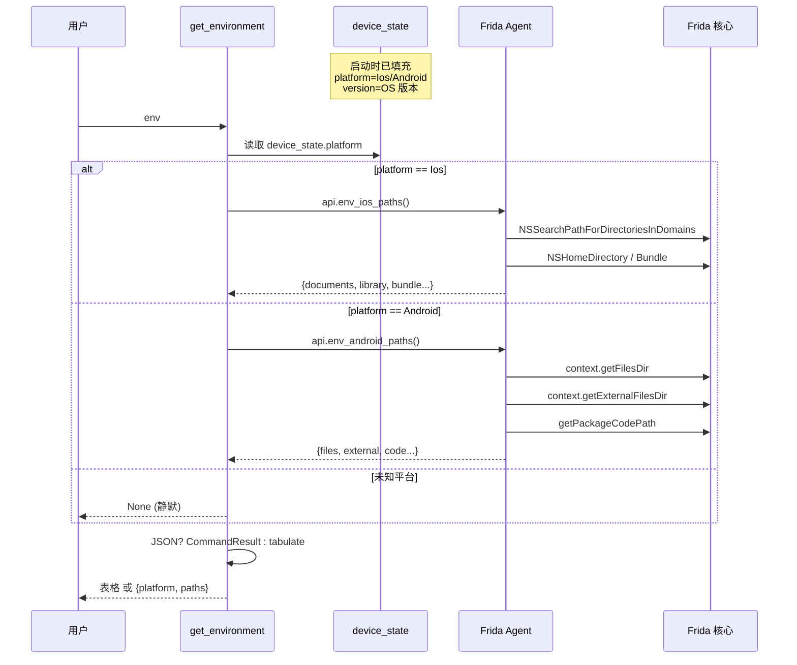

# 设备环境信息 <code>commands/device.py</code>

本模块查询当前注入目标设备的**环境路径**（iOS 的 Documents/Library/bundle，Android 的同等目录），按平台分发到对应 RPC。命令组为 `env`。它是定位文件、规划后续 `filesystem` 操作的起点。

## 📋 模块概览

| 项目 | 值 |
| --- | --- |
| 文件路径 | `objection/commands/device.py` |
| Agent 实现 | `agent/src/ios/filesystem.ts`、`agent/src/android/filesystem.ts`（`env_*_paths`） |
| 命令组 | `env` |
| 依赖 | `click`、`tabulate`、`objection.state.connection`、`objection.state.device`、`objection.utils.output` |

## 🎯 解决的问题

- 不知道当前 App 的 Documents/Library/bundle 目录在哪，无法后续 `cd`。
- iOS 与 Android 路径语义不同，需要平台分发。
- JSON 模式下要把路径作为结构化数据返回。

## 📜 命令清单

| 命令 | 函数 | 说明 |
| --- | --- | --- |
| `env` | `get_environment()` | 按平台查询并打印环境路径 |

## ⚙️ 实现原理

`get_environment` 按 `device_state.platform` 分发到 `_get_ios_environment` 或 `_get_android_environment`。两者结构对称：调 `env_ios_paths()` / `env_android_paths()` 拿到字典，JSON 模式直接返回；非 JSON 用 `tabulate` 渲染 `Name | Path` 两列。

### `get_environment()` — 平台分发

源码：[`objection/commands/device.py:10`](https://github.com/android-security-engineer/objection-skills/blob/master/objection/commands/device.py#L10)

```python
# objection/commands/device.py:21-26
if device_state.platform == Ios:
    return _get_ios_environment(args)

if device_state.platform == Android:
    return _get_android_environment(args)
```

未知平台返回 `None`。

### `_get_ios_environment()` — iOS 路径

源码：[`objection/commands/device.py:30`](https://github.com/android-security-engineer/objection-skills/blob/master/objection/commands/device.py#L30)

调用 `state_connection.get_api().env_ios_paths()`，返回含 `platform: 'ios'` 与 `paths` 字典的 `CommandResult`；非 JSON 模式用 `tabulate` 表格输出（[`objection/commands/device.py:49-50`](https://github.com/android-security-engineer/objection-skills/blob/master/objection/commands/device.py#L49)）。

### `_get_android_environment()` — Android 路径

源码：[`objection/commands/device.py:54`](https://github.com/android-security-engineer/objection-skills/blob/master/objection/commands/device.py#L54)

与 iOS 对称，调用 `env_android_paths()`，返回 `platform: 'android'`。



## 🔌 JSON 模式行为

- 两个平台函数都在 JSON 模式返回 `CommandResult`，含 `platform` 与 `paths` 键。
- 非 JSON 模式返回 `None`，仅打印表格。
- 不做参数校验，`args` 可为 `None`。

## 🔍 源码索引

| 符号 | 位置 |
| --- | --- |
| `get_environment` | [`objection/commands/device.py:10`](https://github.com/android-security-engineer/objection-skills/blob/master/objection/commands/device.py#L10) |
| `_get_ios_environment` | [`objection/commands/device.py:30`](https://github.com/android-security-engineer/objection-skills/blob/master/objection/commands/device.py#L30) |
| `_get_android_environment` | [`objection/commands/device.py:54`](https://github.com/android-security-engineer/objection-skills/blob/master/objection/commands/device.py#L54) |

## 🌐 环境信息采集全景

`env` 命令返回的"环境路径"只是 objection 启动时采集信息的冰山一角。完整的运行时识别链路：Frida 注入后 Agent 端先识别平台（`Process.platform`）回传，Python 侧 `device_state.set_platform()` / `set_version()` 缓存，后续所有命令按此分发。`env` 命令只是把 Agent 端 `env_*_paths` RPC 的结果原样转出。



`device_state`（[`objection/state/device.py:20`](https://github.com/android-security-engineer/objection-skills/blob/master/objection/state/device.py#L20)）只持有 `platform` 与 `version` 两个字段。`Android`/`Ios` 类（`:6`/`:13`）仅含 `name` 与 `path_separator`——两者都为 `'/'`，所以 `device_state.platform.path_separator` 在两平台返回相同值，路径拼接逻辑一致。`Device` 基类用空 `pass`（`:3`），仅作类型标记用 `is` 比较。

## 📁 平台路径布局对照

`env_*_paths` 返回的字典 key 是路径类别名，value 是绝对路径。两平台的 key 集合不同——iOS 围绕 Cocoa 沙盒目录，Android 围绕 Context API 返回的目录。

```
   iOS 沙盒 (/var/mobile/Containers/...)
   +-----------------------------------------------+
   | bundle:    /var/containers/Bundle/.../App.app |
   | documents: .../Application/UUID/Documents      |
   | library:   .../Application/UUID/Library        |
   +-----------------------------------------------+

   Android 沙盒 (/data/data/<pkg> 与 /storage/...)
   +-----------------------------------------------+
   | files:     /data/data/<pkg>/files              |
   | external:  /storage/emulated/0/Android/data/...|
   | code:      /data/app/<pkg>-<hash>/base.apk     |
   +-----------------------------------------------+

   device_state.platform.path_separator = '/'  (两平台相同)
```

路径在 Agent 端由原生 API 计算后原样回传，objection Python 侧不做拼接或规范化。这意味着路径中可能含空格、Unicode（如 App 名含中文），后续 `cd` / `filesystem download` 操作时需作为单个 token 传递——REPL 中用引号包裹，Agent 调用时直接作为字符串参数。

## 🐛 边界情况与设计细节

- **未知平台静默返回 None**：`get_environment` 的 `if Ios / if Android` 链无 `else` 报错（[`objection/commands/device.py:21-27`](https://github.com/android-security-engineer/objection-skills/blob/master/objection/commands/device.py#L21)），未知平台返回 `None`——JSON 模式下 Agent 收到 `null` 而非 error，可能误判成功。这是与 `filemanager.ls`（显式返回 `unknown platform` error）的设计差异。
- **`args` 默认 None**：`get_environment(args=None)` 兼容无参调用（`:10`），`should_output_json(None)` 返回 False，故默认走表格路径。
- **`paths` 字典结构透传**：Python 侧不约定 key 名，Agent 返回什么就转什么——iOS 的 `documents`/`library`/`bundle` 与 Android 的 `files`/`external`/`code` 等 key 完全由 Agent 决定。Agent 实现变更时此命令的输出 key 会随之变。
- **`version` 字段不在此命令暴露**：`device_state.version`（OS 版本）由启动时采集，但 `env` 命令不返回它。要拿版本需通过 frida-ps 或 Agent 其他 RPC。
- **无缓存**：每次 `env` 都发一次 `env_*_paths` RPC，不缓存结果。路径在会话期间通常不变，但 App 重装/迁移后路径会变——不缓存反而是正确的。
- **`tabulate(paths.items())`**（`:50`/`:70`）：直接迭代 dict 的 `items()`，每项 `(key, value)` 作为一行——表格列数固定 2，无需手动构造行。

## 🔗 相关文档

- [文件系统](/features/filesystem)
- [RPC 通信机制](/guide/rpc)
- [REPL 与命令](/guide/repl)
