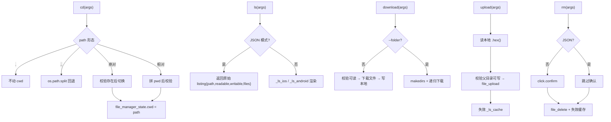

# 文件系统操作 <code>commands/filemanager.py</code>

本模块是 objection 跨平台文件系统的核心，覆盖目录浏览（`ls/cd/pwd`）、上传/下载、删除、查看（`cat`），以及供 REPL tab 补全的短列表辅助函数，共 27 个函数。命令组前缀为 `filesystem ...`、`ls`、`cd`、`pwd`、`rm`。iOS 与 Android 各有一套对称实现，由平台分发。本文为 reference 版逐函数详解。

## 📋 模块概览

| 项目 | 值 |
| --- | --- |
| 文件路径 | `objection/commands/filemanager.py` |
| Agent 实现 | `agent/src/ios/filesystem.ts`、`agent/src/android/filesystem.ts` |
| 命令组 | `ls`、`cd`、`pwd`、`rm`、`filesystem download/upload/cat` |
| 依赖 | `os`、`tempfile`、`time`、`click`、`tabulate`、`objection.state.connection`、`objection.state.device`、`objection.state.filemanager`、`objection.utils.helpers`、`objection.utils.output` |

## 🎯 解决的问题

- 在设备上像本地一样 `ls/cd/pwd`，路径语义跨 iOS/Android。
- 上传/下载文件与目录（目录需 `--folder` 递归）。
- 远程删除文件，带交互确认（JSON 模式跳过）。
- `cat` 远程文件内容到本地终端。
- tab 补全当前目录下的文件/文件夹名。
- 模块级 `_ls_cache` 缓存短列表，加速补全；写操作后自动失效对应缓存。

## 📜 命令清单

| 命令 | 函数 | 说明 |
| --- | --- | --- |
| `cd <dir>` | `cd()` | 切换工作目录（更新本地状态） |
| `pwd` | `pwd_print()` | 打印当前工作目录 |
| `ls [path]` | `ls()` | 列出目录内容 |
| `filesystem download <remote> [local] [--folder]` | `download()` | 下载文件/目录 |
| `filesystem upload <local> [remote]` | `upload()` | 上传本地文件 |
| `rm <file>` | `rm()` | 删除远程文件 |
| `filesystem cat <remote>` | `cat()` | 打印远程文件内容 |

辅助 / 内部函数：

| 函数 | 作用 |
| --- | --- |
| `_should_download_folder` | 检测 `--folder` |
| `path_exists` | 平台分发判断路径是否存在 |
| `_path_exists_ios` / `_path_exists_android` | 各平台实现 |
| `pwd`（内部） | 返回当前 cwd 字符串 |
| `_pwd_ios` / `_pwd_android` | 各平台取 cwd |
| `_ls_ios` / `_ls_android` | 各平台 ls 渲染 |
| `_download_ios` / `_download_android` | 各平台下载 |
| `_upload_ios` / `_upload_android` | 各平台上传 |
| `_rm_ios` / `_rm_android` | 各平台删除 |
| `_get_short_ios_listing` / `_get_short_android_listing` | 短列表（带缓存） |
| `list_folders_in_current_fm_directory` | 补全：当前目录文件夹 |
| `list_files_in_current_fm_directory` | 补全：当前目录文件 |
| `list_content_in_current_fm_directory` | 补全：当前目录全部 |

## ⚙️ 实现原理

模块维护 `file_manager_state.cwd` 作为当前工作目录状态，`_ls_cache` 字典缓存短列表。所有实际操作走 `state_connection.get_api()` 的 `ios_file_*` / `android_file_*` RPC。路径分隔符取 `device_state.platform.path_separator`，相对路径会与 `pwd()` 拼接成绝对路径。

### `cd()` — 切换目录

源码：`objection/commands/filemanager.py:32`

逻辑分四支：`.` 不动（`:66-72`）；`..` 用 `os.path.split` 回退一层，根目录不动（`:77-100`）；绝对路径校验存在后切换（`:104-145`）；相对路径拼 `pwd` 后校验（`:149-199`）。存在性校验走 `_path_exists_ios/android`。JSON 模式返回 `cwd` 与 `changed` 布尔。

### `path_exists()` / `_path_exists_*` — 路径存在性

`path_exists`（`objection/commands/filemanager.py:202`）平台分发；`_path_exists_ios`（`:217`）调 `api.ios_file_exists(path)`；`_path_exists_android`（`:229`）调 `api.android_file_exists(path)`。

### `pwd()` / `pwd_print()` / `_pwd_*` — 工作目录

内部 `pwd`（`objection/commands/filemanager.py:241`）：优先返回 `file_manager_state.cwd`，否则按平台调 `_pwd_ios`（`:283`）/`_pwd_android`（`:300`），两者调 `ios_file_cwd` / `android_file_cwd` 并回写状态。`pwd_print`（`:264`）打印或 JSON 返回 `{cwd}`。

### `ls()` — 列目录

源码：`objection/commands/filemanager.py:317`

无路径用 `pwd()`；相对路径拼 `pwd`。**JSON 模式直接返回原始 listing**（跳过表格渲染，`:335-352`）：

```python
# objection/commands/filemanager.py:335-352
if should_output_json(args):
    api = state_connection.get_api()
    if device_state.platform == Ios:
        data = api.ios_file_ls(path)
    elif device_state.platform == Android:
        data = api.android_file_ls(path)
    ...
    return output_result(
        CommandResult(
            result={'path': path, 'readable': data.get('readable'),
                    'writable': data.get('writable'), 'files': data.get('files')},
        ),
        command='ls',
    )
```

非 JSON 模式分发到 `_ls_ios`（`:364`）/`_ls_android`（`:438`）。

### `_ls_ios()` / `_ls_android()` — 渲染

`_ls_ios`（`objection/commands/filemanager.py:364`）调 `ios_file_ls`，内含两个嵌套 helper（`_get_key_if_exists`、`_humanize_size_if_possible`），用 `tabulate` 渲染十列：`NSFileType/Perms/NSFileProtection/Read/Write/Owner/Group/Size/Creation/Name`（`:406-432`）。`_ls_android`（`:438`）调 `android_file_ls`，嵌套 `_timestamp_to_str` 把毫秒时间戳转 `GMT` 字符串，渲染七列：`Type/Last Modified/Read/Write/Hidden/Size/Name`（`:466-484`）。两者在目录不可读时跳过表格，仅打印可读/可写汇总。

### `download()` — 下载

源码：`objection/commands/filemanager.py:489`

源/目标解析：缺目标时用 `os.path.basename(source)`（`:518-519`）。`_should_download_folder` 决定是否递归目录。平台分发到 `_download_ios`（`:540`）/`_download_android`（`:604`）。JSON 模式返回 `action/source/destination/folder`（`:529-536`）。

### `_download_ios()` / `_download_android()` — 下载实现

两者结构对称（`objection/commands/filemanager.py:540`、`:604`）：相对路径拼 `pwd`；先校验可读（`ios_file_readable`/`android_file_readable`）；若不是文件且未指定 `--folder` 则提示并返回；目录递归时 `os.makedirs` 建本地目录，根节点 `click.confirm` 确认（JSON 模式跳过，`:575`/`:639`），列目录后递归调用自身（`path_root=False`）：

```python
# objection/commands/filemanager.py:580-585
data = api.ios_file_ls(path)
for name, _ in data['files'].items():
    sub_path = device_state.platform.path_separator.join([path, name])
    sub_destination = os.path.join(destination, name)
    _download_ios(sub_path, sub_destination, True, False)
```

文件下载走 `ios_file_download`/`android_file_download`，把 `file_data['data']` 转 bytearray 写本地（`:598-599`/`:661-662`）。

### `upload()` — 上传

源码：`objection/commands/filemanager.py:667`

缺源报错。目标缺省时拼 `pwd + basename(source)`（`:693-694`）。平台分发到 `_upload_ios`（`:712`）/`_upload_android`（`:747`）。JSON 模式返回 `action/source/destination`（`:702-708`）。

### `_upload_ios()` / `_upload_android()` — 上传实现

两者对称（`objection/commands/filemanager.py:712`、`:747`）：目标相对路径拼 `pwd`；校验目标父目录可写（`ios_file_writable`/`android_file_writable`）；本地文件读为 bytes 再 `.hex()` 成字符串发设备：

```python
# objection/commands/filemanager.py:733-737
with open(path, 'rb') as f:
    data = f.read().hex()
...
api.ios_file_upload(destination, data)
```

上传后**失效 `_ls_cache` 对应目录的缓存**（`:743-744`/`:778-779`），保证下次补全看到新文件。

### `rm()` — 删除

源码：`objection/commands/filemanager.py:782`

相对路径拼 `pwd`。**JSON 模式跳过交互确认**（`:810-813`）：

```python
# objection/commands/filemanager.py:810-813
if not should_output_json(args):
    if not click.confirm('Really delete {0} ?'.format(target)):
        click.secho('Not deleting {0}'.format(target), dim=True)
        return None
```

平台分发到 `_rm_ios`（`:855`）/`_rm_android`（`:830`）。JSON 模式返回 `action/target/deleted`。

### `_rm_ios()` / `_rm_android()` — 删除实现

两者对称（`objection/commands/filemanager.py:830`、`:855`）：先 `_path_exists_*` 校验存在；调 `ios_file_delete`/`android_file_delete`；失效 `_ls_cache` 对应目录缓存（`:849-850`/`:874-875`）；返回布尔。

### `cat()` — 查看文件

源码：`objection/commands/filemanager.py:880`

用 `tempfile.mkstemp('.file')` 建临时文件，复用 `_download_ios/android`（`should_download_folder=False`）拉下来。JSON 模式读临时文件内容入 `result.content` 后删除（`:918-925`）；非 JSON 打印内容（`:927-930`）后删除。

### `_get_short_ios_listing()` / `_get_short_android_listing()` — 短列表（带缓存）

`_get_short_ios_listing`（`objection/commands/filemanager.py:936`）：取 `pwd()`，命中 `_ls_cache` 直接返回；否则 `ios_file_ls` 后按 `NSFileType` 标记 `directory`/`file`，存缓存返回（`:952-978`）。`_get_short_android_listing`（`:981`）按 `isDirectory` 标记（`:1010`）。

### `list_folders_in_current_fm_directory()` 等 — 补全辅助

三个函数（`objection/commands/filemanager.py:1019`、`:1053`、`:1087`）结构相同：取短列表，按 type 过滤（folders/files/全部），对含空格的文件名加单引号包裹，返回 `{name: name}` 字典供 REPL tab 补全（`:1044-1048` 等）。



## 🔌 JSON 模式行为

- `cd`：返回 `cwd` 与 `changed` 布尔；根目录时带 `at_root: True`；非法路径返回 `status='error'`。
- `ls`：**直接返回原始 listing**，不做表格渲染——Agent 友好化的关键差异（`:335-352`）。
- `download`：返回 `action/source/destination/folder`；目录递归时**跳过** `click.confirm`（`:575`/`:639`）。
- `upload`：返回 `action/source/destination`。
- `rm`：**跳过** `click.confirm` 直接删除（`:810`）。
- `cat`：把文件内容读入 `result.content` 返回。
- 缺参数的命令在 JSON 模式返回 `status='error'`、`exit_code=1` 与 `human_text` 用法。

## 🔍 源码索引

| 符号 | 位置 |
| --- | --- |
| `_ls_cache` | `objection/commands/filemanager.py:18` |
| `_should_download_folder` | `objection/commands/filemanager.py:21` |
| `cd` | `objection/commands/filemanager.py:32` |
| `path_exists` | `objection/commands/filemanager.py:202` |
| `_path_exists_ios` | `objection/commands/filemanager.py:217` |
| `_path_exists_android` | `objection/commands/filemanager.py:229` |
| `pwd` | `objection/commands/filemanager.py:241` |
| `pwd_print` | `objection/commands/filemanager.py:264` |
| `_pwd_ios` | `objection/commands/filemanager.py:283` |
| `_pwd_android` | `objection/commands/filemanager.py:300` |
| `ls` | `objection/commands/filemanager.py:317` |
| `_ls_ios` | `objection/commands/filemanager.py:364` |
| `_ls_android` | `objection/commands/filemanager.py:438` |
| `download` | `objection/commands/filemanager.py:489` |
| `_download_ios` | `objection/commands/filemanager.py:540` |
| `_download_android` | `objection/commands/filemanager.py:604` |
| `upload` | `objection/commands/filemanager.py:667` |
| `_upload_ios` | `objection/commands/filemanager.py:712` |
| `_upload_android` | `objection/commands/filemanager.py:747` |
| `rm` | `objection/commands/filemanager.py:782` |
| `_rm_android` | `objection/commands/filemanager.py:830` |
| `_rm_ios` | `objection/commands/filemanager.py:855` |
| `cat` | `objection/commands/filemanager.py:880` |
| `_get_short_ios_listing` | `objection/commands/filemanager.py:936` |
| `_get_short_android_listing` | `objection/commands/filemanager.py:981` |
| `list_folders_in_current_fm_directory` | `objection/commands/filemanager.py:1019` |
| `list_files_in_current_fm_directory` | `objection/commands/filemanager.py:1053` |
| `list_content_in_current_fm_directory` | `objection/commands/filemanager.py:1087` |

## 🔗 相关文档

- [文件系统](/features/filesystem)
- [RPC 通信机制](/guide/rpc)
- [REPL 与命令](/guide/repl)
