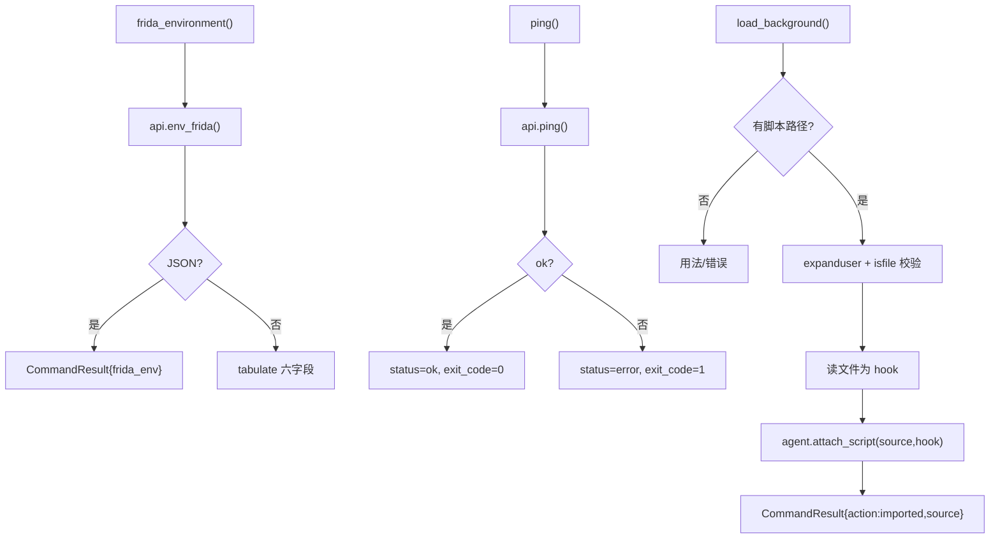

# Frida 环境与脚本导入 <code>commands/frida_commands.py</code>

本模块提供与 Frida 运行时直接相关的三个动作：打印 Frida 环境信息（版本/架构/堆大小）、ping Agent 测连通、把本地 Frida 脚本作为**后台脚本**挂载到 Agent。命令组为 `frida ...` / `import` / `ping`。

## 📋 模块概览

| 项目 | 值 |
| --- | --- |
| 文件路径 | `objection/commands/frida_commands.py` |
| Agent 实现 | `agent/src/generic/index.ts`（`env_frida`/`ping`）、`Frida` agent 的 `attach_script` |
| 命令组 | `frida`、`ping`、`import` |
| 依赖 | `os`、`click`、`tabulate`、`objection.state.connection`、`objection.utils.output`、`objection.utils.helpers` |

## 🎯 解决的问题

- 排查连通性：`ping` 验证 Agent 是否响应。
- 排查版本/架构：`frida` 打印 Frida 版本、进程架构、堆大小等。
- 复用现成 Frida 脚本：`import` 把本地 `.js` 作为后台脚本挂上，输出走异步消息。
- `--no-exception-handler` 标志可在挂脚本时关掉 Agent 异常处理（`_should_disable_exception_handler`，目前仅做检测）。

## 📜 命令清单

| 命令 | 函数 | 说明 |
| --- | --- | --- |
| `frida` | `frida_environment()` | 打印当前 Frida 环境信息 |
| `ping` | `ping()` | 测试 Agent 连通性 |
| `import <local frida-script> [name]` | `load_background()` | 把本地脚本作为后台脚本挂载 |

## ⚙️ 实现原理

三个函数都走 `state_connection.get_api()` 拿 RPC 句柄。`frida_environment` 调 `env_frida()` 拿六字段字典后用 `tabulate` 渲染；`ping` 调 `agent.ping()` 取布尔值；`load_background` 读本地文件内容，调 `state_connection.get_agent().attach_script(source, hook)`。

### `frida_environment()` — Frida 环境

源码：`objection/commands/frida_commands.py:24`

```python
# objection/commands/frida_commands.py:32-47
frida_env = state_connection.get_api().env_frida()
# ...
click.secho(tabulate([
    ('Frida Version', frida_env['version']),
    ('Process Architecture', frida_env['arch']),
    ('Process Platform', frida_env['platform']),
    ('Debugger Attached', frida_env['debugger']),
    ('Script Runtime', frida_env['runtime']),
    ('Frida Heap Size', sizeof_fmt(frida_env['heap']))
]))
```

JSON 模式直接把整个 `frida_env` 字典作为 `result` 返回（`objection/commands/frida_commands.py:34-38`）。

### `ping()` — 连通性测试

源码：`objection/commands/frida_commands.py:51`

```python
# objection/commands/frida_commands.py:59-64
agent = state_connection.get_api()
ok = agent.ping()

if should_output_json(args):
    return output_result(
        CommandResult(result={'ok': bool(ok)}, status='ok' if ok else 'error', exit_code=0 if ok else 1),
        command='ping',
    )
```

按 `ok` 布尔值动态设置 `status` 与 `exit_code`。

### `load_background()` — 后台脚本导入

源码：`objection/commands/frida_commands.py:75`

先用 `clean_argument_flags(args)` 过滤标志判断有无脚本路径（`objection/commands/frida_commands.py:83`），支持 `~` 展开，校验 `os.path.isfile`。读文件后：

```python
# objection/commands/frida_commands.py:121-122
agent = state_connection.get_agent()
agent.attach_script(source, hook)
```

JSON 模式返回 `{'action': 'imported', 'source': source}`，并带 warning：后台脚本输出走异步消息，需轮询 `agent state` 或 HTTP `/events`（`objection/commands/frida_commands.py:124-131`）。



## 🔌 JSON 模式行为

- `frida_environment`：JSON 模式返回原始 `frida_env` 字典，非 JSON 渲染表格。
- `ping`：按布尔结果动态设置 `status`/`exit_code`，是带「失败语义」的命令。
- `load_background`：缺脚本路径或文件不存在均返回 `status='error'`、`exit_code=1`；成功返回 `action='imported'`，脚本输出不在返回值中（异步）。

## 🔍 源码索引

| 符号 | 位置 |
| --- | --- |
| `_should_disable_exception_handler` | `objection/commands/frida_commands.py:12` |
| `frida_environment` | `objection/commands/frida_commands.py:24` |
| `ping` | `objection/commands/frida_commands.py:51` |
| `load_background` | `objection/commands/frida_commands.py:75` |

## 🔗 相关文档

- [运行时操作命令](/features/runtime-commands)
- [RPC 通信机制](/guide/rpc)
- [REPL 与命令](/guide/repl)
