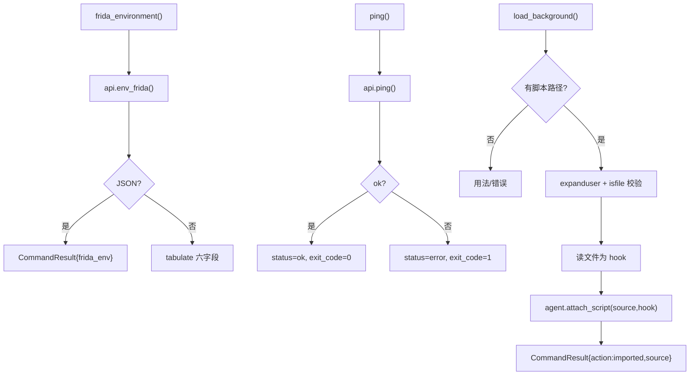
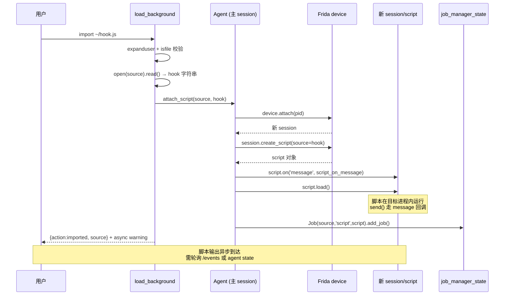

# Frida 环境与脚本导入 <code>commands/frida_commands.py</code>

本模块提供与 Frida 运行时直接相关的三个动作：打印 Frida 环境信息（版本/架构/堆大小）、ping Agent 测连通、把本地 Frida 脚本作为**后台脚本**挂载到 Agent。命令组为 `frida ...` / `import` / `ping`。

## 📋 模块概览

| 项目 | 值 |
| --- | --- |
| 文件路径 | `objection/commands/frida_commands.py` |
| Agent 实现 | `agent/src/generic/index.ts`（`env_frida`/`ping`）、`Frida` agent 的 `attach_script` |
| 命令组 | `frida`、`ping`、`import` |
| 依赖 | `os`、`click`、`tabulate`、`objection.state.connection`、`objection.utils.output`、`objection.utils.helpers` |

## 🎯 解决的问题

- 排查连通性：`ping` 验证 Agent 是否响应。
- 排查版本/架构：`frida` 打印 Frida 版本、进程架构、堆大小等。
- 复用现成 Frida 脚本：`import` 把本地 `.js` 作为后台脚本挂上，输出走异步消息。
- `--no-exception-handler` 标志可在挂脚本时关掉 Agent 异常处理（`_should_disable_exception_handler`，目前仅做检测）。

## 📜 命令清单

| 命令 | 函数 | 说明 |
| --- | --- | --- |
| `frida` | `frida_environment()` | 打印当前 Frida 环境信息 |
| `ping` | `ping()` | 测试 Agent 连通性 |
| `import <local frida-script> [name]` | `load_background()` | 把本地脚本作为后台脚本挂载 |

## ⚙️ 实现原理

三个函数都走 `state_connection.get_api()` 拿 RPC 句柄。`frida_environment` 调 `env_frida()` 拿六字段字典后用 `tabulate` 渲染；`ping` 调 `agent.ping()` 取布尔值；`load_background` 读本地文件内容，调 `state_connection.get_agent().attach_script(source, hook)`。

### `frida_environment()` — Frida 环境

源码：[`objection/commands/frida_commands.py:24`](https://github.com/android-security-engineer/objection-skills/blob/master/objection/commands/frida_commands.py#L24)

```python
# objection/commands/frida_commands.py:32-47
frida_env = state_connection.get_api().env_frida()
# ...
click.secho(tabulate([
    ('Frida Version', frida_env['version']),
    ('Process Architecture', frida_env['arch']),
    ('Process Platform', frida_env['platform']),
    ('Debugger Attached', frida_env['debugger']),
    ('Script Runtime', frida_env['runtime']),
    ('Frida Heap Size', sizeof_fmt(frida_env['heap']))
]))
```

JSON 模式直接把整个 `frida_env` 字典作为 `result` 返回（[`objection/commands/frida_commands.py:34-38`](https://github.com/android-security-engineer/objection-skills/blob/master/objection/commands/frida_commands.py#L34)）。

### `ping()` — 连通性测试

源码：[`objection/commands/frida_commands.py:51`](https://github.com/android-security-engineer/objection-skills/blob/master/objection/commands/frida_commands.py#L51)

```python
# objection/commands/frida_commands.py:59-64
agent = state_connection.get_api()
ok = agent.ping()

if should_output_json(args):
    return output_result(
        CommandResult(result={'ok': bool(ok)}, status='ok' if ok else 'error', exit_code=0 if ok else 1),
        command='ping',
    )
```

按 `ok` 布尔值动态设置 `status` 与 `exit_code`。

### `load_background()` — 后台脚本导入

源码：[`objection/commands/frida_commands.py:75`](https://github.com/android-security-engineer/objection-skills/blob/master/objection/commands/frida_commands.py#L75)

先用 `clean_argument_flags(args)` 过滤标志判断有无脚本路径（[`objection/commands/frida_commands.py:83`](https://github.com/android-security-engineer/objection-skills/blob/master/objection/commands/frida_commands.py#L83)），支持 `~` 展开，校验 `os.path.isfile`。读文件后：

```python
# objection/commands/frida_commands.py:121-122
agent = state_connection.get_agent()
agent.attach_script(source, hook)
```

JSON 模式返回 `{'action': 'imported', 'source': source}`，并带 warning：后台脚本输出走异步消息，需轮询 `agent state` 或 HTTP `/events`（[`objection/commands/frida_commands.py:124-131`](https://github.com/android-security-engineer/objection-skills/blob/master/objection/commands/frida_commands.py#L124)）。



## 🔌 JSON 模式行为

- `frida_environment`：JSON 模式返回原始 `frida_env` 字典，非 JSON 渲染表格。
- `ping`：按布尔结果动态设置 `status`/`exit_code`，是带「失败语义」的命令。
- `load_background`：缺脚本路径或文件不存在均返回 `status='error'`、`exit_code=1`；成功返回 `action='imported'`，脚本输出不在返回值中（异步）。

## 🔍 源码索引

| 符号 | 位置 |
| --- | --- |
| `_should_disable_exception_handler` | [`objection/commands/frida_commands.py:12`](https://github.com/android-security-engineer/objection-skills/blob/master/objection/commands/frida_commands.py#L12) |
| `frida_environment` | [`objection/commands/frida_commands.py:24`](https://github.com/android-security-engineer/objection-skills/blob/master/objection/commands/frida_commands.py#L24) |
| `ping` | [`objection/commands/frida_commands.py:51`](https://github.com/android-security-engineer/objection-skills/blob/master/objection/commands/frida_commands.py#L51) |
| `load_background` | [`objection/commands/frida_commands.py:75`](https://github.com/android-security-engineer/objection-skills/blob/master/objection/commands/frida_commands.py#L75) |

## 📡 脚本注入流程与会话拓扑

`load_background`（`import` 命令）的注入路径与 objection 主 agent 不同：主 agent 在启动时建立一条 Frida session 跑内置脚本；`attach_script` **新建一条独立 session**（`self.device.attach(self.pid)`，[`objection/utils/agent.py:317`](https://github.com/android-security-engineer/objection-skills/blob/master/objection/utils/agent.py#L317)），在该 session 上 `create_script` + `load` 用户脚本。这意味着每个 `import` 的脚本都有独立 session，可单独卸载而不影响主 agent。

```
   Frida device (USB/Local)
   |
   +-- session #0 (主 agent, 启动时建立)
   |   script: objection agent.js (内置 RPC exports)
   |   on('message') -> handlers.script_on_message
   |
   +-- session #1 (import 脚本 A)
   |   script: 用户 .js (source)
   |   on('message') -> handlers.script_on_message (共享)
   |   Job(job_name, 'script', script) -> job_manager_state
   |
   +-- session #2 (import 脚本 B)
       script: 另一用户 .js
       Job(..., 'script', script)
```

注意 `attach_script` 的两个参数顺序：`agent.attach_script(source, hook)`（[`objection/commands/frida_commands.py:122`](https://github.com/android-security-engineer/objection-skills/blob/master/objection/commands/frida_commands.py#L122)）传入 `(source, hook)`，但 `Agent.attach_script(self, job_name, source)`（`agent.py:308`）的签名是 `(job_name, source)`——即 `source`（本地文件路径）被当作 `job_name`，`hook`（文件内容）被当作 `source`（脚本源码）。所以 `import ~/x.js` 创建的 job，其 `job.name` 是文件路径字符串，而非裸文件名。



消息处理共享：所有 `import` 的脚本与主 agent 共用同一个 `handlers.script_on_message` 回调（`agent.py:319`）。脚本的 `send(...)` 消息进入同一消息流，objection 不区分来源脚本——后台脚本的输出与 agent 自身输出混在一起。异步 warning（[`objection/commands/frida_commands.py:128`](https://github.com/android-security-engineer/objection-skills/blob/master/objection/commands/frida_commands.py#L128)）提示用 `agent state` 或 HTTP `/events` 轮询拿这些消息。

## 🩺 ping 与 frida 环境诊断

`ping` 是 objection 中少数带"失败语义"的命令：`ok` 为假时 `status='error'`、`exit_code=1`（[`objection/commands/frida_commands.py:64`](https://github.com/android-security-engineer/objection-skills/blob/master/objection/commands/frida_commands.py#L64)），但**不抛异常**——Agent 无响应时 `agent.ping()` 可能阻塞或超时，而非返回 False。`frida_environment` 的六字段来自 Agent 端 `env_frida()` RPC，映射 Frida 核心 API。

```mermaid
flowchart LR
    subgraph ping 诊断
      P1[api.ping] --> P2{ok?}
      P2 --true--> P3[status=ok exit=0<br/>绿色 "responds ok"]
      P2 --false--> P4[status=error exit=1<br/>红色 "did not respond"]
    end
    subgraph frida 环境 (env_frida)
      F1[Process.id] --> F2[version]
      F2 --> F3[arch<br/>Process.platform/arch]
      F3 --> F4[platform<br/>Process.platform]
      F4 --> F5[debugger<br/>Process.isDebuggerAttached]
      F5 --> F6[runtime<br/>Script.runtime]
      F6 --> F7[heap<br/>Process.heapSize]
    end
    F7 --> R{JSON?}
    R --是--> R1[原始 frida_env dict]
    R --否--> R2[tabulate 六行<br/>heap 经 sizeof_fmt]
```

`sizeof_fmt(frida_env['heap'])`（`:46`）把字节堆大小转人类可读（如 `12.3 MiB`）；JSON 模式返回原始 `frida_env`，`heap` 仍是裸数字——Agent 调用需自行格式化。`debugger` 字段反映 `Process.isDebuggerAttached()`，可用作反调试检测的旁证。

## 🐛 边界情况与设计细节

- **`_should_disable_exception_handler` 是死代码**：检测 `--no-exception-handler` 标志（[`objection/commands/frida_commands.py:12`](https://github.com/android-security-engineer/objection-skills/blob/master/objection/commands/frida_commands.py#L12)），但 `load_background` 从未调用它——`attach_script` 不接受异常处理开关参数。标志被 `clean_argument_flags` 过滤掉后忽略，用户期望的行为未实现。
- **`~` 展开但无通配符**：`source.startswith('~')` 触发 `expanduser`（`:101-102`），但不做 glob 展开，`~/*.js` 会找不到文件。
- **文件读取用文本模式**：`open(source, 'r')`（`:118`）以文本模式读，遇到非 UTF-8 字节会 `UnicodeDecodeError`——若脚本含二进制 payload（如内嵌 wasm）会失败。应改 `open(source, 'r', encoding='utf-8', errors='ignore')` 或读二进制再解码。
- **`hook = ''.join(f.read())`**（`:119`）：`f.read()` 已返回字符串，`''.join(...)` 是冗余操作，等价于 `hook = f.read()`。
- **job_name 为文件路径**：如前述，`attach_script(source, hook)` 把路径当 job_name，`jobs list` 会显示完整路径作为 Name 列。
- **session 泄漏风险**：`attach_script` 新建 session 不在 finally 中注册清理。若 `script.load()` 抛异常，session 已 attach 但未加入 `job_manager_state`，无法通过 `jobs kill` 清理——需断开整个 Frida 连接。
- **ping 阻塞**：`agent.ping()` 是同步 RPC，Agent 卡死时 Python 侧会阻塞直至 Frida 超时（默认较长），无显式超时参数。

## 🔗 相关文档

- [运行时操作命令](/features/runtime-commands)
- [RPC 通信机制](/guide/rpc)
- [REPL 与命令](/guide/repl)
