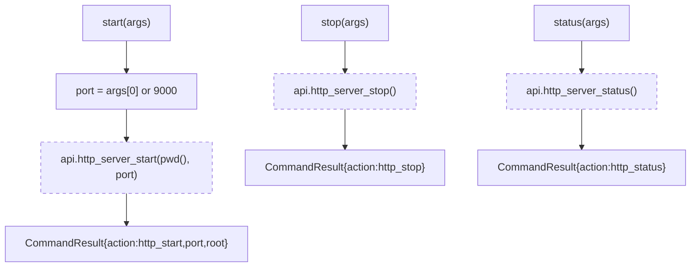

# 设备端 HTTP 服务器 <code>commands/http.py</code>

本模块在注入目标设备上启停一个 HTTP 服务器，借以通过 HTTP 暴露设备文件系统。命令组为 `http start/stop/status`。

> ⚠️ **可用性说明**：Agent 侧实现 `agent/src/generic/http.ts` 当前被注释/标记为 `httpServer module not currently available`（见 `agent/src/generic/http.ts:43`）。Python 层命令本身完整，但运行时实际不会真正起 HTTP 服务。请如实知悉。

## 📋 模块概览

| 项目 | 值 |
| --- | --- |
| 文件路径 | `objection/commands/http.py` |
| Agent 实现 | `agent/src/generic/http.ts`（**当前不可用**）、`agent/src/rpc/other.ts` 注册 RPC |
| 命令组 | `http` |
| 依赖 | `click`、`objection.commands.filemanager`（`pwd`）、`objection.state.connection`、`objection.utils.output` |

## 🎯 解决的问题

- 想用 HTTP 浏览/下载设备文件，而不用逐个 `filesystem download`。
- 控制服务生命周期：启动、停止、查状态。
- 指定端口（默认 9000）。

## 📜 命令清单

| 命令 | 函数 | 说明 |
| --- | --- | --- |
| `http start [port]` | `start()` | 在设备上启动 HTTP 服务器，根目录为当前 `pwd` |
| `http stop` | `stop()` | 停止设备端 HTTP 服务器 |
| `http status` | `status()` | 查询 HTTP 服务器状态 |

## ⚙️ 实现原理

三个函数都极薄，直接转发到 `state_connection.get_api()` 的对应 RPC。`start` 默认端口 9000，可由 `args[0]` 覆盖，根目录取 `filemanager.pwd()`。

### `start()` — 启动

源码：`objection/commands/http.py:10`

```python
# objection/commands/http.py:18-26
port = 9000
if len(args) > 0:
    port = int(args[0])

click.secho('Starting server on port {port}...'.format(port=port), dim=True)

api = state_connection.get_api()
api.http_server_start(pwd(), port)
```

JSON 模式返回 `{'action': 'http_start', 'port': port, 'root': pwd()}`（`objection/commands/http.py:28-32`）。

### `stop()` — 停止

源码：`objection/commands/http.py:36`

调用 `api.http_server_stop()`，JSON 模式返回 `{'action': 'http_stop'}`（`objection/commands/http.py:44-51`）。

### `status()` — 状态

源码：`objection/commands/http.py:55`

调用 `api.http_server_status()`，JSON 模式返回 `{'action': 'http_status'}`（`objection/commands/http.py:63-70`）。注意 Python 层**不**接收状态细节，Agent 端的状态输出（若启用）走异步消息。



虚线表示 Agent 侧当前实际未启用。

## 🔌 JSON 模式行为

- 三个函数在 JSON 模式都返回 `CommandResult`，仅含 `action` 字段（及 `start` 的 `port`/`root`）。
- 不做参数校验：`start` 传非数字端口会在 `int(args[0])` 处抛异常。
- Agent 侧实际行为见可用性说明。

## 🔍 源码索引

| 符号 | 位置 |
| --- | --- |
| `start` | `objection/commands/http.py:10` |
| `stop` | `objection/commands/http.py:36` |
| `status` | `objection/commands/http.py:55` |

## 🔗 相关文档

- [运行时操作命令](/features/runtime-commands)
- [文件系统](/features/filesystem)
- [RPC 通信机制](/guide/rpc)
- [REPL 与命令](/guide/repl)
