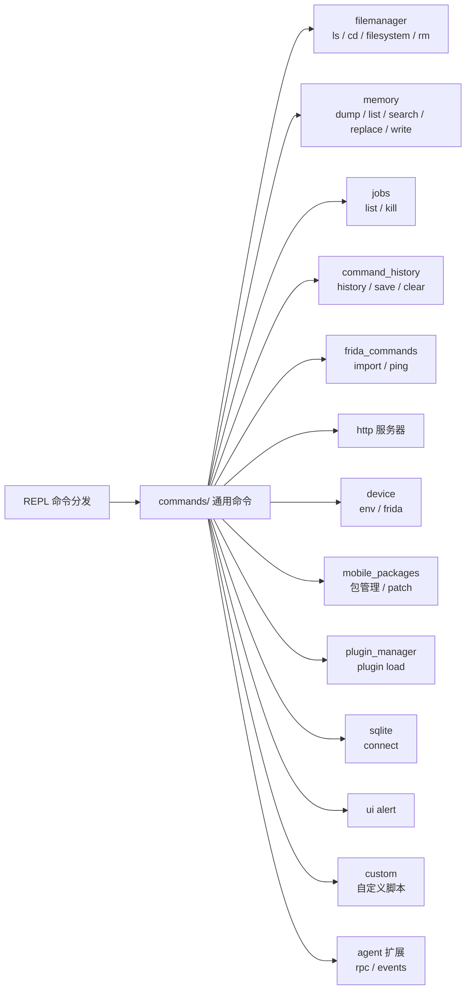

# 🛠️ 通用命令模块文档

`objection/commands/` 根目录下的 Python 文件实现**跨平台通用**命令（文件系统、内存、作业等）。本分区逐文件讲解。

## 🗺️ 模块地图

## 📂 文件清单

| 文档 | 源码 | 命令组 |
| --- | --- | --- |
| [command_history](/reference/commands/command-history) | `commands/command_history.py` | `commands history/save/clear` |
| [custom](/reference/commands/custom) | `commands/custom.py` | 自定义脚本 |
| [device](/reference/commands/device) | `commands/device.py` | `env` / `frida` |
| [filemanager](/reference/commands/filemanager) | `commands/filemanager.py` | `ls/cd/pwd/filesystem/rm` |
| [frida_commands](/reference/commands/frida-commands) | `commands/frida_commands.py` | `import` / `ping` |
| [http](/reference/commands/http) | `commands/http.py` | `http` |
| [jobs](/reference/commands/jobs) | `commands/jobs.py` | `jobs list/kill` |
| [memory](/reference/commands/memory) | `commands/memory.py` | `memory dump/list/search/replace/write` |
| [mobile_packages](/reference/commands/mobile-packages) | `commands/mobile_packages.py` | 包管理 |
| [plugin_manager](/reference/commands/plugin-manager) | `commands/plugin_manager.py` | `plugin load` |
| [sqlite](/reference/commands/sqlite) | `commands/sqlite.py` | `sqlite connect` |
| [ui](/reference/commands/ui) | `commands/ui.py` | `ui alert` |

## 🔗 相关文档

- [命令速查总览](/reference/cli/)
- [运行时操作命令（功能详解）](/features/runtime-commands)
