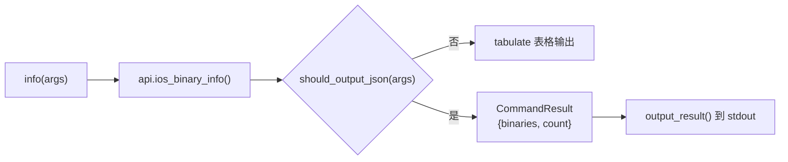

# iOS 二进制信息 <code>commands/ios/binary.py</code>

本模块用于在 iOS 设备上枚举当前进程加载的二进制（Mach-O）与框架，输出其加密、PIE、ARC、栈保护等安全编译标志，帮助判断目标 App 的二进制防护强度。命令组前缀为 `ios binary ...`。

## 模块概览

| 项目 | 值 |
| --- | --- |
| 文件路径 | `objection/commands/ios/binary.py` |
| Agent 实现 | `agent/src/ios/binary.ts` |
| 命令组 | `ios binary ...` |
| 依赖 | `objection.state.connection`、`objection.utils.output`、`tabulate`、`click` |

## 解决的问题

- 想知道主二进制是否被 Apple FairPlay 加密（encrypted），以判断是否需要脱壳才能做静态分析。
- 需要快速确认 PIE、ARC、Stack Canary、Stack Exec、RootSafe 等编译期防护是否启用。
- 在自动化脚本/Agent 中需要以结构化 JSON 拿到二进制清单而非纯文本表格。

## 命令清单

| 命令 | 函数 | 说明 |
| --- | --- | --- |
| `ios binary info` | `info()` | 列出当前进程所有二进制/框架及其安全编译标志 |

## 实现原理

Python 层职责很轻：调用一次 Agent RPC `ios_binary_info()`，拿到以二进制名为键、属性为值的字典，再用 `tabulate` 渲染表格或封装为 `CommandResult`。无参数解析、无状态保存。

### `info()` — 列出二进制及编译标志

源码：[`objection/commands/ios/binary.py:10`](https://github.com/android-security-engineer/objection-skills/blob/master/objection/commands/ios/binary.py#L10)

入参 `args` 仅用于判断 JSON 模式。流程：取 API → `ios_binary_info()` → 按列渲染表格或返回 JSON。关键代码：

```python
# objection/commands/ios/binary.py:18-19
api = state_connection.get_api()
binary_info = api.ios_binary_info()
```

表格列定义在 [`objection/commands/ios/binary.py:33`](https://github.com/android-security-engineer/objection-skills/blob/master/objection/commands/ios/binary.py#L33)：

```python
headers=['Name', 'Type', 'Encrypted', 'PIE', 'ARC', 'Canary', 'Stack Exec', 'RootSafe']
```



## JSON 模式行为

当 `should_output_json(args)` 为真时，`info()` 返回 `CommandResult(result={'binaries': binary_info, 'count': len(binary_info)})`，命令名固定为 `ios binary info`，由 `output_result()` 统一序列化到 stdout。非 JSON 模式直接 `click.secho(tabulate(...))` 并返回 `None`。

## 源码索引

| 符号 | 位置 |
| --- | --- |
| `info` | [`objection/commands/ios/binary.py:10`](https://github.com/android-security-engineer/objection-skills/blob/master/objection/commands/ios/binary.py#L10) |

## 相关文档

- [RPC 通信机制](/guide/rpc)
- [REPL 与命令](/guide/repl)
