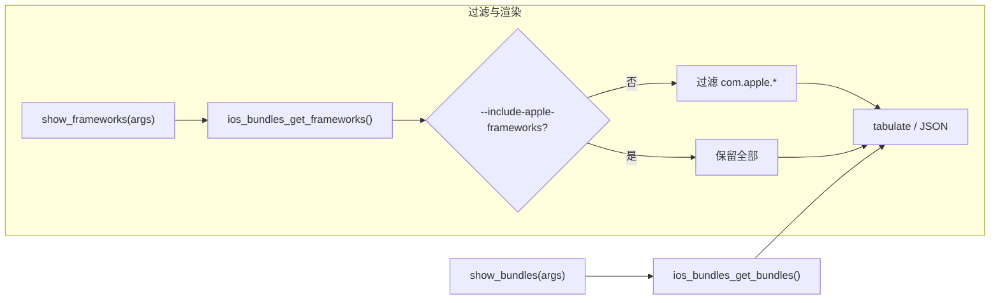

# iOS Bundle 枚举 <code>commands/ios/bundles.py</code>

本模块用于枚举 iOS 应用进程中的 NSBundle：既可以列出所有「框架」bundle（`NSBundle.allFrameworks`），也可以列出「非框架」bundle（`NSBundle.allBundles`），并可按 Apple 私有 bundle 过滤。命令组前缀为 `ios bundles ...`。

## 模块概览

| 项目 | 值 |
| --- | --- |
| 文件路径 | `objection/commands/ios/bundles.py` |
| Agent 实现 | `agent/src/ios/bundles.ts` |
| 命令组 | `ios bundles ...` |
| 依赖 | `objection.state.connection`、`objection.utils.output`、`objection.utils.helpers`、`tabulate`、`click` |

## 解决的问题

- 需要知道 App 内嵌了哪些第三方框架/动态库，以缩小逆向分析范围。
- 不想被 `com.apple.*` 系统框架刷屏，需要一个开关过滤掉 Apple 私有 bundle。
- 路径太长影响阅读，需要 `--full-path` 控制是截断还是完整显示。

## 命令清单

| 命令 | 函数 | 说明 |
| --- | --- | --- |
| `ios bundles list frameworks` | `show_frameworks()` | 列出所有 framework bundle，默认过滤 Apple 私有 |
| `ios bundles list bundles` | `show_bundles()` | 列出所有非 framework bundle |

## 实现原理

Python 层做三件事：调用对应 RPC、按 `--include-apple-frameworks` 决定是否过滤 `com.apple.*` bundle、按 `--full-path` 决定路径列用 `pretty_concat` 截断还是原样输出。两个命令共用同一套过滤与表格渲染逻辑，差异仅在数据来源与命令名。

### `_should_include_apple_bundles()` — 是否保留 Apple bundle

源码：[`objection/commands/ios/bundles.py:11`](https://github.com/android-security-engineer/objection-skills/blob/master/objection/commands/ios/bundles.py#L11)

检测 `--include-apple-frameworks` 标志。逻辑见 [`objection/commands/ios/bundles.py:19`](https://github.com/android-security-engineer/objection-skills/blob/master/objection/commands/ios/bundles.py#L19)：

```python
return len(args) > 0 and '--include-apple-frameworks' in args
```

### `_should_print_full_path()` — 是否完整打印路径

源码：[`objection/commands/ios/bundles.py:22`](https://github.com/android-security-engineer/objection-skills/blob/master/objection/commands/ios/bundles.py#L22)，靠 `--full-path` 触发。

### `_is_apple_bundle()` — 判定 Apple 私有 bundle

源码：[`objection/commands/ios/bundles.py:33`](https://github.com/android-security-engineer/objection-skills/blob/master/objection/commands/ios/bundles.py#L33)，依据是 bundle id 以 `com.apple` 开头：

```python
# objection/commands/ios/bundles.py:47-49
if bundle.startswith('com.apple'):
    return True
return False
```

### `show_frameworks()` — 列出 framework bundle

源码：[`objection/commands/ios/bundles.py:53`](https://github.com/android-security-engineer/objection-skills/blob/master/objection/commands/ios/bundles.py#L53)

流程：取 API → `ios_bundles_get_frameworks()` → 若未带 `--include-apple-frameworks` 则过滤掉 Apple bundle → JSON 或表格。关键代码：

```python
# objection/commands/ios/bundles.py:63-68
api = state_connection.get_api()
frameworks = api.ios_bundles_get_frameworks()
if not _should_include_apple_bundles(args):
    frameworks = [f for f in frameworks if not _is_apple_bundle(f['bundle'])]
```

路径列按标志截断，见 [`objection/commands/ios/bundles.py:85`](https://github.com/android-security-engineer/objection-skills/blob/master/objection/commands/ios/bundles.py#L85)：

```python
entry['path'] if _should_print_full_path(args) else pretty_concat(entry['path'], 40, True),
```

### `show_bundles()` — 列出非 framework bundle

源码：[`objection/commands/ios/bundles.py:92`](https://github.com/android-security-engineer/objection-skills/blob/master/objection/commands/ios/bundles.py#L92)

与 `show_frameworks()` 几乎一致，区别：调用 `ios_bundles_get_bundles()`，不对 Apple bundle 做过滤，命令名为 `ios bundles list bundles`。



## JSON 模式行为

两个函数在 JSON 模式都返回 `CommandResult`。`show_frameworks()` 额外带 `include_apple` 字段反映是否包含 Apple bundle（[`objection/commands/ios/bundles.py:73-74`](https://github.com/android-security-engineer/objection-skills/blob/master/objection/commands/ios/bundles.py#L73)）；`show_bundles()` 仅含 `bundles` 与 `count`。命令名分别固定为 `ios bundles list frameworks` / `ios bundles list bundles`。

## 源码索引

| 符号 | 位置 |
| --- | --- |
| `_should_include_apple_bundles` | [`objection/commands/ios/bundles.py:11`](https://github.com/android-security-engineer/objection-skills/blob/master/objection/commands/ios/bundles.py#L11) |
| `_should_print_full_path` | [`objection/commands/ios/bundles.py:22`](https://github.com/android-security-engineer/objection-skills/blob/master/objection/commands/ios/bundles.py#L22) |
| `_is_apple_bundle` | [`objection/commands/ios/bundles.py:33`](https://github.com/android-security-engineer/objection-skills/blob/master/objection/commands/ios/bundles.py#L33) |
| `show_frameworks` | [`objection/commands/ios/bundles.py:53`](https://github.com/android-security-engineer/objection-skills/blob/master/objection/commands/ios/bundles.py#L53) |
| `show_bundles` | [`objection/commands/ios/bundles.py:92`](https://github.com/android-security-engineer/objection-skills/blob/master/objection/commands/ios/bundles.py#L92) |

## 相关文档

- [RPC 通信机制](/guide/rpc)
- [REPL 与命令](/guide/repl)
