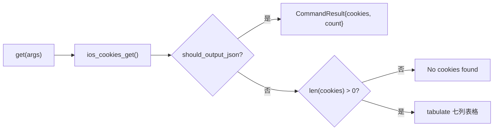

# iOS Cookie 读取 <code>commands/ios/cookies.py</code>

本模块通过 iOS `NSHTTPCookieStorage.sharedHTTPCookieStorage` 读取当前 App 内存中的 HTTP Cookie 并打印，用于取证会话令牌、追踪 Cookie 等。命令组前缀为 `ios cookies ...`。

> 注意对应关系：Python 侧是 `commands/ios/cookies.py`，但 Agent 侧实现文件名为 `agent/src/ios/binarycookies.ts`（聚焦二进制 cookie 读写），RPC 入口为 `ios_cookies_get()`。

## 模块概览

| 项目 | 值 |
| --- | --- |
| 文件路径 | `objection/commands/ios/cookies.py` |
| Agent 实现 | `agent/src/ios/binarycookies.ts` |
| 命令组 | `ios cookies ...` |
| 依赖 | `objection.state.connection`、`objection.utils.output`、`tabulate`、`click` |

## 解决的问题

- 想拿到当前 App 内存里活跃的会话 Cookie，而不必抓包解密 HTTPS。
- 需要查看 Cookie 的 `Secure` / `HttpOnly` 属性，评估其被脚本窃取的难度。
- 在 Agent 自动化流程中以 JSON 拿到完整 Cookie 列表。

## 命令清单

| 命令 | 函数 | 说明 |
| --- | --- | --- |
| `ios cookies get` | `get()` | 读取并打印 NSHTTPCookieStorage 中的全部 Cookie |

## 实现原理

Python 层职责极轻：调用 `ios_cookies_get()` 拿到 Cookie 列表，JSON 模式直接封装为 `CommandResult`，否则在空列表时提示 `No cookies found`，非空则用 `tabulate` 渲染七列表格。无参数解析。

### `get()` — 读取 Cookie

源码：`objection/commands/ios/cookies.py:10`

关键代码：

```python
# objection/commands/ios/cookies.py:18-20
api = state_connection.get_api()
cookies = api.ios_cookies_get()
```

空列表短路见 `objection/commands/ios/cookies.py:28-30`：

```python
if len(cookies) <= 0:
    click.secho('No cookies found')
    return None
```

表格列定义在 `objection/commands/ios/cookies.py:41`：`['Name', 'Value', 'Expires', 'Domain', 'Path', 'Secure', 'HTTPOnly']`。



## JSON 模式行为

JSON 模式直接在拿到 Cookie 后返回 `CommandResult(result={'cookies': cookies, 'count': len(cookies)})`，命令名 `ios cookies get`，**不会**触发空列表的 `No cookies found` 分支（JSON 短路在前）。非 JSON 模式返回 `None`。

## 源码索引

| 符号 | 位置 |
| --- | --- |
| `get` | `objection/commands/ios/cookies.py:10` |

## 相关文档

- [iOS 本地存储取证](/features/ios-local-storage)
- [RPC 通信机制](/guide/rpc)
- [REPL 与命令](/guide/repl)
