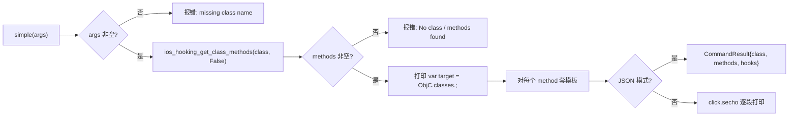

# iOS Hook 代码生成 <code>commands/ios/generate.py</code>

本模块用于为 iOS Objective-C hook 生成 Frida JavaScript 脚本骨架：`clazz` 直接回显内置的 `objchookmanager.js` 模板，`simple` 则根据类名枚举其所有方法并生成逐方法的 `Interceptor.attach` 骨架。命令组前缀为 `ios hooking generate ...`。

## 模块概览

| 项目 | 值 |
| --- | --- |
| 文件路径 | `objection/commands/ios/generate.py` |
| Agent 实现 | 无直接 Agent RPC（`simple` 复用 `agent/src/ios/hooking.ts` 的 `ios_hooking_get_class_methods`；`clazz` 纯本地读模板） |
| 命令组 | `ios hooking generate ...` |
| 依赖 | `os`、`objection.state.connection`、`objection.utils.output`、`click` |

## 解决的问题

- 不熟 Frida ObjC bridge API 的用户想要一个可粘贴的 Hook Manager 模板。
- 想一次性给某个类的所有方法打上 `onEnter/onLeave` 日志桩，避免手写。
- 在 Agent/JSON 流程中拿到生成好的脚本文本，便于后续注入。

## 命令清单

| 命令 | 函数 | 说明 |
| --- | --- | --- |
| `ios hooking generate class` | `clazz()` | 回显内置 `objchookmanager.js` 模板源码 |
| `ios hooking generate simple <class>` | `simple()` | 为指定类的每个方法生成 `Interceptor.attach` 骨架 |

## 实现原理

Python 层职责：`clazz` 纯本地——拼接模板绝对路径并读取；`simple` 需要先调一次 Agent RPC 拿方法列表，再在本地用字符串模板拼装每个方法的 hook 代码。两者都区分 JSON 模式（收集为结构化结果）与交互模式（直接 `click.secho` 打印）。

### `clazz()` — 回显 Hook Manager 模板

源码：`objection/commands/ios/generate.py:10`

模板路径基于本文件位置向上一级再进入 `utils/assets`，见 `objection/commands/ios/generate.py:19-22`：

```python
js_path = os.path.join(
    os.path.abspath(os.path.dirname(__file__)),
    '../../utils/assets', 'objchookmanager.js')
```

读取后非 JSON 模式用 `click.secho(source, dim=True)` 打印；JSON 模式返回 `CommandResult(result={'source': source, 'asset': 'objchookmanager.js'})`。

### `simple()` — 为类方法生成 hook 骨架

源码：`objection/commands/ios/generate.py:37`

流程：校验类名 → `ios_hooking_get_class_methods(classname, False)` 拿方法列表 → 空则报错 → 否则打印 `var target = ObjC.classes.<class>;` 并对每个方法套模板。方法枚举调用见 `objection/commands/ios/generate.py:57`：

```python
methods = api.ios_hooking_get_class_methods(classname, False)
```

单方法 hook 模板见 `objection/commands/ios/generate.py:73-82`，用 `.replace('{method}', method)` 替换方法名：

```python
hook = """
Interceptor.attach(target['{method}'].implementation, {{
  onEnter: function (args) {{
    console.log('Entering {method}!');
  }},
  onLeave: function (retval) {{
    console.log('Leaving {method}');
  }},
}});
""".replace('{method}', method)
```

JSON 模式把所有 hook 字符串收集进 `hooks` 列表返回（`objection/commands/ios/generate.py:88-92`）。



## JSON 模式行为

- `clazz()`：JSON 模式返回 `{'source': 模板全文, 'asset': 'objchookmanager.js'}`，命令名 `ios hooking generate class`。
- `simple()`：缺类名或类不存在时返回 `status='error'` 的 `CommandResult`（`objection/commands/ios/generate.py:48-51`、`objection/commands/ios/generate.py:61-65`）；成功时返回 `{'class', 'methods', 'hooks'}`，命令名 `ios hooking generate simple`。注意第二个参数 `include_parents` 固定为 `False`。

## 源码索引

| 符号 | 位置 |
| --- | --- |
| `clazz` | `objection/commands/ios/generate.py:10` |
| `simple` | `objection/commands/ios/generate.py:37` |

## 相关文档

- [RPC 通信机制](/guide/rpc)
- [REPL 与命令](/guide/repl)
