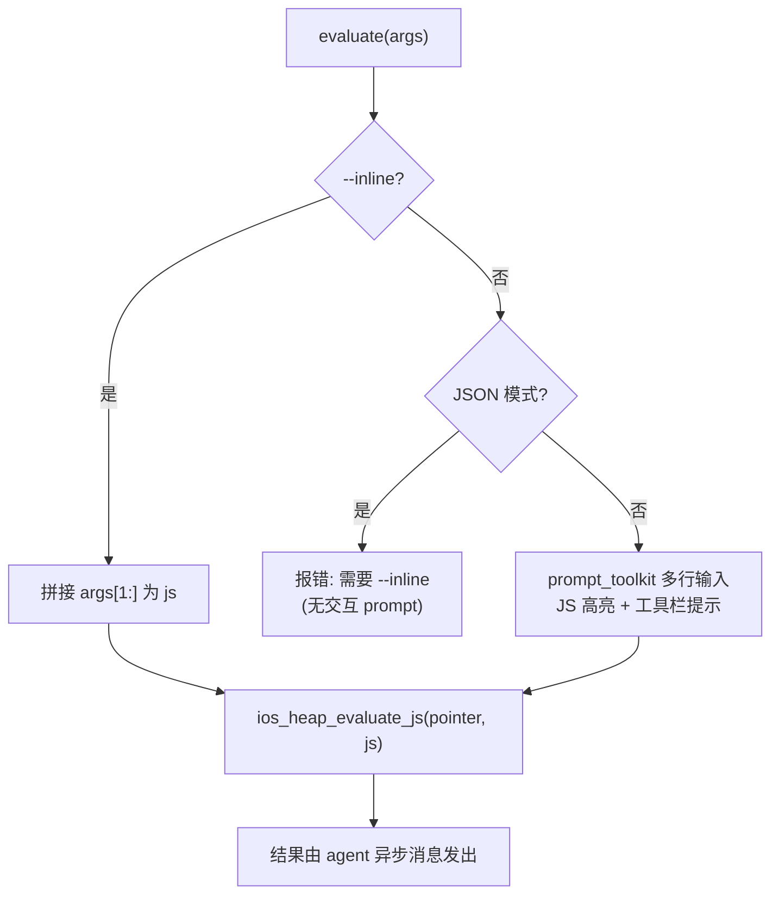

# iOS 堆对象探查 <code>commands/ios/heap.py</code>

本模块用于在 iOS 进程的 Objective-C 运行时里探查堆上对象：按类名搜索存活实例、打印实例指针的 ivars / methods、对指针执行无参方法、甚至在该指针上直接执行任意 JavaScript。命令组前缀为 `ios heap ...`。

## 模块概览

| 项目 | 值 |
| --- | --- |
| 文件路径 | `objection/commands/ios/heap.py` |
| Agent 实现 | `agent/src/ios/heap.ts` |
| 命令组 | `ios heap ...` |
| 依赖 | `pprint`、`prompt_toolkit`、`pygments`、`tabulate`、`click`、`objection.state.connection`、`objection.utils.output` |

## 解决的问题

- 想拿到某个敏感类（如 `NSURLCredentialStorage`、自定义 Session）在堆上的真实句柄，再据此深挖。
- 需要读取某个 Objective-C 对象实例的 ivars 值（如内部 token、密钥）而不写 Frida 脚本。
- 想在某个对象指针上直接调用一个 getter 方法或跑一段 JS，做即时求值。
- Agent 自动化模式下无法用交互式 prompt 输入多行 JS，需要 `--inline` 路径。

## 命令清单

| 命令 | 函数 | 说明 |
| --- | --- | --- |
| `ios heap search instances <class>` | `instances()` | 列出指定类的存活实例及其 ivar/method 计数 |
| `ios heap print ivars <pointer> [--to-utf8]` | `ivars()` | 打印某指针所指对象的 ivars |
| `ios heap print methods <pointer> [--without-arguments]` | `methods()` | 打印某指针所指对象的方法 |
| `ios heap execute method <pointer> <method> [--return-string]` | `execute()` | 在指针上调用一个无参方法 |
| `ios heap execute js <pointer> [--inline <js>]` | `evaluate()` | 在指针上下文执行 JavaScript |

## 实现原理

Python 层职责：解析参数（指针、类名、各类开关）、校验缺失参数并产出友好的错误 `CommandResult`、调用对应 Agent RPC、对返回值做表格或 `pprint` 渲染。`evaluate()` 因支持多行交互式 JS 输入而引入 `prompt_toolkit` + Pygments JS 高亮，并特判 JSON 模式下禁止交互 prompt。

### `instances()` — 搜索类存活实例

源码：`objection/commands/ios/heap.py:58`

缺类名时返回错误 `CommandResult`（`objection/commands/ios/heap.py:66-77`）。关键调用：

```python
# objection/commands/ios/heap.py:82-83
api = state_connection.get_api()
instance_results = api.ios_heap_print_live_instances(target_class)
```

返回结构注释见 `objection/commands/ios/heap.py:91-98`（`IHeapObject` 接口）。表格列：`Handle, Kind, Class, Super, iVars, Methods`（`objection/commands/ios/heap.py:103-112`），其中 ivar/method 显示的是数量。

### `ivars()` — 打印 ivars

源码：`objection/commands/ios/heap.py:116`

调用 `ios_heap_print_ivars(target_pointer, _should_print_as_utf8(args))`，返回 `[class, ivars_dict]` 二元组。`--to-utf8` 由 `_should_print_as_utf8()` 控制（`objection/commands/ios/heap.py:25`）。表格见 `objection/commands/ios/heap.py:152-156`，列为 `iVars, Value`。

### `methods()` — 打印方法

源码：`objection/commands/ios/heap.py:160`

调用 `ios_heap_print_methods(target_pointer)`，返回 `[class, methods_list]`。`--without-arguments` 时过滤掉含 `:` 的方法（即带参 selector），见 `objection/commands/ios/heap.py:188-189`：

```python
if _should_ignore_methods_with_arguments(args):
    method_results[1] = list(filter(lambda x: ':' not in x, method_results[1]))
```

表格用了一个略显 hacky 的拆分把方法签名拆成 `Method / Type / Full` 三列（`objection/commands/ios/heap.py:200-207`）。

### `execute()` — 调用无参方法

源码：`objection/commands/ios/heap.py:211`

校验后若方法名含 `:`（带参）则拒绝，因 Agent 不支持自动构造参数（`objection/commands/ios/heap.py:237-248`）。否则调用：

```python
# objection/commands/ios/heap.py:250-251
api = state_connection.get_api()
exec_results = api.ios_heap_exec_method(target_pointer, method, _should_return_as_string(args))
```

`--return-string` 让 Agent 以字符串而非对象形式返回结果。非 JSON 模式用 `pprint.pformat` 打印（`objection/commands/ios/heap.py:262`）。

### `evaluate()` — 在指针上执行 JS

源码：`objection/commands/ios/heap.py:266`

有三种输入路径（`objection/commands/ios/heap.py:293-318`）：



关键调用 `objection/commands/ios/heap.py:322-323`：

```python
api = state_connection.get_api()
api.ios_heap_evaluate_js(target_pointer, js)
```

注意：JS 求值结果不会作为 RPC 返回值，而是由 Agent 以异步消息发出，因此 JSON 模式下带 warning 提示（`objection/commands/ios/heap.py:325-332`）。交互 prompt 工具栏文案见 `objection/commands/ios/heap.py:318`，提示 `ptr` 变量可用。

## JSON 模式行为

所有函数在缺参数时都返回带 `status='error'`、`exit_code=1`、`human_text`（用法提示）的 `CommandResult`，便于 Agent 程序化处理。`evaluate()` 在 JSON 模式且无 `--inline` 时直接报错（`objection/commands/ios/heap.py:301-310`），因为 Agent 无法响应交互 prompt。各命令名固定：`ios heap search instances` / `ios heap print ivars` / `ios heap print methods` / `ios heap execute method` / `ios heap execute js`。

## 源码索引

| 符号 | 位置 |
| --- | --- |
| `_should_ignore_methods_with_arguments` | `objection/commands/ios/heap.py:14` |
| `_should_print_as_utf8` | `objection/commands/ios/heap.py:25` |
| `_should_return_as_string` | `objection/commands/ios/heap.py:36` |
| `_should_interpret_inline_js` | `objection/commands/ios/heap.py:47` |
| `instances` | `objection/commands/ios/heap.py:58` |
| `ivars` | `objection/commands/ios/heap.py:116` |
| `methods` | `objection/commands/ios/heap.py:160` |
| `execute` | `objection/commands/ios/heap.py:211` |
| `evaluate` | `objection/commands/ios/heap.py:266` |

## 相关文档

- [RPC 通信机制](/guide/rpc)
- [REPL 与命令](/guide/repl)
