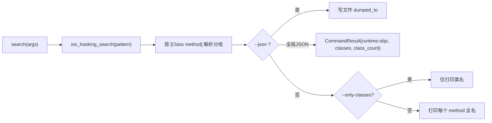

# iOS Hooking 控制 <code>commands/ios/hooking.py</code>

本模块是 iOS 侧最常用的命令集，封装了 Objective-C 运行时枚举与 Hook 控制：列出类、列出方法、按 selector 设置返回值、按模式 watch 调用、按关键字搜索类与方法。命令组前缀为 `ios hooking ...`。

## 模块概览

| 项目 | 值 |
| --- | --- |
| 文件路径 | `objection/commands/ios/hooking.py` |
| Agent 实现 | `agent/src/ios/hooking.ts` |
| 命令组 | `ios hooking ...` |
| 依赖 | `json`、`click`、`objection.state.connection`、`objection.utils.helpers`、`objection.utils.output` |

## 解决的问题

- ObjC 运行时类太多，需要一个 `--ignore-native` 开关过滤掉 `NS/UI/CF/...` 等系统前缀，只看业务类。
- 想强制让某个方法永远返回 `true`/`false`（绕过登录校验、越狱检测等）。
- 想监控某个模式匹配到的所有 selector 的调用，打印参数、返回值、调用栈。
- 想按关键字一次性搜索匹配的类与方法，并可导出为 JSON 文件。

## 命令清单

| 命令 | 函数 | 说明 |
| --- | --- | --- |
| `ios hooking list classes [--ignore-native]` | `show_ios_classes()` | 列出所有 ObjC 类，可过滤系统类 |
| `ios hooking list class_methods <class> [--include-parents]` | `show_ios_class_methods()` | 列出类的方法 |
| `ios hooking set_method_return <selector> <true/false>` | `set_method_return_value()` | 强制方法返回固定布尔值 |
| `ios hooking watch <pattern> [--dump-args] [--dump-backtrace] [--dump-return] [--include-parents]` | `watch()` | 监控匹配模式的所有调用 |
| `ios hooking search <pattern> [--only-classes] [--json [file]]` | `search()` | 搜索匹配的类与方法 |

## 实现原理

Python 层职责：解析大量布尔/取值开关、校验参数、调用 Agent RPC、对返回数据做分组与表格渲染。模块顶部维护一份 `native_prefixes` 启发式前缀表（`objection/commands/ios/hooking.py:12-50`），用于 `--ignore-native` 过滤。

### 开关解析工具函数

| 函数 | 行号 | 对应标志 |
| --- | --- | --- |
| `_should_ignore_native_classes` | `objection/commands/ios/hooking.py:53` | `--ignore-native` |
| `_should_include_parent_methods` | `objection/commands/ios/hooking.py:68` | `--include-parents` |
| `_class_is_prefixed_with_native` | `objection/commands/ios/hooking.py:83` | 用 `native_prefixes` 判断 |
| `_string_is_true` | `objection/commands/ios/hooking.py:100` | `true`/`yes` 视为真 |
| `_should_dump_backtrace` | `objection/commands/ios/hooking.py:111` | `--dump-backtrace` |
| `_should_dump_args` | `objection/commands/ios/hooking.py:122` | `--dump-args` |
| `_should_dump_return_value` | `objection/commands/ios/hooking.py:133` | `--dump-return` |
| `_should_print_only_classes` | `objection/commands/ios/hooking.py:144` | `--only-classes` |
| `_should_dump_json` | `objection/commands/ios/hooking.py:155` | `--json` |
| `_should_be_quiet` | `objection/commands/ios/hooking.py:166` | `--quiet` |
| `_get_flag_value` | `objection/commands/ios/hooking.py:177` | 取标志后的值 |

### `show_ios_classes()` — 列出类

源码：`objection/commands/ios/hooking.py:200`

```python
# objection/commands/ios/hooking.py:209-210
api = state_connection.get_api()
classes = api.ios_hooking_get_classes()
```

非 JSON 模式逐行 `click.secho`，并按 `--ignore-native` 过滤；最后打印 `Found N classes`（`objection/commands/ios/hooking.py:234`）。

### `show_ios_class_methods()` — 列出方法

源码：`objection/commands/ios/hooking.py:238`

用 `clean_argument_flags(args)` 去掉标志后再判断是否缺类名（`objection/commands/ios/hooking.py:246`）。调用：

```python
# objection/commands/ios/hooking.py:262-263
api = state_connection.get_api()
methods = api.ios_hooking_get_class_methods(classname, _should_include_parent_methods(args))
```

### `set_method_return_value()` — 强制返回值

源码：`objection/commands/ios/hooking.py:287`

要求至少 2 个非标志参数（selector + 布尔值），否则报错（`objection/commands/ios/hooking.py:296`）。调用：

```python
# objection/commands/ios/hooking.py:314-315
api = state_connection.get_api()
api.ios_hooking_set_return_value(selector, _string_is_true(retval))
```

### `watch()` — 监控调用

源码：`objection/commands/ios/hooking.py:329`

一次性把四个布尔标志传入 RPC，安装的 Hook 会持续生效直到进程退出或卸载：

```python
# objection/commands/ios/hooking.py:353-358
api.ios_hooking_watch(pattern,
                      _should_dump_args(args),
                      _should_dump_backtrace(args),
                      _should_dump_return_value(args),
                      _should_include_parent_methods(args))
```

### `search()` — 搜索类与方法

源码：`objection/commands/ios/hooking.py:379`

调用 `ios_hooking_search(pattern)` 拿到 `[{name: ...}]`，再按 selector 解析出类名分组到 `data` 字典（`objection/commands/ios/hooking.py:404-415`）：

```python
# objection/commands/ios/hooking.py:408-415
for func in results:
    fullname = func['name']
    start_bracket = fullname.find('[') + 1
    class_name = fullname[start_bracket: fullname.find(' ')]
    if data.get(class_name) is not None:
        data[class_name].append(fullname)
    else:
        data[class_name] = [fullname]
```

`--json <filename>` 会写文件并保留旧行为；全局 JSON 模式（Agent exec）则走统一输出层到 stdout（`objection/commands/ios/hooking.py:417-437`）。



## JSON 模式行为

`search()` 是唯一一个区分「`--json <file>` 写文件」与「全局 JSON 模式 stdout」两条路径的函数：前者返回 `{'dumped_to': target_file, 'class_count': ...}`，后者返回 `{'runtime': 'objc', 'classes': data, 'class_count': ...}`。`watch()` 与 `set_method_return_value()` 安装的是长期 Hook，Job id 不在返回里，靠 warning 提示用 `agent state` 查询（`objection/commands/ios/hooking.py:321-323`、`objection/commands/ios/hooking.py:371-373`）。

## 源码索引

| 符号 | 位置 |
| --- | --- |
| `native_prefixes` | `objection/commands/ios/hooking.py:12` |
| `_should_ignore_native_classes` | `objection/commands/ios/hooking.py:53` |
| `_should_include_parent_methods` | `objection/commands/ios/hooking.py:68` |
| `_class_is_prefixed_with_native` | `objection/commands/ios/hooking.py:83` |
| `_string_is_true` | `objection/commands/ios/hooking.py:100` |
| `_should_dump_backtrace` | `objection/commands/ios/hooking.py:111` |
| `_should_dump_args` | `objection/commands/ios/hooking.py:122` |
| `_should_dump_return_value` | `objection/commands/ios/hooking.py:133` |
| `_should_print_only_classes` | `objection/commands/ios/hooking.py:144` |
| `_should_dump_json` | `objection/commands/ios/hooking.py:155` |
| `_should_be_quiet` | `objection/commands/ios/hooking.py:166` |
| `_get_flag_value` | `objection/commands/ios/hooking.py:177` |
| `show_ios_classes` | `objection/commands/ios/hooking.py:200` |
| `show_ios_class_methods` | `objection/commands/ios/hooking.py:238` |
| `set_method_return_value` | `objection/commands/ios/hooking.py:287` |
| `watch` | `objection/commands/ios/hooking.py:329` |
| `search` | `objection/commands/ios/hooking.py:379` |

## 相关文档

- [RPC 通信机制](/guide/rpc)
- [REPL 与命令](/guide/repl)
