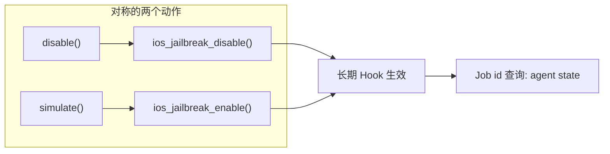

# iOS 越狱检测对抗 <code>commands/ios/jailbreak.py</code>

本模块用于双向操纵 iOS 越狱检测：`disable` 在目标 App 内 Hook 常见越狱检测点使其「假装没越狱」，`simulate` 则反向伪造越狱环境特征（如 `/Applications/Cydia.app` 等存在性）以测试 App 在越狱态的行为。命令组前缀为 `ios jailbreak ...`。

## 模块概览

| 项目 | 值 |
| --- | --- |
| 文件路径 | `objection/commands/ios/jailbreak.py` |
| Agent 实现 | `agent/src/ios/jailbreak.ts` |
| 命令组 | `ios jailbreak ...` |
| 依赖 | `objection.state.connection`、`objection.utils.output` |

## 解决的问题

- 越狱设备上 App 检测到越狱直接退出，需要绕过检测继续使用。
- 反向场景：非越狱设备上想让 App「以为」已越狱，以触发其越狱分支逻辑做分析。
- 这两个动作都是长期生效的 Hook，Agent 流程需要知道 Job 状态。

## 命令清单

| 命令 | 函数 | 说明 |
| --- | --- | --- |
| `ios jailbreak disable` | `disable()` | Hook 越狱检测，使其返回「未越狱」 |
| `ios jailbreak simulate` | `simulate()` | 伪造越狱环境特征，使其「看起来已越狱」 |

## 实现原理

Python 层极简：调用一次 RPC，无参数解析，无返回数据处理。两个函数对称，仅 RPC 方法与命令名不同。安装的 Hook 会持续生效，因此 JSON 模式下都带 Job 提示 warning。

### `disable()` — 关闭越狱检测

源码：[`objection/commands/ios/jailbreak.py:7`](https://github.com/android-security-engineer/objection-skills/blob/master/objection/commands/ios/jailbreak.py#L7)

```python
# objection/commands/ios/jailbreak.py:15-16
api = state_connection.get_api()
api.ios_jailbreak_disable()
```

### `simulate()` — 模拟越狱环境

源码：[`objection/commands/ios/jailbreak.py:29`](https://github.com/android-security-engineer/objection-skills/blob/master/objection/commands/ios/jailbreak.py#L29)

```python
# objection/commands/ios/jailbreak.py:37-38
api = state_connection.get_api()
api.ios_jailbreak_enable()
```



## JSON 模式行为

两者在 JSON 模式都返回 `CommandResult`，结果体仅一个 `action` 字段（`jailbreak_detection_disabled` / `jailbreak_simulated`），并带 warning 提示「Job id 未暴露，用 `agent state` 查询运行中的 Job」（[`objection/commands/ios/jailbreak.py:21-23`](https://github.com/android-security-engineer/objection-skills/blob/master/objection/commands/ios/jailbreak.py#L21)、[`objection/commands/ios/jailbreak.py:43-45`](https://github.com/android-security-engineer/objection-skills/blob/master/objection/commands/ios/jailbreak.py#L43)）。命令名分别为 `ios jailbreak disable` / `ios jailbreak simulate`。非 JSON 模式静默返回 `None`。

## 源码索引

| 符号 | 位置 |
| --- | --- |
| `disable` | [`objection/commands/ios/jailbreak.py:7`](https://github.com/android-security-engineer/objection-skills/blob/master/objection/commands/ios/jailbreak.py#L7) |
| `simulate` | [`objection/commands/ios/jailbreak.py:29`](https://github.com/android-security-engineer/objection-skills/blob/master/objection/commands/ios/jailbreak.py#L29) |

## 相关文档

- [RPC 通信机制](/guide/rpc)
- [REPL 与命令](/guide/repl)
