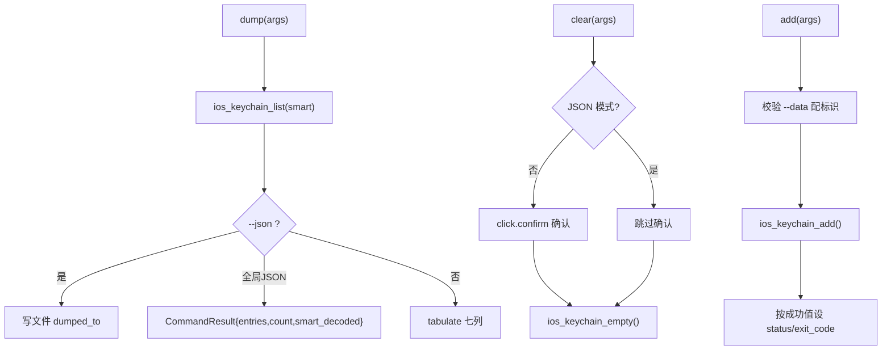

# iOS Keychain 操作 <code>commands/ios/keychain.py</code>

本模块是 iOS 取证与凭据操作的核心，逐函数覆盖 Keychain 的读（dump / dump_raw）、清空（clear）、删（remove）、改（update）、增（add）五大动作。命令组前缀为 `ios keychain ...`。本文为 reference 版逐函数详解，与功能向导 [iOS Keychain Dump](/features/ios-keychain) 互补：后者讲场景与用法，本文讲实现与参数。

## 模块概览

| 项目 | 值 |
| --- | --- |
| 文件路径 | `objection/commands/ios/keychain.py` |
| Agent 实现 | `agent/src/ios/keychain.ts` |
| 命令组 | `ios keychain ...` |
| 依赖 | `json`、`click`、`tabulate`、`objection.state.connection`、`objection.utils.output` |

## 解决的问题

- 想一次性 dump 出 Keychain 所有项（GenericPassword、InternetPassword、证书、密钥等），含创建时间、ACL、可访问性属性。
- 需要 `--smart` 智能解码二进制 data 为可读字符串；或反过来用 `dump_raw` 拿到未解析原始条目。
- 要对单条做精细操作：按 account+service 删除/更新，或新增一条 `kSecClassGenericPassword`。
- `clear` 是破坏性操作，交互模式需 `click.confirm` 确认，Agent 模式需跳过确认。
- `--json <file>` 保留旧的「写文件」行为，全局 JSON 模式则走统一输出层到 stdout。

## 命令清单

| 命令 | 函数 | 说明 |
| --- | --- | --- |
| `ios keychain dump [--smart] [--json file]` | `dump()` | 解析并打印 Keychain 全部条目 |
| `ios keychain dump_raw` | `dump_raw()` | 不解析，原始条目由 Agent 异步输出 |
| `ios keychain clear` | `clear()` | 清空整个 Keychain（破坏性） |
| `ios keychain remove --account ... --service ...` | `remove()` | 按 account+service 删除匹配项 |
| `ios keychain update --account --service --newdata` | `update()` | 更新匹配项的 data |
| `ios keychain add --account --service --data` | `add()` | 新增一条 GenericPassword |

## 实现原理

Python 层职责：解析 `--smart / --data / --service / --account / --newdata / --json` 等标志、做破坏性操作的确认、调用对应 Agent RPC、对返回的条目列表做表格渲染或 JSON 序列化。模块顶部一组 `_should_*` / `_get_*` 辅助函数集中处理标志。

### 标志解析工具函数

| 函数 | 行号 | 作用 |
| --- | --- | --- |
| `_should_do_smart_decode` | `objection/commands/ios/keychain.py:11` | `--smart` |
| `_data_flag_has_identifier` | `objection/commands/ios/keychain.py:23` | `--data` 时需同时有 `--service` 或 `--account` |
| `_get_flag_value` | `objection/commands/ios/keychain.py:38` | 取标志后的值 |
| `_get_json_destination` | `objection/commands/ios/keychain.py:50` | 取 `--json` 后的文件名 |

### `dump()` — 解析式 dump

源码：`objection/commands/ios/keychain.py:63`

先提示用户可能需 TouchID/密码认证（`objection/commands/ios/keychain.py:71`），再调用：

```python
# objection/commands/ios/keychain.py:77-78
api = state_connection.get_api()
keychain = api.ios_keychain_list(_should_do_smart_decode(args))
```

JSON 模式分两条路径（`objection/commands/ios/keychain.py:80-99`）：`--json <file>` 写文件返回 `dumped_to`；全局 JSON 返回 `{entries, count, smart_decoded}`。非 JSON 模式用 `tabulate` 渲染七列（`objection/commands/ios/keychain.py:102-113`）：`Created, Accessible, ACL, Type, Account, Service, Data`，其中 `accessible_attribute` 与 `item_class` 做了字符串裁剪去掉 `kSecAttrAccessible` / `kSecClassGeneric` 前缀。

### `dump_raw()` — 原始 dump

源码：`objection/commands/ios/keychain.py:117`

调用 `api.ios_keychain_list_raw()`，**不接收返回值**——原始条目由 Agent 以异步消息发出，Python 层在 JSON 模式仅返回 `{'action': 'dumped_raw'}` 并带 warning 提示轮询 `agent state` 或 HTTP `/events`（`objection/commands/ios/keychain.py:131-138`）。

### `clear()` — 清空

源码：`objection/commands/ios/keychain.py:142`

破坏性操作。交互模式必须 `click.confirm`（`objection/commands/ios/keychain.py:151-153`）；JSON 模式跳过确认直接执行（Agent 无法回答 confirm）：

```python
# objection/commands/ios/keychain.py:151-153
if not should_output_json(args):
    if not click.confirm('Are you sure you want to clear the iOS keychain?'):
        return None
```

随后 `api.ios_keychain_empty()`（`objection/commands/ios/keychain.py:158`）。

### `remove()` — 删除匹配项

源码：`objection/commands/ios/keychain.py:170`

必须同时提供 `--account` 与 `--service`，否则报错（`objection/commands/ios/keychain.py:181-192`）。调用 `api.ios_keychain_remove(account, service)`（`objection/commands/ios/keychain.py:199`）。

### `update()` — 更新匹配项

源码：`objection/commands/ios/keychain.py:210`

三个标志全都要：`--account / --service / --newdata`，缺一报错（`objection/commands/ios/keychain.py:222-233`）。调用 `api.ios_keychain_update(account, service, newdata)`（`objection/commands/ios/keychain.py:241`）。

### `add()` — 新增条目

源码：`objection/commands/ios/keychain.py:252`

先校验「`--data` 时必须有 `--account` 或 `--service`」（`objection/commands/ios/keychain.py:260-272`），调用 `api.ios_keychain_add(account, service, data)` 返回布尔成功值（`objection/commands/ios/keychain.py:284`），据此设置 `status` 与 `exit_code`：

```python
# objection/commands/ios/keychain.py:287-293
CommandResult(
    result={'added': bool(success), 'account': account, 'service': service},
    status='ok' if success else 'error',
    exit_code=0 if success else 1,
)
```



## JSON 模式行为

- `dump()`：`--json <file>` 走文件路径，全局 JSON 走 stdout，二者互斥判断见 `objection/commands/ios/keychain.py:81-99`。
- `dump_raw()`：原始条目异步发出，返回仅含 action，必须轮询 `agent state` / `/events`。
- `clear()`：JSON 模式跳过 `click.confirm`，直接执行——这是 Agent 友好化的关键差异。
- `remove()/update()`：缺标志返回 `status='error'`、`exit_code=1`。
- `add()`：根据 Agent 返回的布尔值动态设置 `status` 与 `exit_code`，是少数带「失败语义」的命令。

## 源码索引

| 符号 | 位置 |
| --- | --- |
| `_should_do_smart_decode` | `objection/commands/ios/keychain.py:11` |
| `_data_flag_has_identifier` | `objection/commands/ios/keychain.py:23` |
| `_get_flag_value` | `objection/commands/ios/keychain.py:38` |
| `_get_json_destination` | `objection/commands/ios/keychain.py:50` |
| `dump` | `objection/commands/ios/keychain.py:63` |
| `dump_raw` | `objection/commands/ios/keychain.py:117` |
| `clear` | `objection/commands/ios/keychain.py:142` |
| `remove` | `objection/commands/ios/keychain.py:170` |
| `update` | `objection/commands/ios/keychain.py:210` |
| `add` | `objection/commands/ios/keychain.py:252` |

## 相关文档

- [iOS Keychain Dump（功能详解）](/features/ios-keychain)
- [iOS 本地存储取证](/features/ios-local-storage)
- [RPC 通信机制](/guide/rpc)
- [REPL 与命令](/guide/repl)
