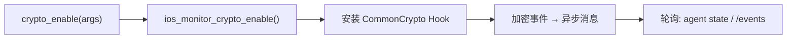

# iOS Crypto 监控 <code>commands/ios/monitor.py</code>

本模块用于在 iOS 上开启 CommonCrypto / Security.framework 的加解密调用监控，Hook `CCCrypt`、`CC_*` 系列函数并把算法、密钥、IV、明文/密文等参数实时打印出来，用于定位 App 内部的对称加密入口。命令组前缀为 `ios monitor ...`。

## 模块概览

| 项目 | 值 |
| --- | --- |
| 文件路径 | `objection/commands/ios/monitor.py` |
| Agent 实现 | `agent/src/ios/crypto.ts` |
| 命令组 | `ios monitor ...` |
| 依赖 | `objection.state.connection`、`objection.utils.output` |

## 解决的问题

- App 用 CCCrypt 加密敏感数据上送，想在不逆向的情况下直接看到明文、密钥、IV。
- 监控是长期 Hook，Agent 流程需要知道 Job 状态与事件获取方式。
- 当前模块仅暴露「开启」动作，停止靠卸载整个会话或退出进程。

## 命令清单

| 命令 | 函数 | 说明 |
| --- | --- | --- |
| `ios monitor crypto` | `crypto_enable()` | 开启 CommonCrypto 调用监控 |

## 实现原理

Python 层极简：调用一次 `ios_monitor_crypto_enable()` 即在目标进程安装加密监控 Hook。无参数、无返回数据处理。监控事件由 Agent 以异步消息发出，因此 JSON 模式带两条 warning 提示轮询方式。

### `crypto_enable()` — 开启加密监控

源码：`objection/commands/ios/monitor.py:7`

```python
# objection/commands/ios/monitor.py:15-16
api = state_connection.get_api()
api.ios_monitor_crypto_enable()
```

JSON 模式返回见 `objection/commands/ios/monitor.py:18-26`：

```python
CommandResult(
    result={'action': 'crypto_monitoring_enabled'},
    warnings=['Crypto events arrive as async messages; poll via `agent state` or HTTP /events.',
              'Job id not surfaced; use `agent state` to list running jobs.'],
)
```



## JSON 模式行为

返回 `CommandResult(result={'action': 'crypto_monitoring_enabled'})`，命令名 `ios monitor crypto`。两条 warning 明确告知：加密事件是异步消息、Job id 未暴露，需通过 `agent state` 或 HTTP `/events` 轮询。非 JSON 模式静默返回 `None`。

## 源码索引

| 符号 | 位置 |
| --- | --- |
| `crypto_enable` | `objection/commands/ios/monitor.py:7` |

## 相关文档

- [RPC 通信机制](/guide/rpc)
- [REPL 与命令](/guide/repl)
