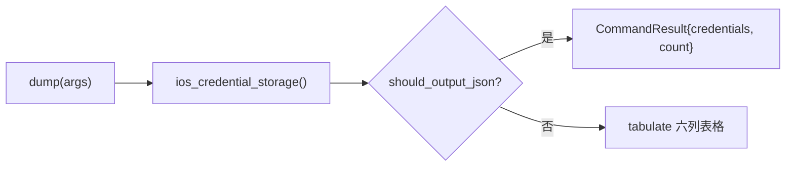

# iOS NSURLCredentialStorage Dump <code>commands/ios/nsurlcredentialstorage.py</code>

本模块用于 dump iOS `NSURLCredentialStorage` 中存储的凭据（用户名/密码、认证方法、协议、主机、端口），这些通常是 App 在挑战-响应式 HTTP 认证（Basic/Digest/NTLM 等）中持久化的账号密码。命令组前缀为 `ios nsurlcredentialstorage ...`。

## 模块概览

| 项目 | 值 |
| --- | --- |
| 文件路径 | `objection/commands/ios/nsurlcredentialstorage.py` |
| Agent 实现 | `agent/src/ios/credentialstorage.ts` |
| 命令组 | `ios nsurlcredentialstorage ...` |
| 依赖 | `objection.state.connection`、`objection.utils.output`、`tabulate`、`click` |

## 解决的问题

- App 用 `NSURLCredential`（而非 Keychain）存了 HTTP 认证凭据，普通 Keychain dump 拿不到。
- 需要看到凭据对应的协议/主机/端口/认证方法，定位是哪次请求的凭据。
- Agent 流程中以 JSON 拿到结构化凭据列表。

## 命令清单

| 命令 | 函数 | 说明 |
| --- | --- | --- |
| `ios nsurlcredentialstorage dump` | `dump()` | dump 共享凭据存储中的所有凭据 |

## 实现原理

Python 层职责极轻：调用 `ios_credential_storage()` 拿到凭据列表，JSON 模式封装为 `CommandResult`，否则用 `tabulate` 渲染六列表格。无参数解析。注意 Python 变量名 `cookies` 实际存的是 credential 列表（历史命名），不影响行为。

### `dump()` — dump 凭据

源码：`objection/commands/ios/nsurlcredentialstorage.py:10`

关键代码：

```python
# objection/commands/ios/nsurlcredentialstorage.py:18-19
api = state_connection.get_api()
cookies = api.ios_credential_storage()
```

表格列定义在 `objection/commands/ios/nsurlcredentialstorage.py:27-37`，`authMethod` 做了字符串裁剪去掉 `NSURLAuthenticationMethod` 前缀：

```python
entry['authMethod'].replace('NSURLAuthenticationMethod', ''),
```

列头：`Protocol, Host, Port, Authentication Method, User, Password`。



## JSON 模式行为

JSON 模式直接返回 `CommandResult(result={'credentials': cookies, 'count': len(cookies)})`，命令名 `ios nsurlcredentialstorage dump`。非 JSON 模式直接渲染表格并返回 `None`。

## 源码索引

| 符号 | 位置 |
| --- | --- |
| `dump` | `objection/commands/ios/nsurlcredentialstorage.py:10` |

## 相关文档

- [iOS 本地存储取证](/features/ios-local-storage)
- [RPC 通信机制](/guide/rpc)
- [REPL 与命令](/guide/repl)
