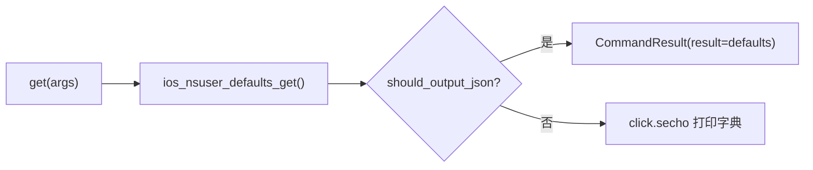

# iOS NSUserDefaults 读取 <code>commands/ios/nsuserdefaults.py</code>

本模块用于读取 iOS `NSUserDefaults`（即 `Info.plist` 级别的轻量偏好存储）的全部键值并打印，常用于发现 App 在用户默认里缓存的配置、开关、上次登录态等。命令组前缀为 `ios nsuserdefaults ...`。

## 模块概览

| 项目 | 值 |
| --- | --- |
| 文件路径 | `objection/commands/ios/nsuserdefaults.py` |
| Agent 实现 | `agent/src/ios/nsuserdefaults.ts` |
| 命令组 | `ios nsuserdefaults ...` |
| 依赖 | `objection.state.connection`、`objection.utils.output`、`click` |

## 解决的问题

- App 把功能开关、灰度配置、调试标志放在 NSUserDefaults，需要快速读取而非整机取证。
- Agent 流程中以 JSON 拿到完整字典。
- 这是只读操作，不会修改 App 状态。

## 命令清单

| 命令 | 函数 | 说明 |
| --- | --- | --- |
| `ios nsuserdefaults get` | `get()` | 读取并打印 NSUserDefaults 全部键值 |

## 实现原理

Python 层极简：调用 `ios_nsuser_defaults_get()` 拿到字典，JSON 模式直接作为 `CommandResult` 的 `result` 返回，非 JSON 模式用 `click.secho(defaults, bold=True)` 打印。无参数解析、无表格渲染。

### `get()` — 读取偏好

源码：[`objection/commands/ios/nsuserdefaults.py:9`](https://github.com/android-security-engineer/objection-skills/blob/master/objection/commands/ios/nsuserdefaults.py#L9)

```python
# objection/commands/ios/nsuserdefaults.py:18-19
api = state_connection.get_api()
defaults = api.ios_nsuser_defaults_get()
```

JSON 模式直接把 `defaults` 作为结果体（[`objection/commands/ios/nsuserdefaults.py:21-25`](https://github.com/android-security-engineer/objection-skills/blob/master/objection/commands/ios/nsuserdefaults.py#L21)）。



## JSON 模式行为

返回 `CommandResult(result=defaults)`，命令名 `ios nsuserdefaults get`。注意 `result` 直接是 defaults 字典本身，而非包在某个键下——消费方需按字典解析。非 JSON 模式返回 `None`。

## 源码索引

| 符号 | 位置 |
| --- | --- |
| `get` | [`objection/commands/ios/nsuserdefaults.py:9`](https://github.com/android-security-engineer/objection-skills/blob/master/objection/commands/ios/nsuserdefaults.py#L9) |

## 相关文档

- [iOS 本地存储取证](/features/ios-local-storage)
- [RPC 通信机制](/guide/rpc)
- [REPL 与命令](/guide/repl)
