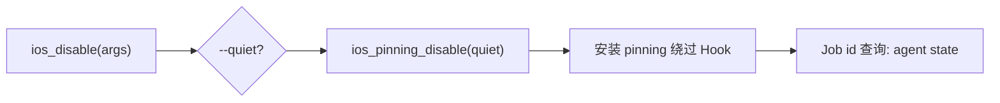

# iOS SSL Pinning 绕过 <code>commands/ios/pinning.py</code>

本模块用于在 iOS 上绕过 SSL/TLS 证书固定（certificate pinning），Hook `NSURLSession`、`SecTrustEvaluate` 等常见 pinning 入口，使 mitmproxy/Charles 等代理能正常解密目标 App 流量。命令组前缀为 `ios sslpinning ...`。

## 模块概览

| 项目 | 值 |
| --- | --- |
| 文件路径 | `objection/commands/ios/pinning.py` |
| Agent 实现 | `agent/src/ios/pinning.ts` |
| 命令组 | `ios sslpinning ...` |
| 依赖 | `objection.state.connection`、`objection.utils.output` |

## 解决的问题

- App 实施了证书固定，常规代理抓包失败，需要一键绕过。
- 绕过是长期 Hook，Agent 流程需要知道 Job 状态。
- `--quiet` 可关闭 Agent 端的逐次 pinning 命中日志，避免刷屏。

## 命令清单

| 命令 | 函数 | 说明 |
| --- | --- | --- |
| `ios sslpinning disable [--quiet]` | `ios_disable()` | 安装 SSL pinning 绕过 Hook |

## 实现原理

Python 层极简：解析 `--quiet` 标志，调用一次 `ios_pinning_disable(quiet)` 即安装绕过 Hook。无返回数据处理，绕过会持续到进程退出。

### `_should_be_quiet()` — 静默开关

源码：`objection/commands/ios/pinning.py:7`，靠 `--quiet` 触发：

```python
# objection/commands/ios/pinning.py:16
return '--quiet' in args
```

### `ios_disable()` — 绕过 pinning

源码：`objection/commands/ios/pinning.py:19`

```python
# objection/commands/ios/pinning.py:28-29
api = state_connection.get_api()
api.ios_pinning_disable(_should_be_quiet(args))
```

JSON 模式返回见 `objection/commands/ios/pinning.py:31-38`：

```python
CommandResult(
    result={'action': 'ssl_pinning_disabled', 'quiet': _should_be_quiet(args)},
    warnings=['Job id not surfaced; use `agent state` to list running jobs.'],
)
```



## JSON 模式行为

返回 `CommandResult(result={'action': 'ssl_pinning_disabled', 'quiet': bool})`，命令名 `ios sslpinning disable`，结果体含 `quiet` 字段反映是否静默。一条 warning 提示 Job id 未暴露。非 JSON 模式静默返回 `None`。

## 源码索引

| 符号 | 位置 |
| --- | --- |
| `_should_be_quiet` | `objection/commands/ios/pinning.py:7` |
| `ios_disable` | `objection/commands/ios/pinning.py:19` |

## 相关文档

- [RPC 通信机制](/guide/rpc)
- [REPL 与命令](/guide/repl)
