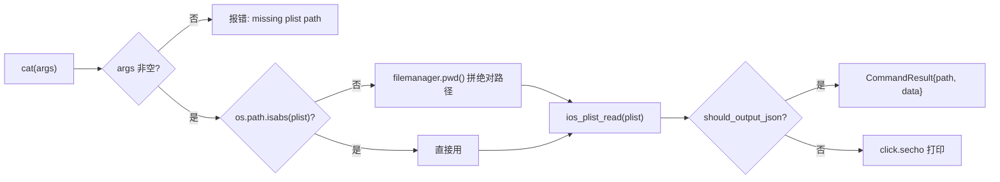

# iOS Plist 解析 <code>commands/ios/plist.py</code>

本模块用于在 iOS 设备上读取并以可读形式打印一个远程 plist 文件的内容。它复用了 `commands/filemanager` 的 `pwd()` 解析相对路径，再交由 Agent 解析二进制/文本 plist。命令组前缀为 `ios plist ...`。

## 模块概览

| 项目 | 值 |
| --- | --- |
| 文件路径 | `objection/commands/ios/plist.py` |
| Agent 实现 | `agent/src/ios/filesystem.ts`（plist 解析复用文件系统 RPC `ios_plist_read`） |
| 命令组 | `ios plist ...` |
| 依赖 | `os`、`click`、`objection.commands.filemanager`、`objection.state.connection`、`objection.state.device`、`objection.utils.output` |

## 解决的问题

- 想直接在设备端把二进制 plist 转成可读文本，而不必先 `download` 到本机再用 `plutil`。
- 命令行里传相对路径时要按设备当前工作目录解析，而非本机 CWD。
- Agent 流程中以 JSON 拿到 plist 路径与解析后数据。

## 命令清单

| 命令 | 函数 | 说明 |
| --- | --- | --- |
| `ios plist cat <remote_plist>` | `cat()` | 读取并打印远程 plist 内容 |

## 实现原理

Python 层职责：校验路径参数、把相对路径按设备 `pwd()` 解析为绝对路径、调用 Agent RPC `ios_plist_read`、JSON 模式封装或直接 `click.secho`。注意它直接复用 `filemanager.pwd()`（而非通过 RPC），因为 `pwd` 已在 Python 侧缓存设备工作目录。

### `cat()` — 读取 plist

源码：[`objection/commands/ios/plist.py:12`](https://github.com/android-security-engineer/objection-skills/blob/master/objection/commands/ios/plist.py#L12)

缺路径参数时返回错误 `CommandResult`（[`objection/commands/ios/plist.py:21-33`](https://github.com/android-security-engineer/objection-skills/blob/master/objection/commands/ios/plist.py#L21)）。相对路径解析见 [`objection/commands/ios/plist.py:37-39`](https://github.com/android-security-engineer/objection-skills/blob/master/objection/commands/ios/plist.py#L37)：

```python
if not os.path.isabs(plist):
    pwd = filemanager.pwd()
    plist = device_state.platform.path_separator.join([pwd, plist])
```

注意用 `device_state.platform.path_separator` 拼接而非硬编码 `/`，保证跨平台语义正确。随后调用 Agent：

```python
# objection/commands/ios/plist.py:41-42
api = state_connection.get_api()
plist_data = api.ios_plist_read(plist)
```

JSON 模式返回 `CommandResult(result={'path': plist, 'data': plist_data})`（[`objection/commands/ios/plist.py:44-48`](https://github.com/android-security-engineer/objection-skills/blob/master/objection/commands/ios/plist.py#L44)），其中 `path` 是解析后的绝对路径；非 JSON 模式 `click.secho(plist_data, bold=True)` 打印。



## JSON 模式行为

返回 `CommandResult(result={'path': 解析后绝对路径, 'data': Agent 解析后的 plist 内容})`，命令名 `ios plist cat`。缺参数时返回 `status='error'`、`exit_code=1`、带 `human_text` 用法提示。非 JSON 模式返回 `None`。

## 源码索引

| 符号 | 位置 |
| --- | --- |
| `cat` | [`objection/commands/ios/plist.py:12`](https://github.com/android-security-engineer/objection-skills/blob/master/objection/commands/ios/plist.py#L12) |

## 相关文档

- [iOS 本地存储取证](/features/ios-local-storage)
- [RPC 通信机制](/guide/rpc)
- [REPL 与命令](/guide/repl)
