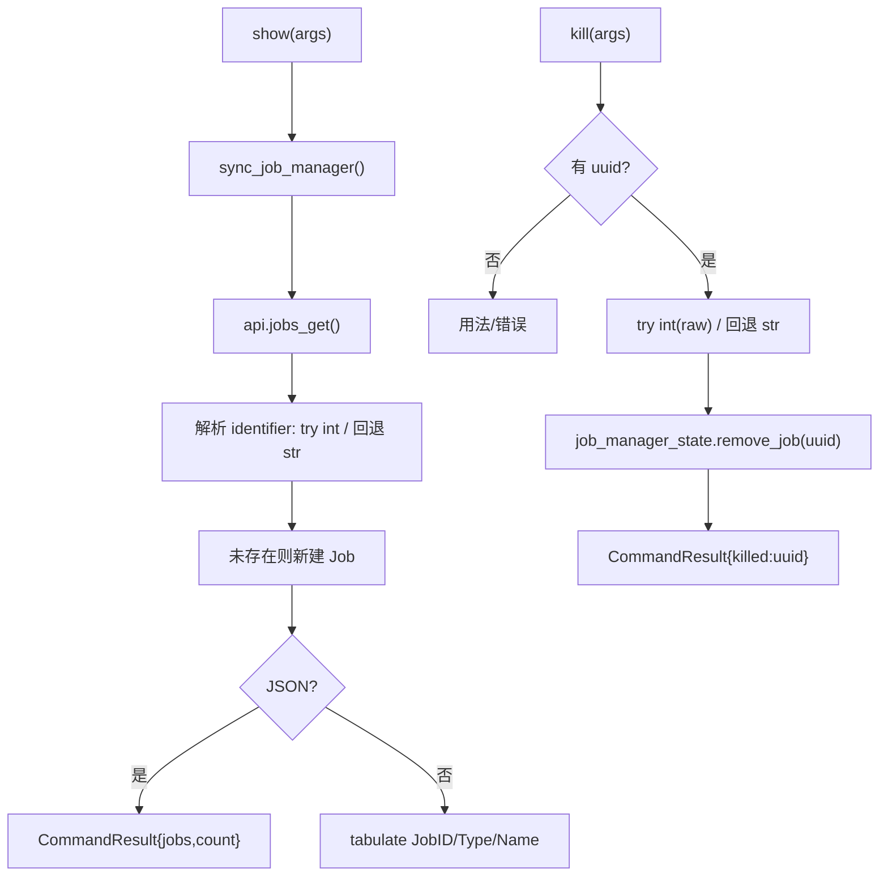
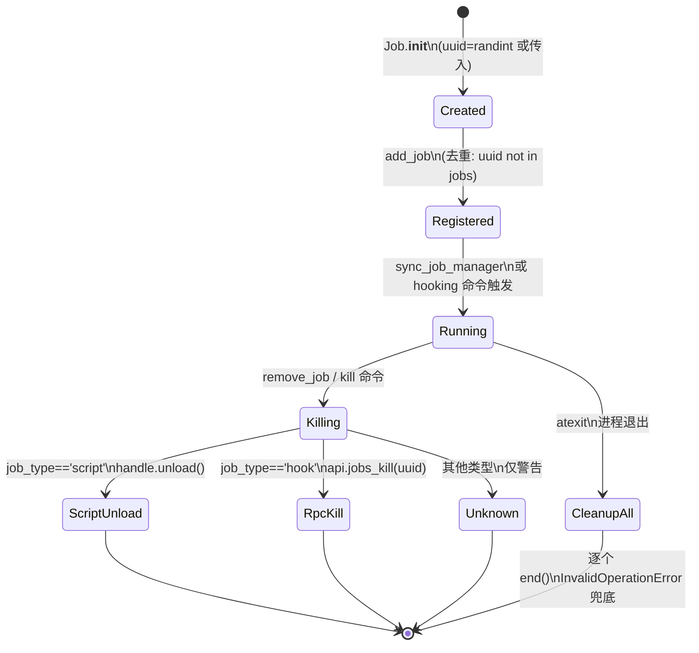
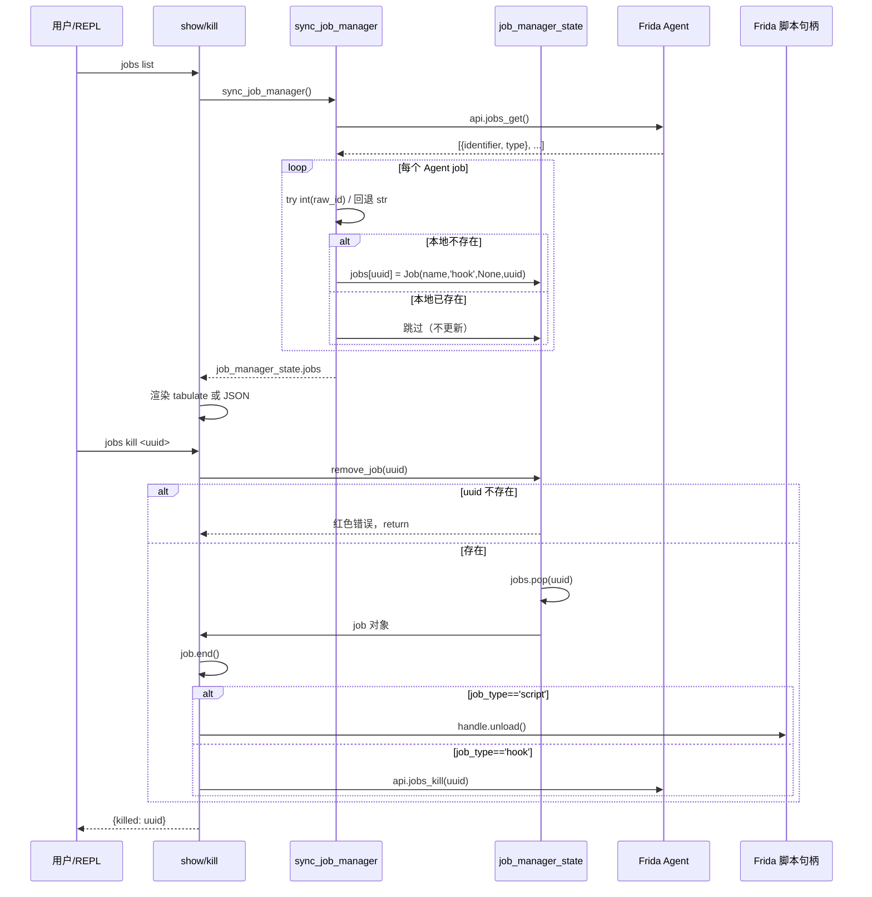

# Jobs 任务管理 <code>commands/jobs.py</code>

本模块管理 objection 的「作业」概念——Agent 上运行中的 hook/监听任务（如 keychain dump、clipboard monitor 等）。提供列出当前作业、按 UUID 终止作业两个动作，命令组前缀为 `jobs ...`。还含一个供 REPL tab 补全用的辅助函数。

## 📋 模块概览

| 项目 | 值 |
| --- | --- |
| 文件路径 | `objection/commands/jobs.py` |
| Agent 实现 | `agent/src/rpc/jobs.ts`（`jobs_get` 等） |
| 命令组 | `jobs list/kill` |
| 依赖 | `click`、`tabulate`、`objection.state.connection`、`objection.state.jobs`、`objection.utils.output` |

## 🎯 解决的问题

- 一眼看清当前跑着哪些 hook 作业、各自类型与名称。
- 按作业 ID 终止单个作业（而非全停）。
- 兼容 Agent 返回的 **base36 字符串 ID**（如 `rdcjq16g8xi`）与旧版纯数字 ID。
- REPL tab 补全作业 ID。

## 📜 命令清单

| 命令 | 函数 | 说明 |
| --- | --- | --- |
| `jobs list` | `show()` | 列出当前所有运行中作业 |
| `jobs kill <uuid>` | `kill()` | 终止指定作业 |

## ⚙️ 实现原理

`show` 先调 `sync_job_manager()` 从 Agent 拉取作业列表同步到本地 `job_manager_state`，再渲染表格或返回 JSON。`kill` 把 ID 尽量转 int 兼容旧逻辑，转不动则保留字符串，调 `job_manager_state.remove_job()`。

### `show()` — 列出作业

源码：[`objection/commands/jobs.py:10`](https://github.com/android-security-engineer/objection-skills/blob/master/objection/commands/jobs.py#L10)

先同步（[`objection/commands/jobs.py:17`](https://github.com/android-security-engineer/objection-skills/blob/master/objection/commands/jobs.py#L17)），JSON 模式返回作业列表（id/type/name）与计数：

```python
# objection/commands/jobs.py:20-32
if should_output_json(args):
    return output_result(
        CommandResult(
            result={
                'jobs': [
                    {'id': uuid, 'type': job.job_type, 'name': job.name}
                    for uuid, job in jobs.items()
                ],
                'count': len(jobs),
            },
        ),
        command='jobs list',
    )
```

非 JSON 用 `tabulate` 渲染 `Job ID | Type | Name` 三列（[`objection/commands/jobs.py:45-51`](https://github.com/android-security-engineer/objection-skills/blob/master/objection/commands/jobs.py#L45)）。

### `kill()` — 终止作业

源码：[`objection/commands/jobs.py:55`](https://github.com/android-security-engineer/objection-skills/blob/master/objection/commands/jobs.py#L55)

缺参数报错。ID 解析兼容 base36 字符串与纯数字：

```python
# objection/commands/jobs.py:79-85
raw = args[0]
try:
    job_uuid = int(raw)
except ValueError:
    job_uuid = raw

job_manager_state.remove_job(job_uuid)
```

JSON 模式返回 `{'killed': job_uuid}`。

### `sync_job_manager()` — 同步 Agent 作业

源码：[`objection/commands/jobs.py:110`](https://github.com/android-security-engineer/objection-skills/blob/master/objection/commands/jobs.py#L110)

从 `api.jobs_get()` 拉作业列表，对每个作业解析 `identifier`（同样 try int / 回退字符串），若本地不存在则新建 `Job` 对象塞入 `job_manager_state.jobs`。容错：若 `jobs` 被外部置为 list 则重置为 dict；整体失败打印 `REPL not ready`（[`objection/commands/jobs.py:131-132`](https://github.com/android-security-engineer/objection-skills/blob/master/objection/commands/jobs.py#L131)）。

### `list_current_jobs()` — REPL 补全

源码：[`objection/commands/jobs.py:95`](https://github.com/android-security-engineer/objection-skills/blob/master/objection/commands/jobs.py#L95)

供 tab 补全用，返回 `{uuid_str: uuid_str}` 字典（[`objection/commands/jobs.py:104-106`](https://github.com/android-security-engineer/objection-skills/blob/master/objection/commands/jobs.py#L104)）。



## 🔌 JSON 模式行为

- `show`：返回 `jobs` 数组（每项含 id/type/name）与 `count`。
- `kill`：缺 uuid 返回 `status='error'`、`exit_code=1`；成功返回 `{'killed': job_uuid}`，`job_uuid` 可能是 int 或 str。
- `sync_job_manager` 失败时静默打印 `REPL not ready`，不抛异常。

## 🔍 源码索引

| 符号 | 位置 |
| --- | --- |
| `show` | [`objection/commands/jobs.py:10`](https://github.com/android-security-engineer/objection-skills/blob/master/objection/commands/jobs.py#L10) |
| `kill` | [`objection/commands/jobs.py:55`](https://github.com/android-security-engineer/objection-skills/blob/master/objection/commands/jobs.py#L55) |
| `list_current_jobs` | [`objection/commands/jobs.py:95`](https://github.com/android-security-engineer/objection-skills/blob/master/objection/commands/jobs.py#L95) |
| `sync_job_manager` | [`objection/commands/jobs.py:110`](https://github.com/android-security-engineer/objection-skills/blob/master/objection/commands/jobs.py#L110) |

## 🔄 Job 生命周期与终止状态机

`Job` 对象（[`objection/state/jobs.py:10`](https://github.com/android-security-engineer/objection-skills/blob/master/objection/state/jobs.py#L10)）按 `job_type` 分两种终止路径：`script` 类型调 `self.handle.unload()`（Frida 脚本句柄卸载，`:45`），`hook` 类型调 `api.jobs_kill(self.uuid)`（RPC 通知 Agent 清理，`:48`），未知类型仅打印警告不操作（`:49-50`）。`JobManagerState` 在 `__init__` 注册 `atexit.register(self.cleanup)`（`:65`），进程退出时遍历所有 job 调 `end()`，单 job 失败由 `frida.InvalidOperationError` 兜底（`:108-110`）。



`remove_job`（[`objection/state/jobs.py:79`](https://github.com/android-security-engineer/objection-skills/blob/master/objection/state/jobs.py#L79)）的健壮性：ID 不存在时打印红色错误并 `return`（`:86-88`），不抛异常——这让 `jobs kill <不存在的id>` 不会崩 REPL。`pop` 后立即 `end()`，保证本地状态与 Agent 端同步清理，即使 Agent 端 kill 失败本地也已移除（可能造成短暂不一致，但避免悬挂 job）。

## 📡 Job 同步与 kill 时序

`sync_job_manager`（[`objection/commands/jobs.py:110`](https://github.com/android-security-engineer/objection-skills/blob/master/objection/commands/jobs.py#L110)）是**单向拉取**：从 Agent `jobs_get()` 拿当前作业列表，对本地不存在的 identifier 新建 `Job` 塞入状态。它**不删除**本地有而 Agent 没有的 job——即 Agent 端 job 自然消失（如脚本崩溃）后，本地状态仍保留陈旧条目，下次 `jobs list` 会显示已死的 job。



`Job.__init__` 的 uuid 生成策略（[`objection/state/jobs.py:23-30`](https://github.com/android-security-engineer/objection-skills/blob/master/objection/state/jobs.py#L23)）：传入 uuid 时 try int 失败则原样保留字符串（兼容 base36 identifier）；未传入时 `randint(100000, 999999)` 生成 6 位随机数——这意味着本地创建的 job（如 `memory list exports` 不创建 job，但 `android hooking watch` 会）与 Agent 返回的 base36 id 在同一 dict 中共存，key 类型混合 int 与 str。Python dict 对此无碍，但 Agent 调用 `jobs_kill` 时必须传与 Agent 端一致的形态。

## 🐛 边界情况与设计陷阱

- **陈旧 job 不清理**：`sync_job_manager` 只增不删（`:127`），Agent 端 job 崩溃后本地仍显示。需手动 `jobs kill` 或重启会话。注释代码（`:34-44`）显示曾有按 invocations/replacements/implementations 计数的设计，已废弃。
- **`cleanup` 的 `atexit` 时机**：`atexit` 在解释器退出时触发，若 Frida session 已断开，`job.end()` 会抛 `frida.InvalidOperationError`，被 `except` 兜底打印"Device may no longer be available"（`:109`），不阻塞退出。
- **base36 id 的 `int()` 兼容陷阱**：`kill` 中 `int(raw)` 对纯数字字符串成功，对 `rdcjq16g8xi` 抛 `ValueError` 回退字符串（`:80-83`）。但若 Agent 未来返回**纯数字字符串的 base36**（如 `"123"`），会被误转成 int 123——若本地恰好有 int 123 的 job 会误杀。当前 Agent 用 base36 含字母避免了此问题。
- **`job_type` 不匹配**：`sync_job_manager` 新建 Job 时硬编码 `job_type='hook'`（`:128`），即使 Agent 返回的 job 实际是 script 类型。这意味着 sync 拉来的 job 调 `end()` 走的是 `api.jobs_kill` 而非 `handle.unload`——因为 sync 来的 job 没有 `handle`（传 `None`），只能走 RPC 路径。
- **`list_current_jobs` 的副作用**：tab 补全调它时会触发 `sync_job_manager`（`:101`），即每次按 Tab 都发一次 `jobs_get` RPC——大作业量时可能卡顿。

## 🔗 相关文档

- [Jobs 任务](/features/jobs)
- [RPC 通信机制](/guide/rpc)
- [REPL 与命令](/guide/repl)
