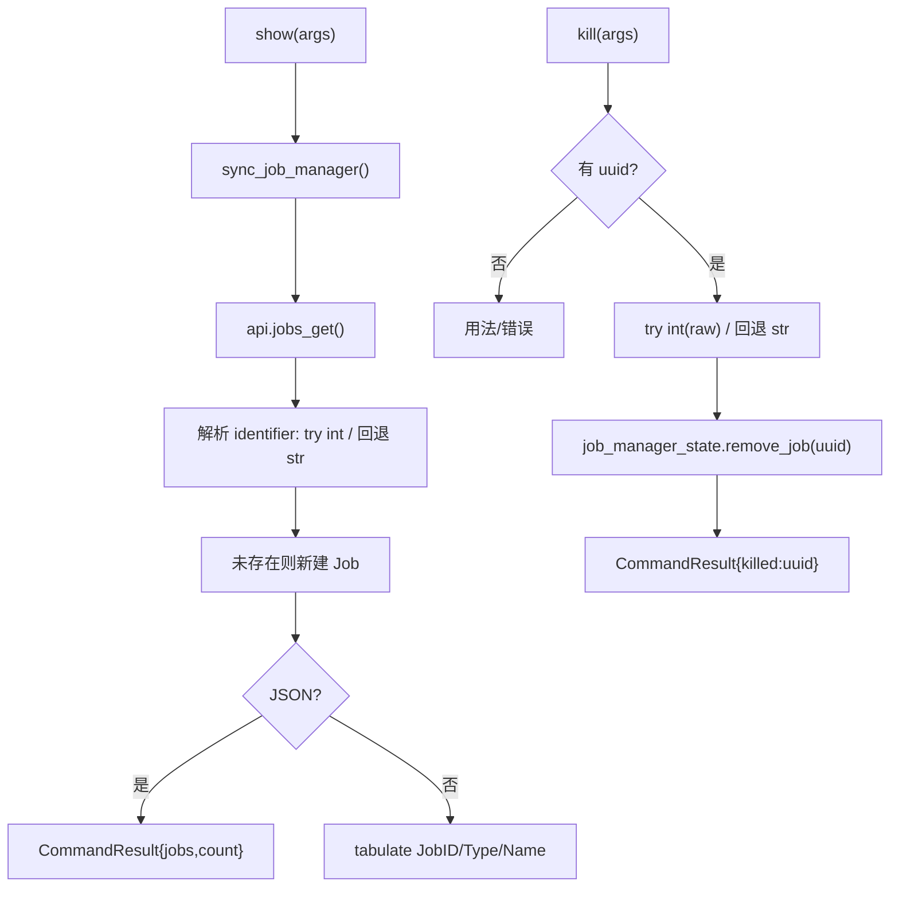

# Jobs 任务管理 <code>commands/jobs.py</code>

本模块管理 objection 的「作业」概念——Agent 上运行中的 hook/监听任务（如 keychain dump、clipboard monitor 等）。提供列出当前作业、按 UUID 终止作业两个动作，命令组前缀为 `jobs ...`。还含一个供 REPL tab 补全用的辅助函数。

## 📋 模块概览

| 项目 | 值 |
| --- | --- |
| 文件路径 | `objection/commands/jobs.py` |
| Agent 实现 | `agent/src/rpc/jobs.ts`（`jobs_get` 等） |
| 命令组 | `jobs list/kill` |
| 依赖 | `click`、`tabulate`、`objection.state.connection`、`objection.state.jobs`、`objection.utils.output` |

## 🎯 解决的问题

- 一眼看清当前跑着哪些 hook 作业、各自类型与名称。
- 按作业 ID 终止单个作业（而非全停）。
- 兼容 Agent 返回的 **base36 字符串 ID**（如 `rdcjq16g8xi`）与旧版纯数字 ID。
- REPL tab 补全作业 ID。

## 📜 命令清单

| 命令 | 函数 | 说明 |
| --- | --- | --- |
| `jobs list` | `show()` | 列出当前所有运行中作业 |
| `jobs kill <uuid>` | `kill()` | 终止指定作业 |

## ⚙️ 实现原理

`show` 先调 `sync_job_manager()` 从 Agent 拉取作业列表同步到本地 `job_manager_state`，再渲染表格或返回 JSON。`kill` 把 ID 尽量转 int 兼容旧逻辑，转不动则保留字符串，调 `job_manager_state.remove_job()`。

### `show()` — 列出作业

源码：`objection/commands/jobs.py:10`

先同步（`objection/commands/jobs.py:17`），JSON 模式返回作业列表（id/type/name）与计数：

```python
# objection/commands/jobs.py:20-32
if should_output_json(args):
    return output_result(
        CommandResult(
            result={
                'jobs': [
                    {'id': uuid, 'type': job.job_type, 'name': job.name}
                    for uuid, job in jobs.items()
                ],
                'count': len(jobs),
            },
        ),
        command='jobs list',
    )
```

非 JSON 用 `tabulate` 渲染 `Job ID | Type | Name` 三列（`objection/commands/jobs.py:45-51`）。

### `kill()` — 终止作业

源码：`objection/commands/jobs.py:55`

缺参数报错。ID 解析兼容 base36 字符串与纯数字：

```python
# objection/commands/jobs.py:79-85
raw = args[0]
try:
    job_uuid = int(raw)
except ValueError:
    job_uuid = raw

job_manager_state.remove_job(job_uuid)
```

JSON 模式返回 `{'killed': job_uuid}`。

### `sync_job_manager()` — 同步 Agent 作业

源码：`objection/commands/jobs.py:110`

从 `api.jobs_get()` 拉作业列表，对每个作业解析 `identifier`（同样 try int / 回退字符串），若本地不存在则新建 `Job` 对象塞入 `job_manager_state.jobs`。容错：若 `jobs` 被外部置为 list 则重置为 dict；整体失败打印 `REPL not ready`（`objection/commands/jobs.py:131-132`）。

### `list_current_jobs()` — REPL 补全

源码：`objection/commands/jobs.py:95`

供 tab 补全用，返回 `{uuid_str: uuid_str}` 字典（`objection/commands/jobs.py:104-106`）。



## 🔌 JSON 模式行为

- `show`：返回 `jobs` 数组（每项含 id/type/name）与 `count`。
- `kill`：缺 uuid 返回 `status='error'`、`exit_code=1`；成功返回 `{'killed': job_uuid}`，`job_uuid` 可能是 int 或 str。
- `sync_job_manager` 失败时静默打印 `REPL not ready`，不抛异常。

## 🔍 源码索引

| 符号 | 位置 |
| --- | --- |
| `show` | `objection/commands/jobs.py:10` |
| `kill` | `objection/commands/jobs.py:55` |
| `list_current_jobs` | `objection/commands/jobs.py:95` |
| `sync_job_manager` | `objection/commands/jobs.py:110` |

## 🔗 相关文档

- [Jobs 任务](/features/jobs)
- [RPC 通信机制](/guide/rpc)
- [REPL 与命令](/guide/repl)
