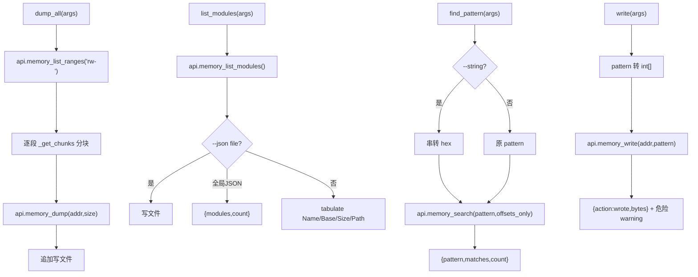

# 内存操作 <code>commands/memory.py</code>

本模块是 objection 内存取证与改写的核心，覆盖 dump（全量 / 按基址）、列举（模块 / 导出）、搜索、替换、写入六大类共 13 个函数。命令组前缀为 `memory ...`。本文为 reference 版逐函数详解。

## 📋 模块概览

| 项目 | 值 |
| --- | --- |
| 文件路径 | `objection/commands/memory.py` |
| Agent 实现 | `agent/src/android/memory.ts`、`agent/src/ios/memory.ts`（共用 RPC 名） |
| 命令组 | `memory dump/list/search/replace/write` |
| 依赖 | `json`、`os`、`click`、`tabulate`、`objection.state.connection`、`objection.utils.output`、`objection.utils.helpers` |

## 🎯 解决的问题

- 把进程可读内存整段 dump 成文件（基于 fridump 思路）。
- 按指定基址 + 大小精确 dump 一段。
- 列出进程加载的模块、某模块的导出符号。
- 在内存中搜索字节模式（支持 `??` 通配与 `--string`）。
- 找到模式后原地替换，或直接向指定地址写字节。
- `--json <file>` 写文件 vs 全局 JSON 模式走 stdout 的两套输出。

## 📜 命令清单

| 命令 | 函数 | 说明 |
| --- | --- | --- |
| `memory dump all <local dest>` | `dump_all()` | dump 全部可读内存段 |
| `memory dump from_base <base> <size> <dest>` | `dump_from_base()` | 按基址+大小 dump |
| `memory list modules [--json file]` | `list_modules()` | 列出加载模块 |
| `memory list exports <module> [--json file]` | `list_exports()` | 列出模块导出符号 |
| `memory search "<pattern>" [--string] [--offsets-only]` | `find_pattern()` | 搜索内存模式 |
| `memory replace "<search>" "<replace>" [--string-pattern] [--string-replace]` | `replace_pattern()` | 搜索并替换 |
| `memory write "<addr>" "<pattern>" [--string]` | `write()` | 向地址写字节 |

辅助函数（非命令）：

| 函数 | 作用 |
| --- | --- |
| `_is_string_input` | 检测 `--string` |
| `_should_only_dump_offsets` | 检测 `--offsets-only` |
| `_is_string_pattern` | 检测 `--string-pattern` |
| `_is_string_replace` | 检测 `--string-replace` |
| `_get_json_destination` | 取 `--json` 后的文件名 |
| `_get_chunks` | 把大块切分为 BLOCK_SIZE 分块 |

## ⚙️ 实现原理

Python 层做参数解析、标志检测、输出渲染；实际内存读写全走 `state_connection.get_api()` 的 `memory_*` RPC。`BLOCK_SIZE = 40960000`（`objection/commands/memory.py:13`）控制单次 dump 分块大小，避免一次读太大。

### 辅助函数

源码集中在 `objection/commands/memory.py:16-106`。

`_is_string_input`（`:16`）：`--string` 在 args 中。`_should_only_dump_offsets`（`:28`）：`--offsets-only` 在 args。`_is_string_pattern`（`:40`）：`--string-pattern`。`_is_string_replace`（`:52`）：`--string-replace`。

`_get_json_destination`（`:64`）取 `--json` 紧随的文件名，用于区分「写文件」与「全局 JSON 模式走 stdout」：

```python
# objection/commands/memory.py:70-78
if not args:
    return None
try:
    idx = args.index('--json')
except ValueError:
    return None
if idx + 1 < len(args):
    return args[idx + 1]
return None
```

`_get_chunks`（`:81`）把大块切分：小块直接返回单块；大块按 `block_size` 切分，末尾余数单独一块。

### `dump_all()` — 全量 dump

源码：`objection/commands/memory.py:114`

基于 fridump 思路。取 `rw-` 可读段，用 `_get_chunks` 分块逐块读，进度条展示，追加写入目标文件（`objection/commands/memory.py:159-179`）：

```python
# objection/commands/memory.py:169-171
chunks = _get_chunks(int(image['base'], 16), int(image['size']), BLOCK_SIZE)
for chunk in chunks:
    dump.extend(bytearray(api.memory_dump(chunk[0], chunk[1])))
```

单块异常被 `except Exception` 吞掉跳过（`objection/commands/memory.py:173-174`），保护因保护变化/重分配导致的失败。JSON 模式返回 `dumped_to/ranges_total/ranges_dumped/total_size`。

### `dump_from_base()` — 按基址 dump

源码：`objection/commands/memory.py:198`

需三个参数：基址、大小、目标文件。文件已存在时交互确认覆盖（JSON 模式跳过，`objection/commands/memory.py:226-230`）。同样分块读，写文件（`objection/commands/memory.py:239-241`）。JSON 模式返回 `dumped_to/base/size/bytes_written`。

### `list_modules()` — 列模块

源码：`objection/commands/memory.py:264`

调 `api.memory_list_modules()`。JSON 模式分两路（`objection/commands/memory.py:278-295`）：`--json <file>` 写文件返回 `dumped_to/count`；全局 JSON 返回 `{modules, count}`。非 JSON 用 `tabulate` 渲染 `Name | Base | Size | Path`，路径做 `pretty_concat` 截断（`objection/commands/memory.py:298-305`）。

### `list_exports()` — 列导出

源码：`objection/commands/memory.py:309`

需模块名参数，调 `api.memory_list_exports(module)`。JSON 双路同 `list_modules`（`objection/commands/memory.py:339-354`）。非 JSON 渲染 `Type | Name | Address`（`objection/commands/memory.py:357-363`）。

### `find_pattern()` — 搜索

源码：`objection/commands/memory.py:367`

`--string` 时把字符串逐字符转 hex（`objection/commands/memory.py:390-393`），否则原样用 pattern。调 `api.memory_search(pattern, offsets_only)`：

```python
# objection/commands/memory.py:397-398
api = state_connection.get_api()
data = api.memory_search(pattern, _should_only_dump_offsets(args))
```

JSON 模式返回 `{pattern, matches, count}`。非 JSON：`--offsets-only` 时逐行打印地址；无匹配提示（`objection/commands/memory.py:406-413`）。

### `replace_pattern()` — 搜索并替换

源码：`objection/commands/memory.py:418`

需两个参数（search、replace）。`--string-pattern` 把 search 串转 hex；`--string-replace` 把 replace 串转 int[]，否则 hex 串转 int[]（`objection/commands/memory.py:442-452`）：

```python
# objection/commands/memory.py:449-452
if _is_string_replace(args):
    replace = [ord(x) for x in replace]
else:
    replace = [int(x, 16) for x in replace.split(' ')]
```

调 `api.memory_replace(pattern, replace)`，返回替换地址列表。JSON 模式带 warning：内存替换可能不稳定，重映射/重链接会还原（`objection/commands/memory.py:459-466`）。

### `write()` — 写内存

源码：`objection/commands/memory.py:479`

需地址与 pattern 两参数。`--string` 时 pattern 逐字符转 int，否则 hex 串转 int[]（`objection/commands/memory.py:506-509`）。调 `api.memory_write(destination, pattern)`。JSON 模式带 warning：直接写内存危险，可能崩溃目标（`objection/commands/memory.py:516-523`）。



## 🔌 JSON 模式行为

- `dump_all`/`dump_from_base`：文件已存在时 JSON 模式跳过覆盖确认；成功返回统计信息。
- `list_modules`/`list_exports`：`--json <file>` 写文件返回 `dumped_to/count`；全局 JSON 返回数据本身。这是区分「写文件」与「走 stdout」的关键双路逻辑（`objection/commands/memory.py:278-295`、`:339-354`）。
- `find_pattern`：返回匹配地址列表与计数。
- `replace_pattern`：返回 `replaced_at` 地址列表，带不稳定性 warning。
- `write`：返回 `action='wrote'` 与字节数，带危险性 warning。
- 所有命令缺参数时返回 `status='error'`、`exit_code=1` 与 `human_text` 用法。

## 🔍 源码索引

| 符号 | 位置 |
| --- | --- |
| `BLOCK_SIZE` | `objection/commands/memory.py:13` |
| `_is_string_input` | `objection/commands/memory.py:16` |
| `_should_only_dump_offsets` | `objection/commands/memory.py:28` |
| `_is_string_pattern` | `objection/commands/memory.py:40` |
| `_is_string_replace` | `objection/commands/memory.py:52` |
| `_get_json_destination` | `objection/commands/memory.py:64` |
| `_get_chunks` | `objection/commands/memory.py:81` |
| `dump_all` | `objection/commands/memory.py:114` |
| `dump_from_base` | `objection/commands/memory.py:198` |
| `list_modules` | `objection/commands/memory.py:264` |
| `list_exports` | `objection/commands/memory.py:309` |
| `find_pattern` | `objection/commands/memory.py:367` |
| `replace_pattern` | `objection/commands/memory.py:418` |
| `write` | `objection/commands/memory.py:479` |

## 🔗 相关文档

- [内存 Dump/Patch](/features/memory)
- [RPC 通信机制](/guide/rpc)
- [REPL 与命令](/guide/repl)
