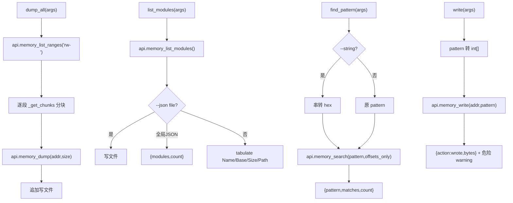
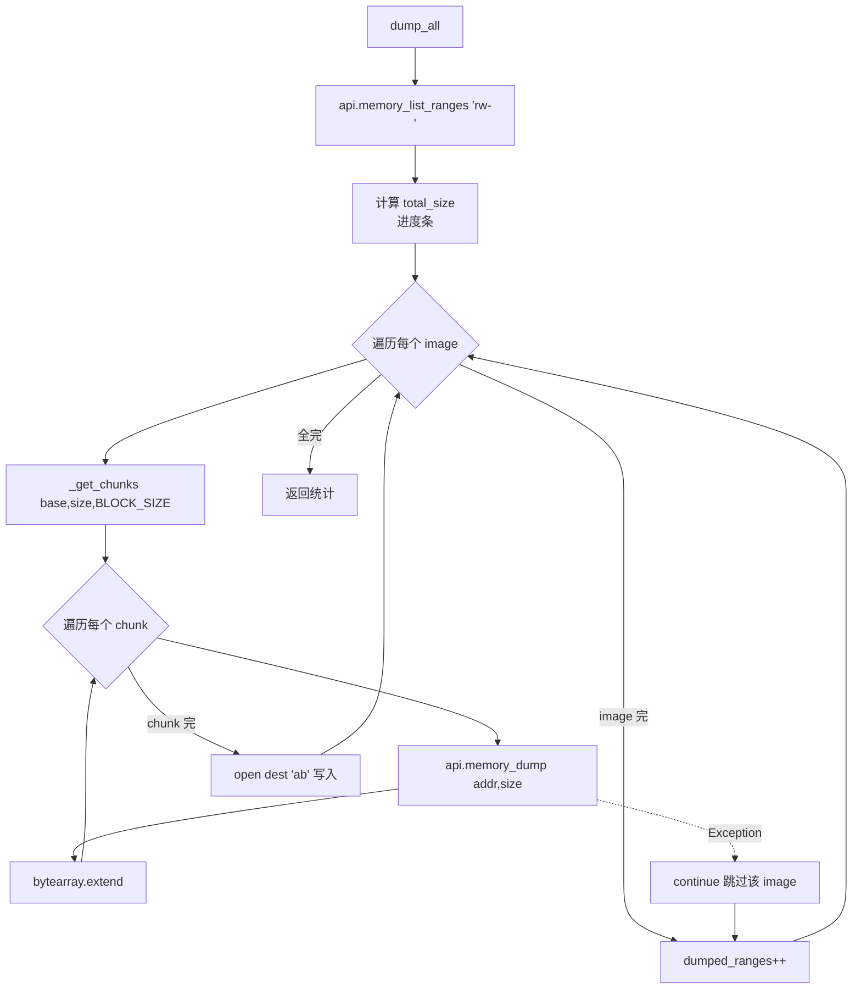
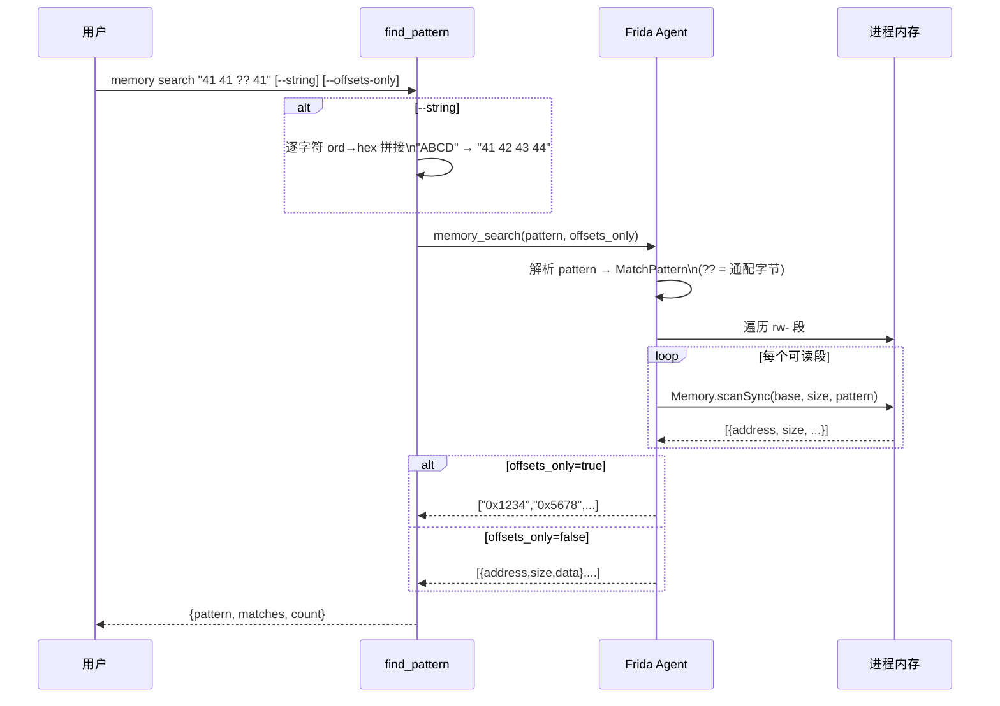
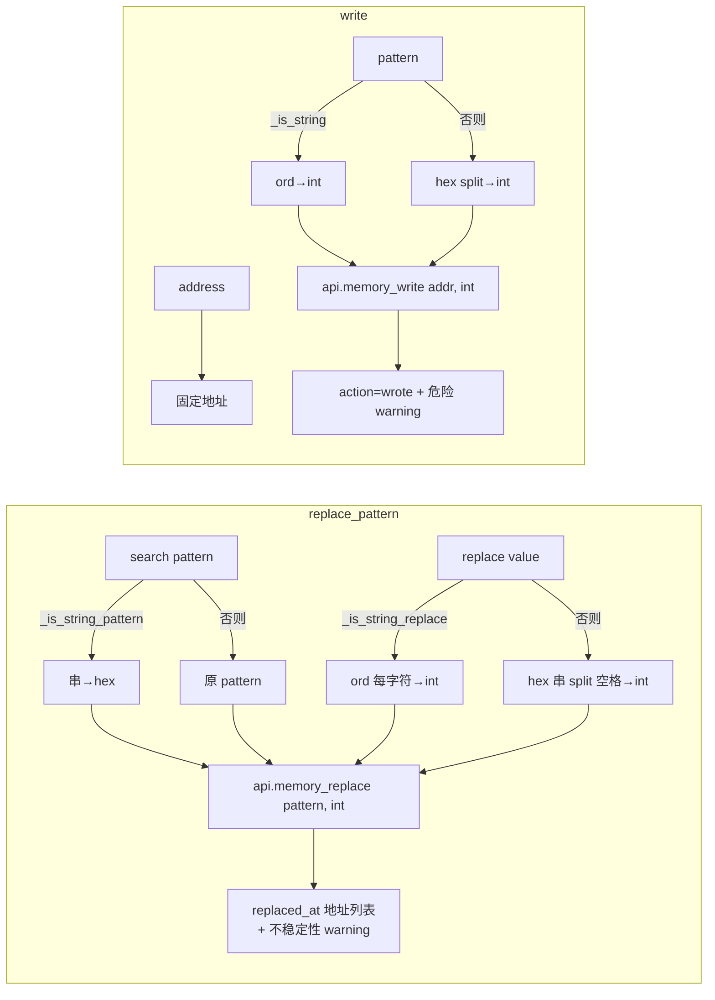

# 内存操作 <code>commands/memory.py</code>

本模块是 objection 内存取证与改写的核心，覆盖 dump（全量 / 按基址）、列举（模块 / 导出）、搜索、替换、写入六大类共 13 个函数。命令组前缀为 `memory ...`。本文为 reference 版逐函数详解。

## 📋 模块概览

| 项目 | 值 |
| --- | --- |
| 文件路径 | `objection/commands/memory.py` |
| Agent 实现 | `agent/src/android/memory.ts`、`agent/src/ios/memory.ts`（共用 RPC 名） |
| 命令组 | `memory dump/list/search/replace/write` |
| 依赖 | `json`、`os`、`click`、`tabulate`、`objection.state.connection`、`objection.utils.output`、`objection.utils.helpers` |

## 🎯 解决的问题

- 把进程可读内存整段 dump 成文件（基于 fridump 思路）。
- 按指定基址 + 大小精确 dump 一段。
- 列出进程加载的模块、某模块的导出符号。
- 在内存中搜索字节模式（支持 `??` 通配与 `--string`）。
- 找到模式后原地替换，或直接向指定地址写字节。
- `--json <file>` 写文件 vs 全局 JSON 模式走 stdout 的两套输出。

## 📜 命令清单

| 命令 | 函数 | 说明 |
| --- | --- | --- |
| `memory dump all <local dest>` | `dump_all()` | dump 全部可读内存段 |
| `memory dump from_base <base> <size> <dest>` | `dump_from_base()` | 按基址+大小 dump |
| `memory list modules [--json file]` | `list_modules()` | 列出加载模块 |
| `memory list exports <module> [--json file]` | `list_exports()` | 列出模块导出符号 |
| `memory search "<pattern>" [--string] [--offsets-only]` | `find_pattern()` | 搜索内存模式 |
| `memory replace "<search>" "<replace>" [--string-pattern] [--string-replace]` | `replace_pattern()` | 搜索并替换 |
| `memory write "<addr>" "<pattern>" [--string]` | `write()` | 向地址写字节 |

辅助函数（非命令）：

| 函数 | 作用 |
| --- | --- |
| `_is_string_input` | 检测 `--string` |
| `_should_only_dump_offsets` | 检测 `--offsets-only` |
| `_is_string_pattern` | 检测 `--string-pattern` |
| `_is_string_replace` | 检测 `--string-replace` |
| `_get_json_destination` | 取 `--json` 后的文件名 |
| `_get_chunks` | 把大块切分为 BLOCK_SIZE 分块 |

## ⚙️ 实现原理

Python 层做参数解析、标志检测、输出渲染；实际内存读写全走 `state_connection.get_api()` 的 `memory_*` RPC。`BLOCK_SIZE = 40960000`（[`objection/commands/memory.py:13`](https://github.com/android-security-engineer/objection-skills/blob/master/objection/commands/memory.py#L13)）控制单次 dump 分块大小，避免一次读太大。

### 辅助函数

源码集中在 [`objection/commands/memory.py:16-106`](https://github.com/android-security-engineer/objection-skills/blob/master/objection/commands/memory.py#L16)。

`_is_string_input`（`:16`）：`--string` 在 args 中。`_should_only_dump_offsets`（`:28`）：`--offsets-only` 在 args。`_is_string_pattern`（`:40`）：`--string-pattern`。`_is_string_replace`（`:52`）：`--string-replace`。

`_get_json_destination`（`:64`）取 `--json` 紧随的文件名，用于区分「写文件」与「全局 JSON 模式走 stdout」：

```python
# objection/commands/memory.py:70-78
if not args:
    return None
try:
    idx = args.index('--json')
except ValueError:
    return None
if idx + 1 < len(args):
    return args[idx + 1]
return None
```

`_get_chunks`（`:81`）把大块切分：小块直接返回单块；大块按 `block_size` 切分，末尾余数单独一块。

### `dump_all()` — 全量 dump

源码：[`objection/commands/memory.py:114`](https://github.com/android-security-engineer/objection-skills/blob/master/objection/commands/memory.py#L114)

基于 fridump 思路。取 `rw-` 可读段，用 `_get_chunks` 分块逐块读，进度条展示，追加写入目标文件（[`objection/commands/memory.py:159-179`](https://github.com/android-security-engineer/objection-skills/blob/master/objection/commands/memory.py#L159)）：

```python
# objection/commands/memory.py:169-171
chunks = _get_chunks(int(image['base'], 16), int(image['size']), BLOCK_SIZE)
for chunk in chunks:
    dump.extend(bytearray(api.memory_dump(chunk[0], chunk[1])))
```

单块异常被 `except Exception` 吞掉跳过（[`objection/commands/memory.py:173-174`](https://github.com/android-security-engineer/objection-skills/blob/master/objection/commands/memory.py#L173)），保护因保护变化/重分配导致的失败。JSON 模式返回 `dumped_to/ranges_total/ranges_dumped/total_size`。

### `dump_from_base()` — 按基址 dump

源码：[`objection/commands/memory.py:198`](https://github.com/android-security-engineer/objection-skills/blob/master/objection/commands/memory.py#L198)

需三个参数：基址、大小、目标文件。文件已存在时交互确认覆盖（JSON 模式跳过，[`objection/commands/memory.py:226-230`](https://github.com/android-security-engineer/objection-skills/blob/master/objection/commands/memory.py#L226)）。同样分块读，写文件（[`objection/commands/memory.py:239-241`](https://github.com/android-security-engineer/objection-skills/blob/master/objection/commands/memory.py#L239)）。JSON 模式返回 `dumped_to/base/size/bytes_written`。

### `list_modules()` — 列模块

源码：[`objection/commands/memory.py:264`](https://github.com/android-security-engineer/objection-skills/blob/master/objection/commands/memory.py#L264)

调 `api.memory_list_modules()`。JSON 模式分两路（[`objection/commands/memory.py:278-295`](https://github.com/android-security-engineer/objection-skills/blob/master/objection/commands/memory.py#L278)）：`--json <file>` 写文件返回 `dumped_to/count`；全局 JSON 返回 `{modules, count}`。非 JSON 用 `tabulate` 渲染 `Name | Base | Size | Path`，路径做 `pretty_concat` 截断（[`objection/commands/memory.py:298-305`](https://github.com/android-security-engineer/objection-skills/blob/master/objection/commands/memory.py#L298)）。

### `list_exports()` — 列导出

源码：[`objection/commands/memory.py:309`](https://github.com/android-security-engineer/objection-skills/blob/master/objection/commands/memory.py#L309)

需模块名参数，调 `api.memory_list_exports(module)`。JSON 双路同 `list_modules`（[`objection/commands/memory.py:339-354`](https://github.com/android-security-engineer/objection-skills/blob/master/objection/commands/memory.py#L339)）。非 JSON 渲染 `Type | Name | Address`（[`objection/commands/memory.py:357-363`](https://github.com/android-security-engineer/objection-skills/blob/master/objection/commands/memory.py#L357)）。

### `find_pattern()` — 搜索

源码：[`objection/commands/memory.py:367`](https://github.com/android-security-engineer/objection-skills/blob/master/objection/commands/memory.py#L367)

`--string` 时把字符串逐字符转 hex（[`objection/commands/memory.py:390-393`](https://github.com/android-security-engineer/objection-skills/blob/master/objection/commands/memory.py#L390)），否则原样用 pattern。调 `api.memory_search(pattern, offsets_only)`：

```python
# objection/commands/memory.py:397-398
api = state_connection.get_api()
data = api.memory_search(pattern, _should_only_dump_offsets(args))
```

JSON 模式返回 `{pattern, matches, count}`。非 JSON：`--offsets-only` 时逐行打印地址；无匹配提示（[`objection/commands/memory.py:406-413`](https://github.com/android-security-engineer/objection-skills/blob/master/objection/commands/memory.py#L406)）。

### `replace_pattern()` — 搜索并替换

源码：[`objection/commands/memory.py:418`](https://github.com/android-security-engineer/objection-skills/blob/master/objection/commands/memory.py#L418)

需两个参数（search、replace）。`--string-pattern` 把 search 串转 hex；`--string-replace` 把 replace 串转 int[]，否则 hex 串转 int[]（[`objection/commands/memory.py:442-452`](https://github.com/android-security-engineer/objection-skills/blob/master/objection/commands/memory.py#L442)）：

```python
# objection/commands/memory.py:449-452
if _is_string_replace(args):
    replace = [ord(x) for x in replace]
else:
    replace = [int(x, 16) for x in replace.split(' ')]
```

调 `api.memory_replace(pattern, replace)`，返回替换地址列表。JSON 模式带 warning：内存替换可能不稳定，重映射/重链接会还原（[`objection/commands/memory.py:459-466`](https://github.com/android-security-engineer/objection-skills/blob/master/objection/commands/memory.py#L459)）。

### `write()` — 写内存

源码：[`objection/commands/memory.py:479`](https://github.com/android-security-engineer/objection-skills/blob/master/objection/commands/memory.py#L479)

需地址与 pattern 两参数。`--string` 时 pattern 逐字符转 int，否则 hex 串转 int[]（[`objection/commands/memory.py:506-509`](https://github.com/android-security-engineer/objection-skills/blob/master/objection/commands/memory.py#L506)）。调 `api.memory_write(destination, pattern)`。JSON 模式带 warning：直接写内存危险，可能崩溃目标（[`objection/commands/memory.py:516-523`](https://github.com/android-security-engineer/objection-skills/blob/master/objection/commands/memory.py#L516)）。



## 🔌 JSON 模式行为

- `dump_all`/`dump_from_base`：文件已存在时 JSON 模式跳过覆盖确认；成功返回统计信息。
- `list_modules`/`list_exports`：`--json <file>` 写文件返回 `dumped_to/count`；全局 JSON 返回数据本身。这是区分「写文件」与「走 stdout」的关键双路逻辑（[`objection/commands/memory.py:278-295`](https://github.com/android-security-engineer/objection-skills/blob/master/objection/commands/memory.py#L278)、`:339-354`）。
- `find_pattern`：返回匹配地址列表与计数。
- `replace_pattern`：返回 `replaced_at` 地址列表，带不稳定性 warning。
- `write`：返回 `action='wrote'` 与字节数，带危险性 warning。
- 所有命令缺参数时返回 `status='error'`、`exit_code=1` 与 `human_text` 用法。

## 🔍 源码索引

| 符号 | 位置 |
| --- | --- |
| `BLOCK_SIZE` | [`objection/commands/memory.py:13`](https://github.com/android-security-engineer/objection-skills/blob/master/objection/commands/memory.py#L13) |
| `_is_string_input` | [`objection/commands/memory.py:16`](https://github.com/android-security-engineer/objection-skills/blob/master/objection/commands/memory.py#L16) |
| `_should_only_dump_offsets` | [`objection/commands/memory.py:28`](https://github.com/android-security-engineer/objection-skills/blob/master/objection/commands/memory.py#L28) |
| `_is_string_pattern` | [`objection/commands/memory.py:40`](https://github.com/android-security-engineer/objection-skills/blob/master/objection/commands/memory.py#L40) |
| `_is_string_replace` | [`objection/commands/memory.py:52`](https://github.com/android-security-engineer/objection-skills/blob/master/objection/commands/memory.py#L52) |
| `_get_json_destination` | [`objection/commands/memory.py:64`](https://github.com/android-security-engineer/objection-skills/blob/master/objection/commands/memory.py#L64) |
| `_get_chunks` | [`objection/commands/memory.py:81`](https://github.com/android-security-engineer/objection-skills/blob/master/objection/commands/memory.py#L81) |
| `dump_all` | [`objection/commands/memory.py:114`](https://github.com/android-security-engineer/objection-skills/blob/master/objection/commands/memory.py#L114) |
| `dump_from_base` | [`objection/commands/memory.py:198`](https://github.com/android-security-engineer/objection-skills/blob/master/objection/commands/memory.py#L198) |
| `list_modules` | [`objection/commands/memory.py:264`](https://github.com/android-security-engineer/objection-skills/blob/master/objection/commands/memory.py#L264) |
| `list_exports` | [`objection/commands/memory.py:309`](https://github.com/android-security-engineer/objection-skills/blob/master/objection/commands/memory.py#L309) |
| `find_pattern` | [`objection/commands/memory.py:367`](https://github.com/android-security-engineer/objection-skills/blob/master/objection/commands/memory.py#L367) |
| `replace_pattern` | [`objection/commands/memory.py:418`](https://github.com/android-security-engineer/objection-skills/blob/master/objection/commands/memory.py#L418) |
| `write` | [`objection/commands/memory.py:479`](https://github.com/android-security-engineer/objection-skills/blob/master/objection/commands/memory.py#L479) |

## 🧱 dump 分块算法与内存布局

`BLOCK_SIZE = 40960000`（约 39 MB，[`objection/commands/memory.py:13`](https://github.com/android-security-engineer/objection-skills/blob/master/objection/commands/memory.py#L13)）是单次 `memory_dump` RPC 的上限。`_get_chunks`（`:81`）把大段切成 `(addr, size)` 元组列表：小块（`size < block_size`）整块返回；大块按整除切 N 份，余数单独成块。地址随每块递增，保证覆盖连续虚拟地址空间。

```
   原始范围 [base, base+size)
   size = 100_000_000, BLOCK_SIZE = 40_960_000

   +-----------------------+  base
   |  chunk[0]             |  size = 40_960_000
   +-----------------------+  base + 40_960_000
   |  chunk[1]             |  size = 40_960_000
   +-----------------------+  base + 81_920_000
   |  chunk[2] (余数)      |  size = 18_080_000
   +-----------------------+  base + 100_000_000

   _get_chunks 返回:
   [(base,         40960000),
    (base+40960000,40960000),
    (base+81920000,18080000)]
```

`dump_all` 把每个可读段 (`rw-`) 的所有分块字节 `bytearray.extend` 拼成该段的 dump，然后以 `'ab'`（追加）模式写入目标文件（[`objection/commands/memory.py:178`](https://github.com/android-security-engineer/objection-skills/blob/master/objection/commands/memory.py#L178)）。注意是追加而非覆盖——这导致重复 `dump_all` 到同一文件会**累积重复数据**，源码中 `os.path.exists` 检查只警告 "Continue, appending to the file?"（`:142-146`），JSON 模式直接跳过确认继续追加。



关键容错：单块 `Exception` 被 `except Exception as e: continue` 吞掉（`:173-174`），**跳过整个 image** 而非单个 chunk——因为 `try` 包住整个 chunk 循环。这意味着一个 100 MB 段在第 2 个 chunk 失败时，前 1 个 chunk 已读的字节也会被丢弃（`dump` 局部变量随 `continue` 重建），该段不计入 `dumped_ranges`。保护变化（如 `rwx` 转 `r--`）或重分配是常见失败原因。

## 🔍 内存扫描与匹配算法

`find_pattern` 在 Python 侧只做参数预处理（`--string` 串转 hex，`:390-393`），真正的扫描在 Frida Agent 内 `memory_search` RPC 完成。`--offsets-only` 控制返回形态：`True` 只返回地址列表，`False` 返回 `{address, size, data}` 完整匹配（供后续 hex dump）。



通配 `??` 由 Frida 原生 `Memory.scanSync` 支持，objection 不做额外过滤。注意 `--string` 模式逐字符转 hex 用 `hex(ord(x))[2:]`（`:391`/`:443`），**不补前导零**——对大于 0x0f 的字节正常（如 `ord('A')=65 → '41'`），但 ASCII 控制符如 `\n`（10）会变成 `'a'` 而非 `'0a'`，与 Frida 的 pattern 解析不兼容。实际使用 `--string` 应仅用于可见 ASCII。

## 🔄 search → replace → write 的写入语义

三者共享同一套 pattern 解析，但写入语义递进：`search` 只读、`replace` 找到后原地改写多个匹配、`write` 无搜索直接定址写。`replace` 的替换值有两种编码路径（[`objection/commands/memory.py:449-452`](https://github.com/android-security-engineer/objection-skills/blob/master/objection/commands/memory.py#L449)）：



`replace` 与 `write` 的 warning 差异体现风险等级：`replace` 的 warning 是"In-memory replacement can be unstable; re-mapping or relinking may revert changes."（`:463`），强调**易失性**——JIT 编译器、GC、`mprotect` 重映射都会让改动消失；`write` 的 warning 是"Direct memory writes are dangerous and may crash the target."（`:520`），强调**破坏性**——写到只读页触发 SIGSEGV，写到代码段可能破坏指令一致性缓存（arm64 icache）。

## 🐛 边界情况与平台差异

- **`dump_all` 文件已存在**：交互模式问"Continue, appending to the file?"（`:145`），JSON 模式跳过确认**直接追加**——重复 dump 会污染文件，取证时务必用新文件名。
- **`dump_from_base` 文件已存在**：交互问"Override?"（`:229`），但实际写模式是 `'wb'`（覆盖，`:244`），与提示一致；而 `dump_all` 用 `'ab'`（追加，`:178`）——两者文件已存在语义不同，易踩坑。
- **`list_modules` 无参数也能跑**：不像其他命令缺参报错，`list_modules` 不需要位置参数，`args=None` 默认值（`:264`）兼容空调用。
- **`list_exports` 的 `--json` 双路**：`--json <file>` 写文件返回 `{dumped_to, module, count}`；全局 JSON 返回 `{module, exports, count}`（`:339-354`）。Agent 调用应走全局 JSON 拿结构化数据。
- **`find_pattern` 无匹配**：非 JSON 模式打印"Unable to find the pattern"（`:413`），JSON 模式返回空 `matches` 列表与 `count: 0`，不报错。
- **`write` 地址解析**：`destination = args[0]` 原样字符串发给 Agent（`:503`），不在 Python 侧转 int——Agent 端负责 `ptr()` 解析，支持 `0x...` 与裸十进制。

## 🔗 相关文档

- [内存 Dump/Patch](/features/memory)
- [RPC 通信机制](/guide/rpc)
- [REPL 与命令](/guide/repl)
