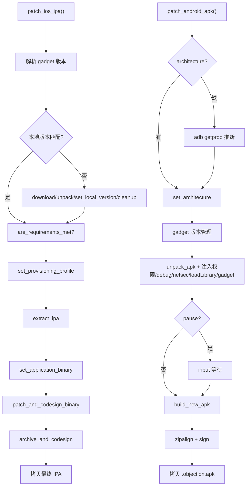
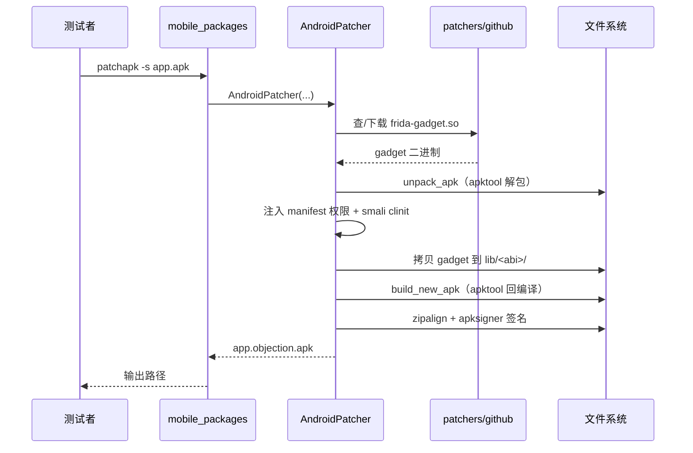

# 移动应用打包/重打包 <code>commands/mobile_packages.py</code>

本模块在**本地**（非设备注入）对 iOS IPA 与 Android APK 做 Frida Gadget 注入式重打包：解包、注入 gadget、（iOS）签名/（Android）补 SMALI + 对齐 + 签名、重新打包。它是 `objection patchapk` / `patchipa` CLI 命令的后端，命令组无统一前缀。

## 📋 模块概览

| 项目 | 值 |
| --- | --- |
| 文件路径 | `objection/commands/mobile_packages.py` |
| Agent 实现 | 无（本地打包工具链） |
| 命令组 | `patchipa`、`patchapk`、由 `objection/utils/patchers/*` 承载 |
| 依赖 | `os`、`shutil`、`click`、`delegator`、`packaging.version`、`objection.utils.patchers.android`、`objection.utils.patchers.ios`、`objection.utils.patchers.github` |

## 🎯 解决的问题

- 设备无法 root/越狱时，用 Frida Gadget 注入到重打包的 IPA/APK 实现「免 root」注入。
- 自动管理 gadget 版本：本地过期或缺失时从 GitHub 下载。
- Android 支持 SMALI 注入 `loadLibrary`、网络安全配置、debug 标志、aapt2、自定义 manifest 等大量开关。
- iOS 需 codesign 与 provisioning profile，模块串联整个流程。
- 支持 `pause` 在重新打包前暂停，便于手动修改临时目录。

## 📜 命令清单

| 函数 | 说明 |
| --- | --- |
| `patch_ios_ipa()` | 解包 IPA → 注入 Frida dylib → codesign → 重打包 |
| `patch_android_apk()` | 解包 APK → 补 SMALI/注入 gadget → 对齐签名 → 重打包 |
| `sign_android_apk()` | 仅 zipalign + 用 objection key 签名 APK |

## ⚙️ 实现原理

三个函数都依赖 `objection.utils.patchers` 下的 `Github`（取 gadget 版本/下载）、`IosGadget`/`AndroidGadget`（gadget 本地管理）、`IosPatcher`/`AndroidPatcher`（实际打包流程）。版本对比用 `packaging.version.Version`。

### `patch_ios_ipa()` — IPA 重打包

源码：[`objection/commands/mobile_packages.py:13`](https://github.com/android-security-engineer/objection-skills/blob/master/objection/commands/mobile_packages.py#L13)

取/校验 gadget 版本：手动指定或 `github.get_latest_version()`，与本地版本对比，过期则下载解包更新（`:40-61`）：

```python
# objection/commands/mobile_packages.py:52-61
if Version(github_version) != Version(local_version) or not ios_gadget.gadget_exists():
    ios_gadget.download() \
        .unpack() \
        .set_local_version('ios_universal', github_version) \
        .cleanup()
```

打包流程（`:66-91`）：`are_requirements_met` 校验工具链 → `set_provsioning_profile` → `extract_ipa` → `set_application_binary` → `patch_and_codesign_binary` → 可选拷贝自定义脚本 → `pause` 时暂停 → `archive_and_codesign` → 拷贝最终 IPA 到当前目录。

### `patch_android_apk()` — APK 重打包

源码：[`objection/commands/mobile_packages.py:99`](https://github.com/android-security-engineer/objection-skills/blob/master/objection/commands/mobile_packages.py#L99)

参数极多（架构、pause、skip_cleanup、enable_debug、gadget_version、skip_resources、network_security_config、target_class、use_aapt2、gadget_config、script_source、ignore_nativelibs、manifest、skip_signing、only_main_classes、fix_concurrency_to）。

无架构时用 `delegator.run('adb shell getprop ro.product.cpu.abi')` 推断（`:135-146`）。`script_source` 必须配 `gadget_config`（`:152-154`）。gadget 版本管理与 iOS 对称（`:157-179`）。打包流程（`:183-236`）：

```python
# objection/commands/mobile_packages.py:195-209
patcher.set_apk_source(source=source)
patcher.unpack_apk(fix_concurrency_to=fix_concurrency_to)
patcher.inject_internet_permission()
if not ignore_nativelibs:
    patcher.extract_native_libs_patch()
if enable_debug:
    patcher.flip_debug_flag_to_true()
if network_security_config:
    patcher.add_network_security_config()
patcher.inject_load_library(target_class=target_class)
patcher.add_gadget_to_apk(architecture, android_gadget.get_frida_library_path(), gadget_config)
```

`pause` 时打印临时目录并 `input()` 等待（`:218-224`）；随后 `build_new_apk` → `zipalign_apk` → 非 `skip_signing` 时 `sign_apk`；最终拷贝 `<原名>.objection.apk` 到当前目录（`:232-236`）。

### `sign_android_apk()` — 仅签名

源码：[`objection/commands/mobile_packages.py:239`](https://github.com/android-security-engineer/objection-skills/blob/master/objection/commands/mobile_packages.py#L239)

最简流程：`are_requirements_met` → `set_apk_source` → `zipalign_apk` → `sign_apk` → 拷贝 `<原名>.objection.apk`（`:249-264`）。用于已打好但未签名的 APK。



## 🔌 JSON 模式行为

- 本模块**不**返回 `CommandResult`，三个函数返回 `None`——它是 CLI 工具后端，不进入 Agent RPC 通道。
- 所有输出走 `click.secho`，进度信息直接打印。
- `pause` 用 `input()` 阻塞，仅在交互式 CLI 下可用。

## 🔬 技术细节

### Android patch 端到端时序



### patch 产物结构

```
app.objection.apk（重打包后）
├── AndroidManifest.xml      ← 已注入 INTERNET / debuggable / usesCleartextTraffic
├── classes.dex              ← smali <clinit> 注入 System.loadLibrary("frida-gadget")
├── lib/
│   ├── arm64-v8a/
│   │   └── libfrida-gadget.so   ← 从 GitHub 下载的 gadget（与宿主 frida 同版本）
│   ├── armeabi-v7a/
│   │   └── libfrida-gadget.so
│   └── x86_64/
│       └── libfrida-gadget.so
└── META-INF/                ← apksigner 重签名产物
```

### 边界情况

- **架构推断**：未指定 `--architecture` 时用 `adb getprop ro.product.cpu.abi` 推断；无连接设备则失败。
- **`--skip-resources`**：传给 apktool 跳过资源解析，加速但 manifest 保留为二进制 AXML，无法再 ElementTree 改（与权限注入互斥）。
- **gadget 版本一致性**：下载的 gadget 大版本必须与宿主 `frida` 库一致，否则 App 启动后连不上。
- **签名密钥**：默认用 objection 内置调试密钥；生产测试应传 `--skip-resources` 之外的独立 keystore。
- **iOS 仅限 macOS**：`patchipa` 依赖 `codesign`/`applesign`，非 macOS 不可用。

## 🔍 源码索引

| 符号 | 位置 |
| --- | --- |
| `patch_ios_ipa` | [`objection/commands/mobile_packages.py:13`](https://github.com/android-security-engineer/objection-skills/blob/master/objection/commands/mobile_packages.py#L13) |
| `patch_android_apk` | [`objection/commands/mobile_packages.py:99`](https://github.com/android-security-engineer/objection-skills/blob/master/objection/commands/mobile_packages.py#L99) |
| `sign_android_apk` | [`objection/commands/mobile_packages.py:239`](https://github.com/android-security-engineer/objection-skills/blob/master/objection/commands/mobile_packages.py#L239) |

## 🔗 相关文档

- [APK Patch 功能详解](/features/patcher)
- [源码：utils/patchers/android](/reference/utils/patchers/android)
- [安装与依赖](/guide/installation)
- [RPC 通信机制](/guide/rpc)
- [REPL 与命令](/guide/repl)
