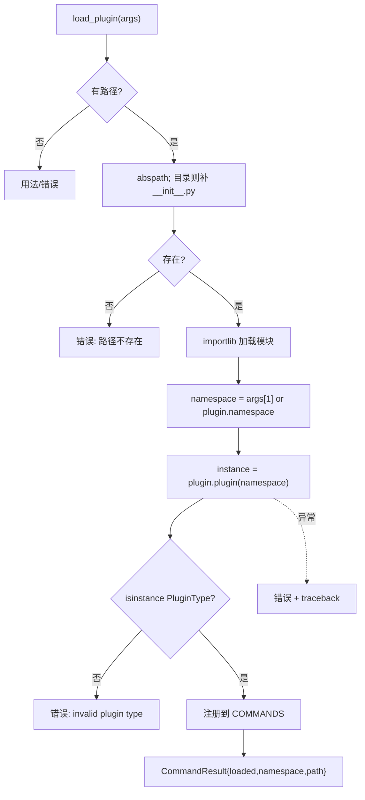

# 插件加载 <code>commands/plugin_manager.py</code>

本模块在运行时把外部 Python 插件**动态导入**到 objection REPL，注册为新命令组。命令组前缀为 `plugin load`。插件是一个含 `__init__.py` 的目录或单文件，须实现 `plugin` 工厂函数返回 `objection.utils.plugin.Plugin` 实例。

## 📋 模块概览

| 项目 | 值 |
| --- | --- |
| 文件路径 | `objection/commands/plugin_manager.py` |
| Agent 实现 | 无（纯 Python 侧动态导入） |
| 命令组 | `plugin load` |
| 依赖 | `importlib.util`、`os`、`traceback`、`uuid`、`click`、`objection.utils.plugin`、`objection.utils.output` |

## 🎯 解决的问题

- 不改 objection 源码即可扩展命令：写个插件目录挂上去。
- 插件目录或单文件两种形态都能加载（目录自动找 `__init__.py`）。
- 插件可自定义命名空间，避免与内置命令冲突。
- 加载失败要给出可读 traceback，便于排查。

## 📜 命令清单

| 命令 | 函数 | 说明 |
| --- | --- | --- |
| `plugin load <plugin path> [namespace]` | `load_plugin()` | 动态导入并注册插件 |

## ⚙️ 实现原理

`load_plugin` 用 `importlib.util.spec_from_file_location` 以随机 UUID 前 8 位为模块名加载文件，调用插件暴露的 `plugin(namespace)` 工厂，校验返回值是 `Plugin` 子类实例，最后把它注册进 `commands.COMMANDS['plugin']['commands'][namespace]`。

### `load_plugin()` — 加载插件

源码：`objection/commands/plugin_manager.py:13`

路径解析：目录自动补 `__init__.py`，不存在则报错（`objection/commands/plugin_manager.py:30-42`）：

```python
# objection/commands/plugin_manager.py:30-34
path = os.path.abspath(args[0])
if os.path.isdir(path):
    path = os.path.join(path, '__init__.py')

if not os.path.exists(path):
    ...
```

动态导入（`objection/commands/plugin_manager.py:44-46`）：

```python
# objection/commands/plugin_manager.py:44-46
spec = importlib.util.spec_from_file_location(str(uuid.uuid4())[:8], path)
plugin = importlib.util.module_from_spec(spec)
spec.loader.exec_module(plugin)
```

命名空间：优先用参数 `args[1]`，否则用插件自身的 `plugin.namespace`（`objection/commands/plugin_manager.py:48-52`）。实例化与类型校验：

```python
# objection/commands/plugin_manager.py:57-58
instance = plugin.plugin(namespace)
assert isinstance(instance, PluginType)
```

注册（`objection/commands/plugin_manager.py:80-81`）：

```python
# objection/commands/plugin_manager.py:80-81
from ..console import commands
commands.COMMANDS['plugin']['commands'][instance.namespace] = instance.implementation
```

异常分两种：`AssertionError`（类型不对）与通用 `Exception`（构造失败），后者会附 `traceback`。



## 🔌 JSON 模式行为

- 缺路径：返回 `status='error'`、`{'error': 'missing plugin path'}`。
- 路径不存在：返回 `{'error': 'plugin path does not exist', 'path': path}`。
- 类型不匹配：返回 `{'error': 'invalid plugin type', 'namespace': namespace}`。
- 构造异常：返回 `{'error': str(e), 'namespace', 'traceback': traceback}`。
- 成功：返回 `{'loaded': True, 'namespace', 'path'}`。

## 🔍 源码索引

| 符号 | 位置 |
| --- | --- |
| `load_plugin` | `objection/commands/plugin_manager.py:13` |

## 🔗 相关文档

- [插件系统](/features/plugins)
- [RPC 通信机制](/guide/rpc)
- [REPL 与命令](/guide/repl)
