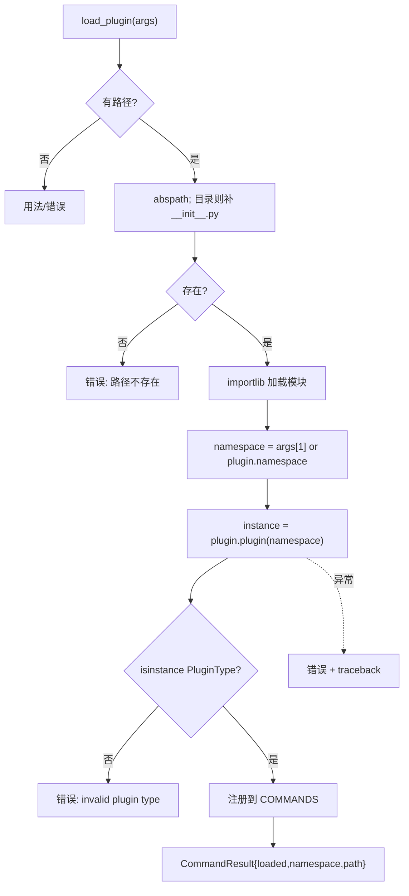

# 插件加载 <code>commands/plugin_manager.py</code>

本模块在运行时把外部 Python 插件**动态导入**到 objection REPL，注册为新命令组。命令组前缀为 `plugin load`。插件是一个含 `__init__.py` 的目录或单文件，须实现 `plugin` 工厂函数返回 `objection.utils.plugin.Plugin` 实例。

## 📋 模块概览

| 项目 | 值 |
| --- | --- |
| 文件路径 | `objection/commands/plugin_manager.py` |
| Agent 实现 | 无（纯 Python 侧动态导入） |
| 命令组 | `plugin load` |
| 依赖 | `importlib.util`、`os`、`traceback`、`uuid`、`click`、`objection.utils.plugin`、`objection.utils.output` |

## 🎯 解决的问题

- 不改 objection 源码即可扩展命令：写个插件目录挂上去。
- 插件目录或单文件两种形态都能加载（目录自动找 `__init__.py`）。
- 插件可自定义命名空间，避免与内置命令冲突。
- 加载失败要给出可读 traceback，便于排查。

## 📜 命令清单

| 命令 | 函数 | 说明 |
| --- | --- | --- |
| `plugin load <plugin path> [namespace]` | `load_plugin()` | 动态导入并注册插件 |

## ⚙️ 实现原理

`load_plugin` 用 `importlib.util.spec_from_file_location` 以随机 UUID 前 8 位为模块名加载文件，调用插件暴露的 `plugin(namespace)` 工厂，校验返回值是 `Plugin` 子类实例，最后把它注册进 `commands.COMMANDS['plugin']['commands'][namespace]`。

### `load_plugin()` — 加载插件

源码：[`objection/commands/plugin_manager.py:13`](https://github.com/android-security-engineer/objection-skills/blob/master/objection/commands/plugin_manager.py#L13)

路径解析：目录自动补 `__init__.py`，不存在则报错（[`objection/commands/plugin_manager.py:30-42`](https://github.com/android-security-engineer/objection-skills/blob/master/objection/commands/plugin_manager.py#L30)）：

```python
# objection/commands/plugin_manager.py:30-34
path = os.path.abspath(args[0])
if os.path.isdir(path):
    path = os.path.join(path, '__init__.py')

if not os.path.exists(path):
    ...
```

动态导入（[`objection/commands/plugin_manager.py:44-46`](https://github.com/android-security-engineer/objection-skills/blob/master/objection/commands/plugin_manager.py#L44)）：

```python
# objection/commands/plugin_manager.py:44-46
spec = importlib.util.spec_from_file_location(str(uuid.uuid4())[:8], path)
plugin = importlib.util.module_from_spec(spec)
spec.loader.exec_module(plugin)
```

命名空间：优先用参数 `args[1]`，否则用插件自身的 `plugin.namespace`（[`objection/commands/plugin_manager.py:48-52`](https://github.com/android-security-engineer/objection-skills/blob/master/objection/commands/plugin_manager.py#L48)）。实例化与类型校验：

```python
# objection/commands/plugin_manager.py:57-58
instance = plugin.plugin(namespace)
assert isinstance(instance, PluginType)
```

注册（[`objection/commands/plugin_manager.py:80-81`](https://github.com/android-security-engineer/objection-skills/blob/master/objection/commands/plugin_manager.py#L80)）：

```python
# objection/commands/plugin_manager.py:80-81
from ..console import commands
commands.COMMANDS['plugin']['commands'][instance.namespace] = instance.implementation
```

异常分两种：`AssertionError`（类型不对）与通用 `Exception`（构造失败），后者会附 `traceback`。



## 🔌 JSON 模式行为

- 缺路径：返回 `status='error'`、`{'error': 'missing plugin path'}`。
- 路径不存在：返回 `{'error': 'plugin path does not exist', 'path': path}`。
- 类型不匹配：返回 `{'error': 'invalid plugin type', 'namespace': namespace}`。
- 构造异常：返回 `{'error': str(e), 'namespace', 'traceback': traceback}`。
- 成功：返回 `{'loaded': True, 'namespace', 'path'}`。

## 🔍 源码索引

| 符号 | 位置 |
| --- | --- |
| `load_plugin` | [`objection/commands/plugin_manager.py:13`](https://github.com/android-security-engineer/objection-skills/blob/master/objection/commands/plugin_manager.py#L13) |

## 🔌 插件加载完整流程

`load_plugin` 只是入口，真正的初始化在 `Plugin.__init__`（[`objection/utils/plugin.py:12`](https://github.com/android-security-engineer/objection-skills/blob/master/objection/utils/plugin.py#L12)）中完成两件副作用：`_prepare_source()` 寻找并加载 Frida 脚本源码，`_append_to_api()` 把插件的可选 Flask Blueprint 挂到 objection HTTP API。加载完成后插件还**未注入** Frida 脚本——注入由 `Plugin.inject()` 显式触发（通常在插件首次被调用时）。

```mermaid
flowchart TD
    A[load_plugin args] --> B[abspath + 目录补 __init__.py]
    B --> C[importlib.spec_from_file_location\n模块名=uuid前8位]
    C --> D[exec_module 执行插件 __init__]
    D --> E[namespace = args[1] or plugin.namespace]
    E --> F[instance = plugin.plugin namespace]
    F --> G{isinstance Plugin?}
    G -- 否 --> H[error: invalid plugin type]
    G -- 是 --> I[Plugin.__init__ 副作用]
    I --> J[_prepare_source 找 Frida 脚本]
    J --> K{script_src?}
    K -- 已设 --> L[跳过]
    K -- script_path --> M[读该文件]
    K -- 都无 --> N[找同目录 index.js]
    N --> O{存在?}
    O -- 否 --> P[debug warning: 无脚本]
    O -- 是 --> M
    I --> Q[_append_to_api]
    Q --> R{有 http_api?}
    R -- 否 --> S[跳过]
    R -- 是 --> T[api_state.append_api_blueprint]
    L --> U[注册 COMMANDS plugin commands namespace = implementation]
    M --> U
    P --> U
    S --> U
    T --> U
    U --> V[Loaded + JSON 返回]
```

注册到 `COMMANDS['plugin']['commands'][instance.namespace]` 的是 `instance.implementation`（一个 dict，[`objection/utils/plugin.py:22`](https://github.com/android-security-engineer/objection-skills/blob/master/objection/utils/plugin.py#L22)），结构同内置命令组——含 `'meta'` 与若干 `'命令名': {'meta':..., 'exec':...}`。REPL 走 `_find_command_exec_method` 时把 `plugin <namespace> <命令>` 路由到这个 dict。

## 🧩 插件的三段式结构

一个完整的 objection 插件由 Python 包装层 + 可选 Frida 脚本 + 可选 HTTP API 三部分组成。`Plugin` 基类（ABC）约定子类提供 `implementation` dict 与 `plugin()` 工厂。

```
   插件目录结构 (例: myplugin/)
   +----------------------------------+
   | __init__.py                      | <- Python 包装层
   |   class MyPlugin(Plugin):        |    定义 implementation dict
   |     def plugin(ns): return ...   |    工厂函数
   |     def http_api(): return BP    | <- 可选 Flask Blueprint
   | index.js                         | <- 可选 Frida 脚本
   |   rpc.exports = { foo: ... }     |    Agent 端 RPC
   +----------------------------------+

   Plugin.__init__ 加载顺序:
   1. _prepare_source()
      |- script_src 已设?  -> 用之
      |- script_path 设?   -> 读该文件
      |- 都无              -> 找同目录 index.js
      |- 都失败            -> debug warning (无脚本也能当纯 Python 插件)
   2. _append_to_api()
      |- 无 http_api 属性  -> 跳过
      |- 有 http_api       -> api_state.append_api_blueprint(bp)
   3. 返回 instance (未注入 Frida 脚本)

   后续 inject() (按需):
      agent.device.attach(pid) -> 新 session
      create_script(script_src) -> script
      script.on('message', 自定义 or 默认 handler)
      script.load()
      self.api = script.exports  <- RPC 句柄
```

`Plugin.inject()`（[`objection/utils/plugin.py:77`](https://github.com/android-security-engineer/objection-skills/blob/master/objection/utils/plugin.py#L77)）与 `frida_commands.load_background` 类似，都新建独立 Frida session，但 `inject` 允许插件提供自定义 `on_message_handler`（`:95-96`），否则回退到 objection 默认 `script_on_message`。`self.api = self.script.exports`（`:99`）让插件 Python 代码能直接调 Frida 脚本导出的 RPC 方法。

## 🐛 边界情况与设计陷阱

- **模块名用 UUID 前 8 位**：`str(uuid.uuid4())[:8]`（[`objection/commands/plugin_manager.py:44`](https://github.com/android-security-engineer/objection-skills/blob/master/objection/commands/plugin_manager.py#L44)）作为模块名——短且几乎不冲突，但若两个插件 UUID 前 8 位碰撞（概率极低但非零），后加载的会覆盖前者在 `sys.modules` 中的条目。
- **`plugin.namespace` 必须存在**：`namespace = plugin.namespace`（`:48`）在 `plugin()` 工厂调用**之前**读取模块属性——若插件 `__init__.py` 未定义模块级 `namespace` 变量会 `AttributeError`，被通用 `except Exception` 捕获返回 traceback。
- **`plugin.__name__ = namespace`**（`:52`）：加载后改写模块 `__name__`，仅影响日志显示（`Loaded plugin: {__name__}`，`:82`），不影响 `sys.modules` key。
- **namespace 覆盖**：`args[1]` 显式 namespace 覆盖插件自带 namespace（`:49-50`）。若两个不同插件用同一 namespace 加载，后者覆盖前者在 `COMMANDS` 中的注册——静默覆盖，无警告。
- **`except AssertionError` 的捕获边界**：源码 `except AssertionError:`（`:60`）捕获 `assert isinstance(instance, PluginType)`（`:58`）失败。注意 `AssertionError` 仅捕获 `assert` 语句触发的异常；若 `plugin.plugin(namespace)` 内部主动 `raise AssertionError(...)` 也会被此处捕获，与"类型不对"的语义混淆。其他异常（`ValueError`/`TypeError` 等）走通用 `except Exception`（`:69`）附带 traceback。
- **`assert` 在 `-O` 模式失效**：若 Python 以 `python -O` 启动，`assert isinstance(...)` 语句被整体移除，类型校验静默失效——非 `Plugin` 子类的返回值会通过校验并注册，后续调用 `instance.implementation` 时才 `AttributeError`。生产环境不应依赖 `assert` 做校验。
- **`_prepare_source` 失败非致命**：找不到 Frida 脚本只 `debug_print` warning（`:75`），不抛异常——纯 Python 插件（无 Frida 脚本）可正常加载，但调 `inject()` 时抛 `'Unable to discover Frida script source'`（`:85`）。
- **HTTP API 注册时机**：`_append_to_api` 在 `__init__` 时立即 `api_state.append_api_blueprint`（`:119`），但 API 服务器可能已启动——后注册的 Blueprint 能否生效取决于 Flask 实现与启动顺序。
- **`exec_module` 不缓存**：每次 `plugin load` 都重新执行 `__init__.py`，模块级副作用（如全局计数器）会重复触发。`sys.modules` 中以 UUID 名注册，同名不会命中缓存。

## 🔗 相关文档

- [插件系统](/features/plugins)
- [RPC 通信机制](/guide/rpc)
- [REPL 与命令](/guide/repl)
