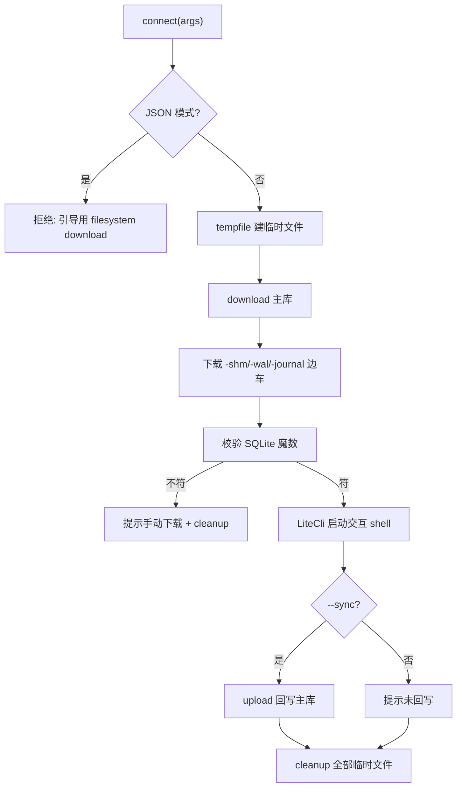
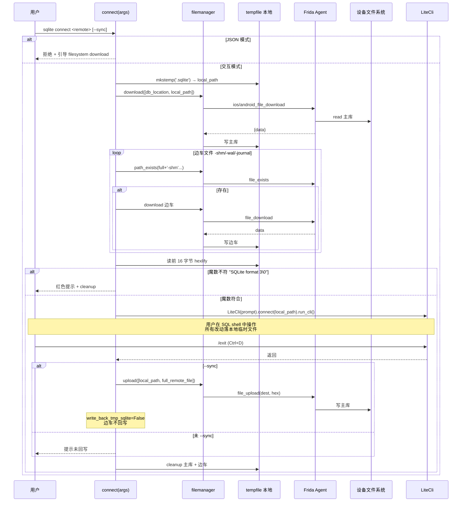

# SQLite 数据库交互 <code>commands/sqlite.py</code>

本模块把设备上的 SQLite 数据库**下载到本地临时文件**，用 litecli 启动一个交互式 SQL shell，退出时可选 `--sync` 回写设备。命令组前缀为 `sqlite connect`。

## 📋 模块概览

| 项目 | 值 |
| --- | --- |
| 文件路径 | `objection/commands/sqlite.py` |
| Agent 实现 | 复用 `agent/src/ios/filesystem.ts`、`agent/src/android/filesystem.ts`（download/upload） |
| 命令组 | `sqlite connect` |
| 依赖 | `binascii`、`os`、`tempfile`、`click`、`litecli`、`objection.commands.filemanager`、`objection.utils.output` |

## 🎯 解决的问题

- App 的 SQLite 库在设备上，不想逐个 `filesystem download` 再手动开 DB 工具。
- 想**就地**用熟悉的 SQL CLI 查/改库表。
- SQLite 的 `-shm`/`-wal`/`-journal` 边车文件要一起缓存，否则数据不一致。
- 改完要能回写设备（`--sync`）。
- Agent 模式下交互 shell 不可用，要明确引导替代路径。

## 📜 命令清单

| 命令 | 函数 | 说明 |
| --- | --- | --- |
| `sqlite connect <remote_file> [--sync]` | `connect()` | 缓存 DB 到本地并启动 litecli |

辅助函数：

| 函数 | 作用 |
| --- | --- |
| `modify_config` | monkey-patch litecli 配置（关 pager、less_chatty） |
| `cleanup` | 删除本地临时 DB |
| `_should_sync_once_done` | 检测 `--sync` |

## ⚙️ 实现原理

模块加载时即 monkey-patch `litecli.main.get_config`（[`objection/commands/sqlite.py:30-31`](https://github.com/android-security-engineer/objection-skills/blob/master/objection/commands/sqlite.py#L30)），关掉 pager 与 chatty 提示。`connect` 用 `tempfile.mkstemp` 建临时文件，调 `filemanager.download` 把远程库拉下来，校验 SQLite 文件头魔数 `53514c69746520666f726d6174203300`（`"SQLite format 3\0"`），再启动 `LiteCli`。

### `connect()` — 连接并启动 shell

源码：[`objection/commands/sqlite.py:56`](https://github.com/android-security-engineer/objection-skills/blob/master/objection/commands/sqlite.py#L56)

无参数报错。**JSON/Agent 模式直接拒绝**——交互 shell 无法在 Agent 下运行（[`objection/commands/sqlite.py:80-91`](https://github.com/android-security-engineer/objection-skills/blob/master/objection/commands/sqlite.py#L80)）：

```python
# objection/commands/sqlite.py:80-91
if should_output_json(args):
    return output_result(
        CommandResult(
            result={'error': 'interactive sqlite shell unavailable in JSON mode'},
            status='error', exit_code=1,
            human_text=('Use `filesystem download <remote_file> <local.sqlite>` '
                        'to pull the database, then inspect locally.'),
            warnings=['The interactive litecli shell cannot run under an AI Agent.'],
        ),
        command='sqlite connect',
    )
```

缓存 DB 与边车文件（[`objection/commands/sqlite.py:104-117`](https://github.com/android-security-engineer/objection-skills/blob/master/objection/commands/sqlite.py#L104)）：

```python
# objection/commands/sqlite.py:105-117
download([db_location, local_path])
if path_exists(full_remote_file + '-shm'):
    download([db_location + '-shm', local_path + '-shm'])
    use_shm = True
if path_exists(full_remote_file + '-wal'):
    download([db_location + '-wal', local_path + '-wal'])
    use_wal = True
if path_exists(full_remote_file + '-journal'):
    download([db_location + '-journal', local_path + '-journal'])
    use_jnl = True
```

文件头校验（[`objection/commands/sqlite.py:119-128`](https://github.com/android-security-engineer/objection-skills/blob/master/objection/commands/sqlite.py#L119)）：读前 16 字节 hex，必须等于 `b'53514c69746520666f726d6174203300'`，否则提示手动下载并清理。启动 litecli（[`objection/commands/sqlite.py:133-135`](https://github.com/android-security-engineer/objection-skills/blob/master/objection/commands/sqlite.py#L133)）：

```python
# objection/commands/sqlite.py:133-135
lite = LiteCli(prompt='SQLite @ {} > '.format(db_location))
lite.connect(local_path)
lite.run_cli()
```

退出后 `--sync` 则回写主库（边车文件回写默认关闭，`write_back_tmp_sqlite` 未启用，[`objection/commands/sqlite.py:137-147`](https://github.com/android-security-engineer/objection-skills/blob/master/objection/commands/sqlite.py#L137)）；最后清理所有临时文件（[`objection/commands/sqlite.py:152-158`](https://github.com/android-security-engineer/objection-skills/blob/master/objection/commands/sqlite.py#L152)）。

### `modify_config()` / `cleanup()` — 辅助

`modify_config`（[`objection/commands/sqlite.py:14`](https://github.com/android-security-engineer/objection-skills/blob/master/objection/commands/sqlite.py#L14)）在 patch 后的 `get_config` 里强制 `less_chatty=True`、`enable_pager=False`。`cleanup`（`:34`）单行 `os.remove(p)`。`_should_sync_once_done`（`:45`）检测 `--sync`。



## 🔌 JSON 模式行为

- **JSON/Agent 模式下不可用**：返回 `status='error'`、`exit_code=1`，`human_text` 引导用 `filesystem download` 拉库后本地查看。这是关键差异——交互 shell 无法在 Agent 下运行。
- 非 JSON 模式：缺参数打印用法；文件头不符提示手动下载。
- `--sync` 默认关闭；边车文件回写 (`write_back_tmp_sqlite`) 硬编码为 `False`，注释说明未测试。

## 🔍 源码索引

| 符号 | 位置 |
| --- | --- |
| `modify_config` | [`objection/commands/sqlite.py:14`](https://github.com/android-security-engineer/objection-skills/blob/master/objection/commands/sqlite.py#L14) |
| `real_get_config` | [`objection/commands/sqlite.py:30`](https://github.com/android-security-engineer/objection-skills/blob/master/objection/commands/sqlite.py#L30) |
| `cleanup` | [`objection/commands/sqlite.py:34`](https://github.com/android-security-engineer/objection-skills/blob/master/objection/commands/sqlite.py#L34) |
| `_should_sync_once_done` | [`objection/commands/sqlite.py:45`](https://github.com/android-security-engineer/objection-skills/blob/master/objection/commands/sqlite.py#L45) |
| `connect` | [`objection/commands/sqlite.py:56`](https://github.com/android-security-engineer/objection-skills/blob/master/objection/commands/sqlite.py#L56) |

## 🗄️ SQLite 会话连接时序

`sqlite connect` 的核心思路是"下载-校验-启动 litecli-可选回写-清理"五阶段。litecli 是一个独立的 SQL CLI 进程内交互式 shell，它直接操作本地临时文件，对设备的所有 I/O 都集中在下载与回写两步。会话期间设备端 DB 文件不被锁定——这意味着**并发写入风险**：若 App 在会话期间写入原库，`--sync` 回写会覆盖 App 的新数据。



魔数校验的关键细节：读 16 字节后 `binascii.hexlify`（[`objection/commands/sqlite.py:122`](https://github.com/android-security-engineer/objection-skills/blob/master/objection/commands/sqlite.py#L122)），与 `b'53514c69746520666f726d6174203300'` 严格相等比较。这串 hex 解码后即 ASCII 字符串 `"SQLite format 3\0"`（含尾部 NUL）。校验失败时 `cleanup(local_path)` 删主库临时文件——但**不删边车**（此时边车尚未下载，`use_*` 全 False，安全）。

## 📦 边车文件与临时文件布局

SQLite 的 WAL 模式会产生 `-wal`（Write-Ahead Log）与 `-shm`（Shared Memory）边车，旧式 rollback journal 产生 `-journal`。三者必须与主库一起缓存，否则 litecli 看到的是过期快照（WAL 未合并到主库）。

```
   设备端                                  本地临时 (tempfile.mkstemp)
   +-----------------------+              +-----------------------+
   | /app/databases/app.db | --download-> | /tmp/tmpXXXX.sqlite      |
   +-----------------------+              +-----------------------+
   | /app/databases/app.db-shm | ----+    | /tmp/tmpXXXX.sqlite-shm  |
   +-----------------------+      |    |   +-----------------------+
   | /app/databases/app.db-wal | --+----+   | /tmp/tmpXXXX.sqlite-wal  |
   +-----------------------+      |    |   +-----------------------+
   | /app/databases/app.db-journal | -+    | /tmp/tmpXXXX.sqlite-journal|
   +-----------------------+              +-----------------------+

   魔数校验: 前 16 字节 hexlify
   b'53514c69746520666f726d6174203300'
    = "SQLite format 3\0"

   回写 (--sync):
   主库:    local_path      --> full_remote_file
   边车:    硬编码 write_back_tmp_sqlite=False → 不回写
```

`full_remote_file` 计算（[`objection/commands/sqlite.py:101-102`](https://github.com/android-security-engineer/objection-skills/blob/master/objection/commands/sqlite.py#L101)）：绝对路径原样用，相对路径 `os.path.join(pwd(), db_location)`。注意这里用 `os.path.join` 而非 `device_state.platform.path_separator.join`——在 Windows 宿主机上会引入反斜杠，但目标路径发到 Agent 后由 Agent 端解析，实测 iOS/Android 都接受 `/` 分隔符。`path_exists` 检查边车时用 `full_remote_file + '-shm'` 字符串拼接（`:106`），依赖主库名以 `.db` 结尾的约定——若库名为 `app.sqlite`，边车名是 `app.sqlite-shm`，符合 SQLite 规范。

## 🐛 边界情况与设计陷阱

- **WAL 数据丢失风险**：`write_back_tmp_sqlite` 硬编码 `False`（`:98`），`--sync` 只回写主库。若会话期间改动落在 WAL（未 checkpoint），回写的主库不包含 WAL 中的新数据——用户在 litecli 看到的修改可能"丢失"。源码注释"this has not been tested"明确警示。WAL 通常在连接关闭时自动 checkpoint，litecli 退出时大概率已合并，但不保证。
- **JSON 模式硬拒绝**：与 `filemanager` 等模块"JSON 模式跳过交互但仍执行"不同，`sqlite connect` 在 JSON 模式直接返回 error 不下载任何文件（`:80-91`）。Agent 想取库必须走 `filesystem download`。
- **monkey-patch 时机**：`modify_config` 在模块**导入时**即 patch `litecli.main.get_config`（`:30-31`），影响整个进程的 litecli 行为。若同一进程其他代码依赖原 litecli 配置（如 pager），会被波及。`real_get_config` 保留原函数引用但未恢复。
- **边车 path_exists 的 RPC 开销**：每次 `connect` 最多发 3 次 `file_exists` RPC 检查边车（`:106/110/114`），即使绝大多数库没有边车。无缓存优化。
- **cleanup 不在 finally 中**：`cleanup` 调用（`:152-158`）不在 `try/finally` 中——若 litecli 抛异常（如本地 sqlite 库损坏），临时文件不会被清理，泄漏到 `/tmp`。
- **`--sync` 覆盖无确认**：`upload` 回写（`:139`）不问用户确认，直接覆盖设备原库。若设备端 App 正持有该库的写锁，回写可能失败或破坏库完整性。

## 🔗 相关文档

- [运行时操作命令](/features/runtime-commands)
- [文件系统](/features/filesystem)
- [RPC 通信机制](/guide/rpc)
- [REPL 与命令](/guide/repl)
